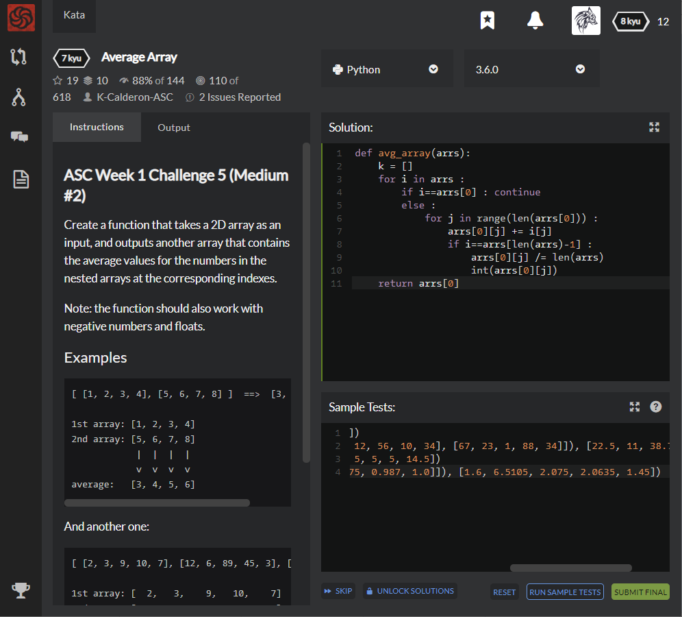

# [7 kyu] Average Array




## Instructions

Create a function that takes a 2D array as an input, and outputs another array that contains the average values for the numbers in the nested arrays at the corresponding indexes.

Note: the function should also work with negative numbers and floats.

### Examples

```Python
[ [1, 2, 3, 4], [5, 6, 7, 8] ]  ==>  [3, 4, 5, 6]

1st array: [1, 2, 3, 4]
2nd array: [5, 6, 7, 8]
            |  |  |  |
            v  v  v  v
average:   [3, 4, 5, 6]
```


## Sample Test

```python
Test.assert_equals(avg_array([[1, 2, 3, 4], [5, 6, 7, 8]]), [3, 4, 5, 6])
Test.assert_equals(avg_array([[2, 3, 9, 10, 7], [12, 6, 89, 45, 3], [9, 12, 56, 10, 34], [67, 23, 1, 88, 34]]), [22.5, 11, 38.75, 38.25, 19.5])
Test.assert_equals(avg_array([[2, 5, 4, 3, 19], [2, 5, 6, 7, 10]]), [2, 5, 5, 5, 14.5])
Test.assert_equals(avg_array([[1.2, 8.521, 0.4, 3.14, 1.9], [2, 4.5, 3.75, 0.987, 1.0]]), [1.6, 6.5105, 2.075, 2.0635, 1.45])
```


## My solution

```python
def avg_array(arrs):
    for i in arrs :
        if i==arrs[0] : continue
        else :
            for j in range(len(arrs[0])) :
                arrs[0][j] += i[j]
                if i==arrs[len(arrs)-1] :
                    arrs[0][j] /= len(arrs)
                    int(arrs[0][j])
    return arrs[0]
```


## Test Results

Test Passed

Test Passed

Test Passed

You have passed all of the tests! :)

---------

Time: 759ms Passed: 106 Failed: 0


## Best Solution

```python
def avg_array(arrs):
    return [sum(a)/len(a) for a in zip(*arrs)]
```


## The things I got

​	**zip(*iterable)** : Take **iterables** (can be zero or more), makes **iterator** that aggregates(종합) elements based on the iterables passed, and returns an iterator of tuples.

```python
a = [1,2,3]
b = ["one","two","three"]

c = zip(a,b) // pointer
print(*c) // value of the pointer
```

 A result will be  `(1, 'one') (2, 'two') (3, 'three')`


**Iterable** : An object capable of returning tis members one at a time ; **list, str,** and **tuple**

**Iterator** : An object representing a stream of data. Repeated calls to the iterator’s **next()** method return successive items in the stream. When no more data are available a **StopIteration** exception is raised instead.


[python docs - Iterable](https://docs.python.org/3/glossary.html#term-iterable)

[python docs - Iterator](https://docs.python.org/3/glossary.html#term-iterator)


  
  

study with [Programiz](https://www.programiz.com/python-programming/methods/built-in/zip)
