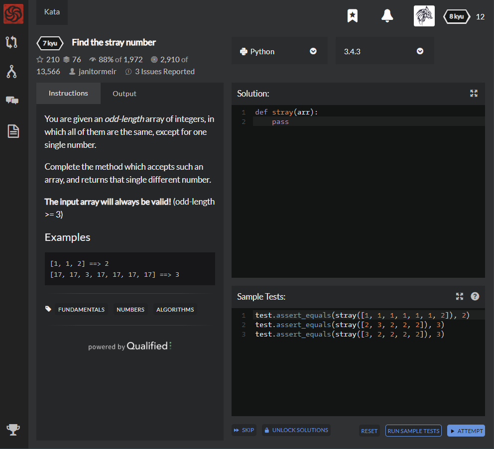

# [7 kyu] Find the stray number




## Instructions

You are given an *odd-length* array of integers, in which all of them are the same, except for one single number.

Complete the method which accepts such an array, and returns that single different number.

**The input array will always be valid!** (odd-length >= 3)

### Example

```python
[1, 1, 2] ==> 2
[17, 17, 3, 17, 17, 17, 17] ==> 3
```


## Sample Test

```python
test.assert_equals(stray([1, 1, 1, 1, 1, 1, 2]), 2)
test.assert_equals(stray([2, 3, 2, 2, 2]), 3)
test.assert_equals(stray([3, 2, 2, 2, 2]), 3)
```


## My solution

```python
def stray(arr):
    avg = sum(arr)/len(arr)

    if avg-min(arr) > max(arr)-avg : return min(arr)
    else : return max(arr)
```

If stray number is maximum in the array,

an average of the array is more similar with minimum than maximum.

## Test Results

Test Passed

Test Passed

Test Passed

You have passed all of the tests! :)

---------

Time: 782ms Passed: 103 Failed: 0


## Best Solution

```python
def stray(arr):
    return min(arr, key=arr.count)
```


## The things I got

min() method's input variable type

**min(iterable, *iterables[,key, default])**

**key** :  a function where the iterables are passed and comparison is performed based on its return value.

That is, the min() method returns array's original value, which is the most smallest value of results from key function. And default is literally default.

```python
max_value=max([1,3,11,-23],key=abs,default=2)
print(max_value)
```

A result will be  `-23`  because the array's maximum abs(absolute) value is  `-23`


study with [doosikbae](https://blog.doosikbae.com/15) and [programiz](https://www.programiz.com/python-programming/methods/built-in/min)

