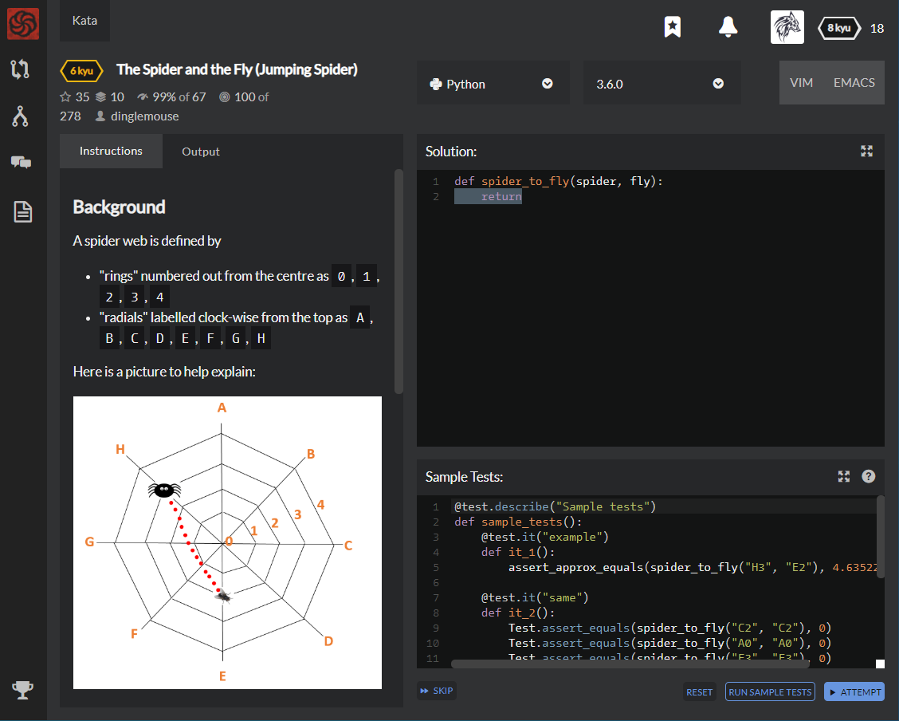

# [6 kyu] The Spider and the Fly(Jumping Spider)




## Instructions

### Background

A spider web is defined by

- "rings" numbered out from the centre as `0`, `1`, `2`, `3`, `4`

- "radials" labelled clock-wise from the top as `A`, `B`, `C`, `D`, `E`, `F`, `G`, `H`

Here is a picture to help explain:


As you can see, each point where the rings and the radials intersect can be described by a "web coordinate".

So in this example the spider is at `H3` and the fly is at `E2`

### Kata Task

Our friendly jumping spider is resting and minding his own spidery business at web-coordinate `spider`.

An inattentive fly bumbles into the web at web-coordinate `fly` and gets itself stuck.

Your task is to calculate and return ***\*the distance\**** the spider must jump to get to the fly.

### Example

The solution to the scenario described by the picture is `4.63522`

### Notes

- The centre of the web will always be referred to as `A0`
- The rings intersect the radials at **evenly** spaced distances of **1 unit**

### 


## Sample Test

```python
@test.describe("Sample tests")
def sample_tests():
    @test.it("example")
    def it_1():
        assert_approx_equals(spider_to_fly("H3", "E2"), 4.635221825785533)
        
    @test.it("same")
    def it_2():
        Test.assert_equals(spider_to_fly("C2", "C2"), 0)
        Test.assert_equals(spider_to_fly("A0", "A0"), 0)
        Test.assert_equals(spider_to_fly("F3", "F3"), 0)
        
    @test.it("radial-out")
    def it_3():
        Test.assert_equals(spider_to_fly("H1", "H2"), 1)
        Test.assert_equals(spider_to_fly("H1", "H4"), 3)
        
    @test.it("radial-thru-the-middle")
    def it_4():
        Test.assert_equals(spider_to_fly("G4", "C4"), 8)
        Test.assert_equals(spider_to_fly("G4", "C3"), 7)
```


## My solution

```python
def spider_to_fly(spider, fly):
    import math
    
    radial_s,ring_s = list(spider)
    radial_f,ring_f = list(fly)
    
    angle_s = (ord(radial_s)-65)*45
    angle_f = (ord(radial_f)-65)*45
    angle = math.radians(abs(angle_s-angle_f))
    
    distance = math.sqrt( math.pow(int(ring_s),2) + math.pow(int(ring_f),2) - 			 
									2*int(ring_s)*int(ring_f)*math.cos(angle))
    return distance
```

Split radial and ring by using list() function and change radial to angle with **ASCII CODE**

(an angle of 'A', which is 65 as ASCII CODE, will be 0 degree and 'H' will be 135 degree)

Finally, calculate distance by the **Law of cosines**

 

with the angle I just solve, which should be change into radian value.


## Test Results

Test Passed

Test Passed

Test Passed

You have passed all of the tests! :)

---------

Time: 889ms Passed: 534 Failed: 0


## Best Solution

```python
from math import cos, pi

def spider_to_fly(a, b):
    x, y = int(a[1]), int(b[1])
    return (x**2 + y**2 - 2 * x * y * cos((ord(a[0]) - ord(b[0])) * pi / 4))**0.5
```


## The things I got

I can pick out methods I need by  `from ... import ...` 

so don't need to type math.cos() or math.pi(), just cos() or pi()

Also I don't have to use sqrt() and pow(), just use ******


study with [mathfactory](https://www.mathfactory.net/10678), [mwultong blog](http://mwultong.blogspot.com/2007/01/python-ascii-code-char.html), [hashcode]([https://hashcode.co.kr/questions/1235/%EB%AC%B8%EC%9E%90%EC%97%B4%EC%9D%84-%EC%B2%A0%EC%9E%90-%ED%95%98%EB%82%98%EC%94%A9-%EB%81%8A%EC%96%B4-list%EB%A1%9C-%EC%A0%80%EC%9E%A5%ED%95%98%EB%A0%A4-%ED%95%A9%EB%8B%88%EB%8B%A4](https://hashcode.co.kr/questions/1235/문자열을-철자-하나씩-끊어-list로-저장하려-합니다)), [youngjae blog](http://blog.naver.com/PostView.nhn?blogId=dudwo567890&logNo=130165175511), and [wikipedia](https://en.wikipedia.org/wiki/Law_of_cosines)

