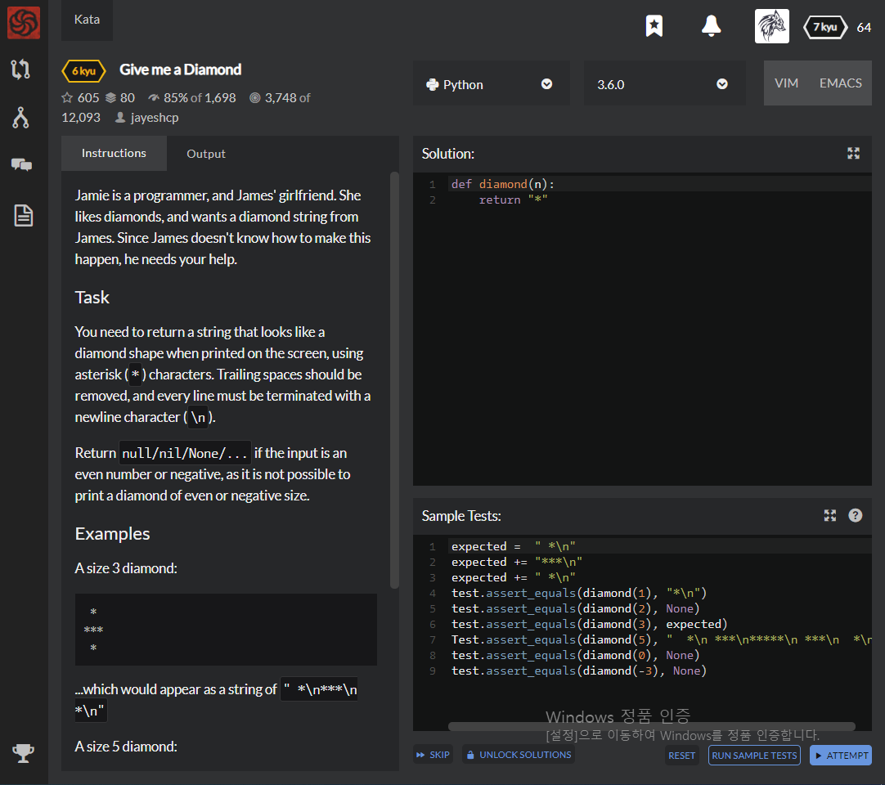

# [6 Kyu] Give me a Diamond




## Instructions

Jamie is a programmer, and James' girlfriend. She likes diamonds, and wants a diamond string from James. Since James doesn't know how to make this happen, he needs your help.

### Task

You need to return a string that looks like a diamond shape when printed on the screen, using asterisk (`*`) characters. Trailing spaces should be removed, and every line must be terminated with a newline character (`\n`).

Return `null/nil/None/...` if the input is an even number or negative, as it is not possible to print a diamond of even or negative size.

### Examples

A size 3 diamond:

```
 *
***
 *
```

...which would appear as a string of `" *\n***\n *\n"`

A size 5 diamond:

```
  *
 ***
*****
 ***
  *
```

...that is: `" *\n ***\n*****\n ***\n *\n"`

### 


## Sample Test

```python
expected =  " *\n"
expected += "***\n"
expected += " *\n"
test.assert_equals(diamond(1), "*\n")
test.assert_equals(diamond(2), None)
test.assert_equals(diamond(3), expected)
Test.assert_equals(diamond(5), "  *\n ***\n*****\n ***\n  *\n")
test.assert_equals(diamond(0), None)
test.assert_equals(diamond(-3), None)
```


## My solution

```python
def diamond(n):
    if n%2==0 or n<1 : return None
    else :
        a=''
        for x in range(1,n+1,2) :
            a += (' '*int((n-x)/2) + '*'*x + "\n")
        for x in range(n-2,0,-2) :
            a += (' '*int((n-x)/2) + '*'*x + "\n")
        return a
```


## Test Results

Test Passed

Test Passed

Test Passed

You have passed all of the tests! :)

---------

Time: 781ms Passed: 30 Failed: 0


## Best Solution

```python
def diamond(n):
    if not n%2 or n<1: return None
    d = [" "*i+"*"*(n-2*i)+"\n" for i in range(n/2,0,-1)]
    return ''.join(d) + "*"*n + "\n" + ''.join(d[::-1])
```


## The things I got

**str * integer** is str+str+str...

**join() method** : return append all items of list

```python
food = [ "123", "자장면", "짬뽕", "탕수육", "물만두", "팔보채" ]

" ".join(food) : 123 자장면 짬뽕 탕수육 물만두 팔보채
" ".join(food) : 123자장면짬뽕탕수육물만두팔보채
"/".join(food) : 123/자장면/짬뽕/탕수육/물만두/팔보채
"\n".join(food) :
123
자장면
짬뽕
탕수육
물만두
팔보채
```


study with [mwultong](http://mwultong.blogspot.com/2006/12/python-join-list-array.html), [dojang](https://dojang.io/mod/page/view.php?id=2192).