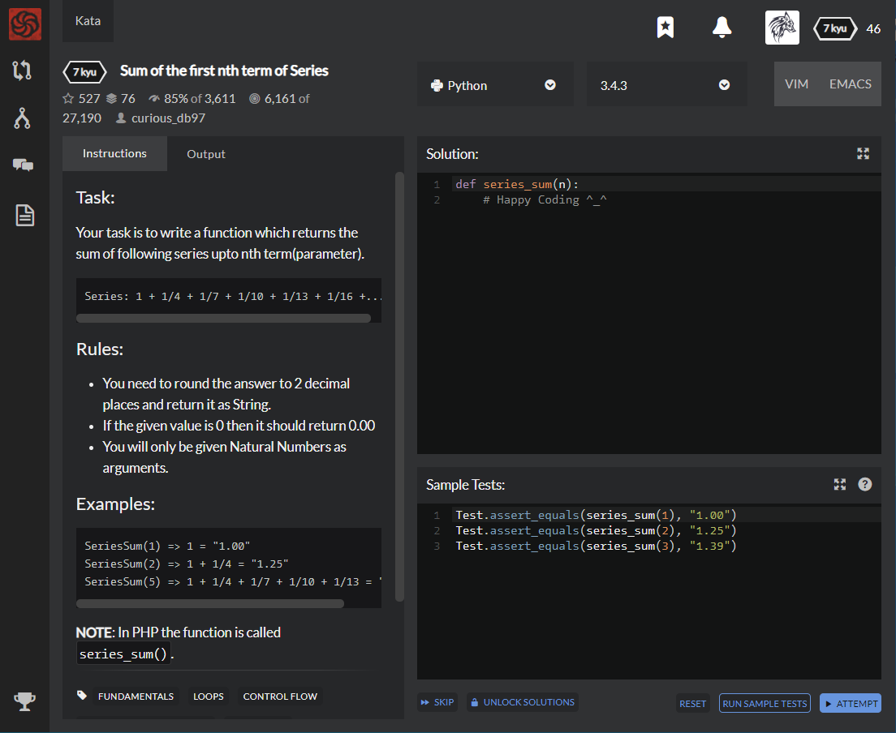

# [7 kyu] Sum of the first nth term of Series




## Instructions

### Task

Your task is to write a function which returns the sum of following series upto nth term(parameter).

```
Series: 1 + 1/4 + 1/7 + 1/10 + 1/13 + 1/16 +...
```

### Rules

- You need to round the answer to 2 decimal places and return it as String.
- If the given value is 0 then it should return 0.00
- You will only be given Natural Numbers as arguments.

### Example

```python
SeriesSum(1) => 1 = "1.00"
SeriesSum(2) => 1 + 1/4 = "1.25"
SeriesSum(5) => 1 + 1/4 + 1/7 + 1/10 + 1/13 = "1.57"
```

**NOTE**: In PHP the function is called `series_sum()`.


## Sample Test

```python
Test.assert_equals(series_sum(1), "1.00")
Test.assert_equals(series_sum(2), "1.25")
Test.assert_equals(series_sum(3), "1.39")
```


## My solution

```python
def series_sum(n):
    sum=0
    for x in range(n):
        sum += 1/(3*x+1)
    if n==0 : sum=0
    return "%.2f" % sum
```


## Test Results

Test Passed

Test Passed

Test Passed

You have passed all of the tests! :)

---------

Time: 840ms Passed: 53 Failed: 0


## Best Solution

```python
def series_sum(n):
    return '{:.2f}'.format(sum(1.0/(3 * i + 1) for i in range(n)))
```


## The things I got

I can set the format of string like this `'{:.0f}'.format( variable )` or `"I eat %d apple " %apple`


study with [wikidocs - Jump to python](https://wikidocs.net/13)