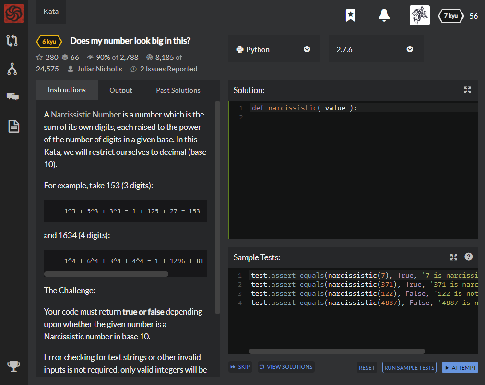

# [6 Kyu] Does my number look big in this?




## Instructions

A [Narcissistic Number](https://en.wikipedia.org/wiki/Narcissistic_number) is a number which is the sum of its own digits, each raised to the power of the number of digits in a given base. In this Kata, we will restrict ourselves to decimal (base 10).

The Challenge:

Your code must return **true or false** depending upon whether the given number is a Narcissistic number in base 10.

Error checking for text strings or other invalid inputs is not required, only valid integers will be passed into the function.


### Example

```python
1^3 + 5^3 + 3^3 = 1 + 125 + 27 = 153 (True, Narcissistic Number)
1^4 + 6^4 + 3^4 + 4^4 = 1 + 1296 + 81 + 256 = 1634 (True, Narcissistic Number)
```


## Sample Test

```python
test.assert_equals(narcissistic(7), True, '7 is narcissistic');
test.assert_equals(narcissistic(371), True, '371 is narcissistic');
test.assert_equals(narcissistic(122), False, '122 is not narcissistic')
test.assert_equals(narcissistic(4887), False, '4887 is not narcissistic')
```


## My solution

```python
def narcissistic( value ):
    return sum([int(x)**len(list(str(value))) for x in 				 
                					list(str(value))])==value
```


## Test Results

Test Passed

Test Passed

Test Passed

You have passed all of the tests! :)

---------

Time: 728ms Passed: 29 Failed: 0


## Best Solution

```python
def narcissistic(value):
    return value == sum(int(x) ** len(str(value)) for x in str(value))
```


## The things I got

Not only list can be separated by for-in statement, string type can also be separated as such.

```python
a = "Life is too short, You need Python"
b = a[0] + a[1] + a[2] + a[3]
print(b)
```

The result will be  `'Life'`


study with [wikidocs - Jump to Python](https://wikidocs.net/13)

