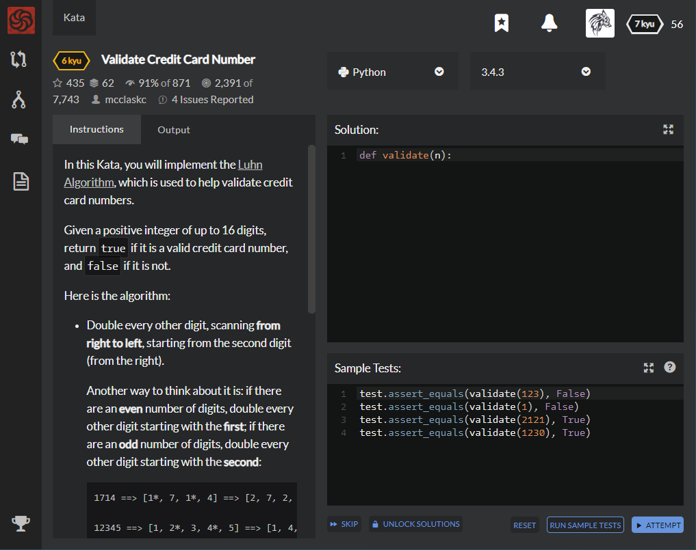

# [6 Kyu] Validate Credit Card Number




## Instructions

In this Kata, you will implement the [Luhn Algorithm](http://en.wikipedia.org/wiki/Luhn_algorithm), which is used to help validate credit card numbers.

Given a positive integer of up to 16 digits, return `true` if it is a valid credit card number, and `false` if it is not.

Here is the algorithm:

- Double every other digit, scanning **from right to left**, starting from the second digit (from the right).

  Another way to think about it is: if there are an **even** number of digits, double every other digit starting with the **first**; if there are an **odd** number of digits, double every other digit starting with the **second**:

  ```python
  1714 ==> [1*, 7, 1*, 4] ==> [2, 7, 2, 4]
  
  12345 ==> [1, 2*, 3, 4*, 5] ==> [1, 4, 3, 8, 5]
  
  891 ==> [8, 9*, 1] ==> [8, 18, 1]
  ```

- If a resulting number is greater than `9`, replace it with the sum of its own digits (which is the same as subtracting `9` from it):

  ```python
  [8, 18*, 1] ==> [8, (1+8), 1] ==> [8, 9, 1]
  
  or:
  
  [8, 18*, 1] ==> [8, (18-9), 1] ==> [8, 9, 1]
  ```

- Sum all of the final digits:

  ```python
  [8, 9, 1] ==> 8 + 9 + 1 = 18
  ```

- Finally, take that sum and divide it by `10`. If the remainder equals zero, the original credit card number is valid.

  ```python
    18 (modulus) 10 ==> 8 , which is not equal to 0, so this is not a valid credit card number
  ```


## Sample Test

```python
test.assert_equals(validate(123), False)
test.assert_equals(validate(1), False)
test.assert_equals(validate(2121), True)
test.assert_equals(validate(1230), True)
```


## My solution

```python
def validate(n):
    k = [int(x) for x in str(n)]
    if len(k) % 2 : 
        for x in range(len(k)) :
            if x % 2 : k[x] *= 2
            if k[x] > 9 : k[x] -= 9
        
    else :
        for x in range(len(k)) :
            if x % 2 : continue
            else : k[x] *= 2
            if k[x] > 9 : k[x] -= 9
    return sum(k)%10==0
```


## Test Results

Test Passed

Test Passed

Test Passed

You have passed all of the tests! :)

---------

Time: 856ms Passed: 12 Failed: 0


## Best Solution

```python
def validate(n):
    digits = [int(x) for x in str(n)]
    for x in xrange(len(digits)-2, -1, -2):
        digits[x] = sum(map(int, str(digits[x] * 2)))
    return sum(digits) % 10 == 0
```


## The things I got

**range() method** :   built-in function that create lists containing plain gap integers.

range(start, stop, step)

- start : start of the list
- stop : end of the list
- step : increase value

```python
range(1, 10, 3) : [1, 4, 7]
range(2, 20, 3) : [2, 5, 8, 11, 14, 17]
```


**xrange() method** : similar with range(), but data type ; returns type 'xrange'

(range() method returns type 'list')

xrange type : same amount of memory, no matter the size of the range it represents.

```python
import sys

sys.getsizeof(range(10)) : 152
sys.getsizeof(range(10000)) : 80072
    
sys.getsizeof(xrange(10)) : 40
sys.getsizeof(xrange(10000)) : 40
```

Good at iteration access or access by index  like  `for - in`  statements

Bad at flexibility like limitation of several methods(slice or operand)

```python
>>> xrange(10)[:3]
Traceback (most recent call last):
  File "<stdin>", line 1, in <module>
TypeError: sequence index must be integer, not 'slice'

>>> xrange(5) + xrange(5)
Traceback (most recent call last):
  File "<stdin>", line 1, in <module>
TypeError: unsupported operand type(s) for +: 'xrange' and 'xrange'
```


so let's me use  `for x in xrange()`  form.


**map() method** : Apply function to every item of iterable and return a list of the result.

map(function, iterable, iterable, ...)

```python
def func(x):
	return x * 2

map(func,[1,2,3,4]) : [2,4,6,8]
```

It helps me not to use  `for - in`  statement


study with [ㅍㅍㅋㄷ - xrange](https://bluese05.tistory.com/57), [ㅍㅍㅋㄷ - map](https://bluese05.tistory.com/58), and [초보몽키의 개발공부로그](https://wayhome25.github.io/algorithm/2017/03/06/evenOrOdd/)