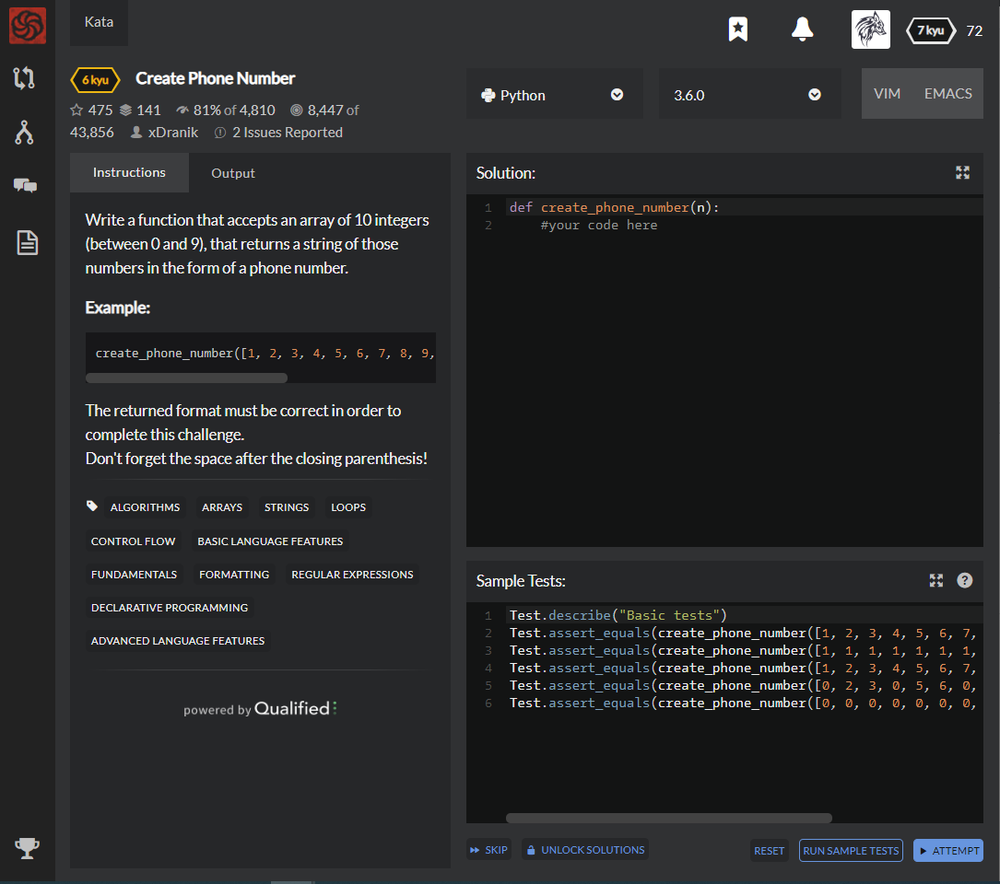

# [6 Kyu] Create Phone Number




## Instructions

Write a function that accepts an array of 10 integers (between 0 and 9), that returns a string of those numbers in the form of a phone number.

### Example

```python
create_phone_number([1, 2, 3, 4, 5, 6, 7, 8, 9, 0])
# => returns "(123) 456-7890"
```

The returned format must be correct in order to complete this challenge. 
Don't forget the space after the closing parenthesis!


## Sample Test

```python
Test.describe("Basic tests")
Test.assert_equals
(create_phone_number([1, 2, 3, 4, 5, 6, 7, 8, 9, 0]), "(123) 456-7890")
Test.assert_equals
(create_phone_number([1, 1, 1, 1, 1, 1, 1, 1, 1, 1]), "(111) 111-1111")
Test.assert_equals
(create_phone_number([1, 2, 3, 4, 5, 6, 7, 8, 9, 0]), "(123) 456-7890")
Test.assert_equals
(create_phone_number([0, 2, 3, 0, 5, 6, 0, 8, 9, 0]), "(023) 056-0890")
Test.assert_equals
(create_phone_number([0, 0, 0, 0, 0, 0, 0, 0, 0, 0]), "(000) 000-0000")
```


## My solution

```python
def create_phone_number(n):
    n.insert(3," ")
    n.insert(7," ")
    a = [x for x in ''.join(list(map(str,n))).split(" ")]
    return "(" + a[0] + ") " + a[1] + "-" + a[2]
```


## Test Results

Test Passed

Test Passed

Test Passed

You have passed all of the tests! :)

---------

Time: 806ms Passed: 45 Failed: 0


## Best Solution

```python
def create_phone_number(n):
  return "({}{}{}) {}{}{}-{}{}{}{}".format(*n)
```


## The things I got

**Asterisk(*)**  : most used operators in Python that isn't just multiplying the two numbers.

There are 4 cases for using the asterisk in Python


1. Multiplication and power operation
2. Extending the list-type container repeatedly
3. Receiving any excess positional parameters and keyword arguments by tuple and dictionary
4. Unpacking the containers


**Multiplication and power operation**

```python
2*3
6

2**3
8
```


**Extending the list-type container repeatedly**

```python
[0]*3
[0,0,0]

(0)*4
(0,0,0,0)

'abc'*2
'abcabc'
```


**Receiving any excess positional parameters and keyword arguments by tuple and dictionary**

```python
def foo(a, b, c, **args):
    print "a = %s" % (a,)
    print "b = %s" % (b,)
    print "c = %s" % (c,)
    print args

foo(a="testa", d="excess", c="testc", b="testb", k="another_excess")
```

```py
a = testa
b = testb
c = testc
{'k': 'another_excess', 'd': 'excess'}
```

The foo method has only a,b,c parameters  not d,k(excess keyword arguments).

so d and k go to the dictionary of args.


```python
def foo(a, b, c, *args):
    print "a = %s" % (a,)
    print "b = %s" % (b,)
    print "c = %s" % (c,)
    print args

foo("testa", "testb", "testc", "excess", "another_excess")
```

```python
a = testa
b = testb
c = testc
('excess', 'another_excess')
```

The foo method has only three specific parameters, no more.

Therefore, only three values can be taken by three parameters.

rest of values(excess positional parameters) go to the tuple of args


**Unpacking the containers**

```python
numbers = [1, 2, 3, 4, 5, 6]

*numbers = 1, 2, 3, 4, 5, 6

# slicing
*a, = numbers
a
[1, 2, 3, 4, 5, 6]

*a, b = numbers
a
[1, 2, 3, 4, 5]
b
6

a, *b, = numbers
a
1 
b
[2, 3, 4, 5, 6]

a, *b, c = numbers
a
1
b
[2, 3, 4, 5]
c
6
```


study with [minigrammer](https://mingrammer.com/understanding-the-asterisk-of-python/), [codeday](https://codeday.me/ko/qa/20190306/6545.html).