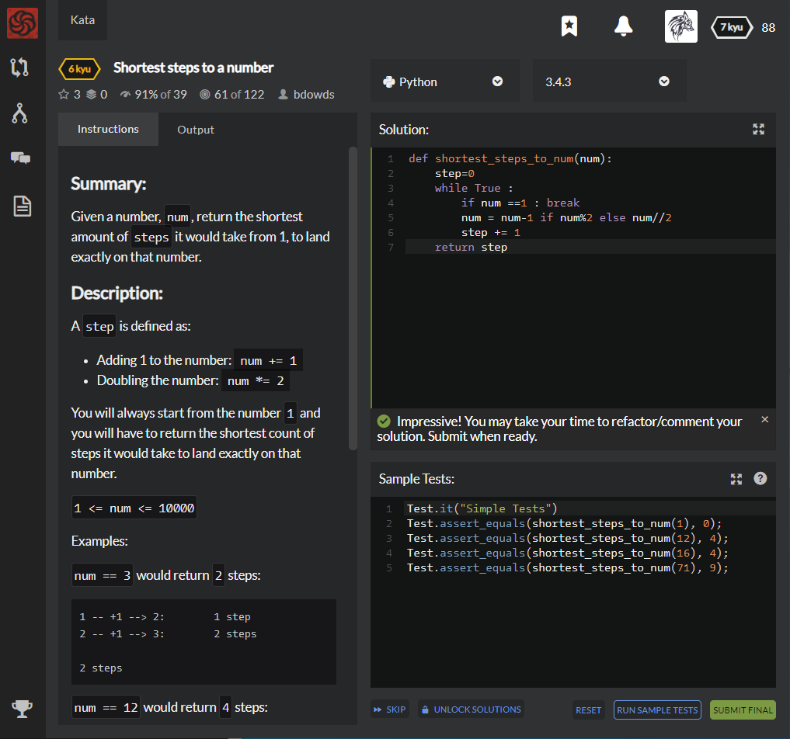

# [6 Kyu] Shortest steps to a number




## Instructions

### Summary

Given a number, `num`, return the shortest amount of `steps` it would take from 1, to land exactly on that number.

### Description

A `step` is defined as:

- Adding 1 to the number: `num += 1`
- Doubling the number: `num *= 2`

You will always start from the number `1` and you will have to return the shortest count of steps it would take to land exactly on that number.

```python
1 <= num <= 10000
```

Examples:

`num == 3` would return `2` steps:

```python
1 -- +1 --> 2:        1 step
2 -- +1 --> 3:        2 steps

2 steps
```

`num == 12` would return `4` steps:

```python
1 -- +1 --> 2:        1 step
2 -- +1 --> 3:        2 steps
3 -- x2 --> 6:        3 steps
6 -- x2 --> 12:       4 steps

4 steps
```

`num == 16` would return `4` steps:

```python
1 -- +1 --> 2:        1 step
2 -- x2 --> 4:        2 steps
4 -- x2 --> 8:        3 steps
8 -- x2 --> 16:       4 steps

4 steps
```


## Sample Test

```python
Test.it("Simple Tests")
Test.assert_equals(shortest_steps_to_num(1), 0);
Test.assert_equals(shortest_steps_to_num(12), 4);
Test.assert_equals(shortest_steps_to_num(16), 4);
Test.assert_equals(shortest_steps_to_num(71), 9);
```


## My solution

```python
def shortest_steps_to_num(num):
    step=0
    while True :
        if num ==1 : break
        num = num-1 if num%2 else num//2
        step += 1
    return step
```


## Test Results

Test Passed

Test Passed

Test Passed

You have passed all of the tests! :)

---------

Time: 771ms Passed: 154 Failed: 0


## Best Solution

```python
def shortest_steps_to_num(num):
    return num.bit_length() + bin(num).count('1') - 2
```


## The things I got

**bin(interger)** : return String type binary value that starts with '0b'

**otc(interger)** :  return String type binary value that starts with '0o'

**hex(interger)** :  return String type binary value that starts with '0x'


### Example

```python
>>> bin(3)
'0b11'
>>> bin(-10)
'0b1010'

>>> oct(13)
'0o15'
>>> oct(-25)
'0o31'

>>> hex(31)
'0x1f'
>>> hex(-52)
'-0x34'
```


**integer.bit_length()** : return length of integer's binary type that removed leading zeros and minus sign

```python
def bit_length(self):
    s = bin(self)       # binary representation:  bin(-37) --> '-0b100101'
    s = s.lstrip('-0b') # remove leading zeros and minus sign
    return len(s)       # len('100101') --> 6
```

