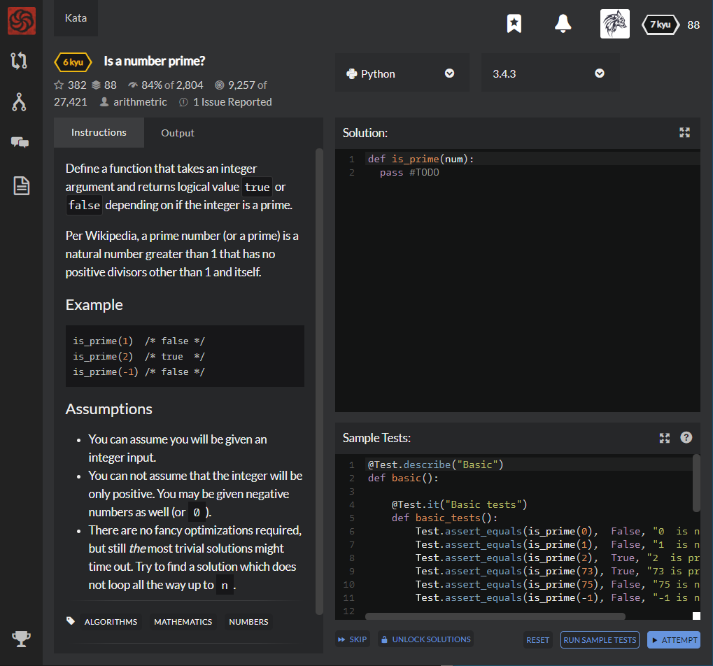

# [6 kyu] Is a number prime?




## Instructions

Define a function that takes an integer argument and returns logical value `true` or `false` depending on if the integer is a prime.

Per Wikipedia, a prime number (or a prime) is a natural number greater than 1 that has no positive divisors other than 1 and itself.

### Example

```python
is_prime(1)  # false
is_prime(2)  # true  
is_prime(-1) # false 
```

### Assumptions

- You can assume you will be given an integer input.
- You can not assume that the integer will be only positive. You may be given negative numbers as well (or `0`).
- There are no fancy optimizations required, but still *the* most trivial solutions might time out. Try to find a solution which does not loop all the way up to `n`.


## Sample Test

```python
@Test.describe("Basic")
def basic():
    
    @Test.it("Basic tests")
    def basic_tests():
        Test.assert_equals(is_prime(0),  False, "0  is not prime")
        Test.assert_equals(is_prime(1),  False, "1  is not prime")
        Test.assert_equals(is_prime(2),  True, "2  is prime")
        Test.assert_equals(is_prime(73), True, "73 is prime")
        Test.assert_equals(is_prime(75), False, "75 is not prime")
        Test.assert_equals(is_prime(-1), False, "-1 is not prime")

    
    @Test.it("Test prime")
    def test_prime():
        Test.assert_equals(is_prime(3),  True, "3  is not prime");
        Test.assert_equals(is_prime(5),  True, "5  is not prime");
        Test.assert_equals(is_prime(7),  True, "7  is prime");
        Test.assert_equals(is_prime(41), True, "41 is prime");
        Test.assert_equals(is_prime(5099), True, "5099 is prime");
        
    @Test.it("Test not prime")
    def test_not_prime():
        Test.assert_equals(is_prime(4),  False, "4  is not prime");
        Test.assert_equals(is_prime(6),  False, "6  is not prime");
        Test.assert_equals(is_prime(8),  False, "8  is prime");
        Test.assert_equals(is_prime(9), False, "9 is prime");
        Test.assert_equals(is_prime(45), False, "45 is not prime");
        Test.assert_equals(is_prime(-5), False, "-5 is not prime");
        Test.assert_equals(is_prime(-8), False, "-8 is not prime");
        Test.assert_equals(is_prime(-41), False, "-41 is not prime");

```


## My solution

```python
def is_prime(num):
  return num==2 or num>2 and num&1 and all([num%x for x in range(3,int(num**.5+1),2)])
```

Let 2 be prime.

And if the number is bigger than 1, odd, and no factors except itself, it will be prime number.


## Test Results

Test Passed

Test Passed

Test Passed

You have passed all of the tests! :)

---------

Time: 2573ms Passed: 519 Failed: 0


## Best Solution

```python
def is_prime(num):
    return num > 1 and not any(num % n == 0 for n in range(2,num))
```


## The things I got

**integer & integer** : 

**&** is bit operator that returns integer resulted from comparison between two integer when they are binary.

```python
>>> 1 & 3 # bin(1) == 001
1		  # bin(3) == 101 -> same 1 in 0^2 = 0^2 = 1

>>> 1 & 8 # bin(1) == 0001
0		  # bin(8) == 1000 -> no same 1 = 0

>>> 9 & 10 # bin(9)  == 1001
8		   # bin(10) == 1010 -> same 1 in 2^3 = 3^2 = 8

>>> 5 & 10 # bin(5)  == 0101
0		   # bin(10) == 1010 -> no same 1 = 0

>>> 26 & 31 # bin(26) == 11010
26			# bin(31) == 11111 -> same 1 in 2^4, 2^3 and 2^1 = 2^4 + 2^3 + 2^1 = 26
```


**all(iterable)** : return True if all items of iterable are True, return False if iterable has False at least one.

**any(iterable)** : return True if iterable has True at least one., return False only if all of iterable are False.

```python
>>> all([1, 2, 3])
True
>>> all([1, 2, 3, 0])
False


>>> any([1, 2, 3, 0])
True
>>> any([0, ""])
False
```


study with [wikidocs-Jump to Python](https://wikidocs.net/32#all), [oniondev](http://oniondev.egloos.com/9839582), and [Python-docs](https://docs.python.org/ko/3/library/stdtypes.html).