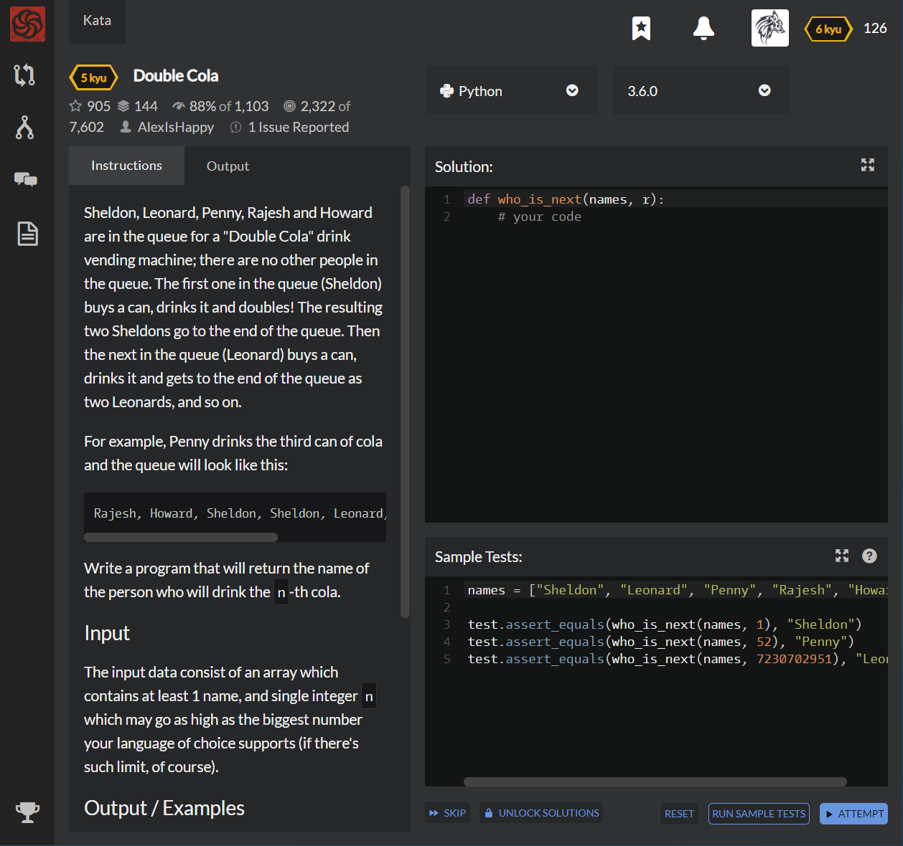

# [5 kyu] Double Cola




## Instructions

Sheldon, Leonard, Penny, Rajesh and Howard are in the queue for a "Double Cola" drink vending machine; there are no other people in the queue. The first one in the queue (Sheldon) buys a can, drinks it and doubles! The resulting two Sheldons go to the end of the queue. Then the next in the queue (Leonard) buys a can, drinks it and gets to the end of the queue as two Leonards, and so on.

For example, Penny drinks the third can of cola and the queue will look like this:

```
Rajesh, Howard, Sheldon, Sheldon, Leonard, Leonard, Penny, Penny
```

Write a program that will return the name of the person who will drink the `n`-th cola.

### Input

The input data consist of an array which contains at least 1 name, and single integer `n` which may go as high as the biggest number your language of choice supports (if there's such limit, of course).

### Output / Examples

Return the single line — the name of the person who drinks the n-th can of cola. The cans are numbered starting from 1.

```python
who_is_next(["Sheldon", "Leonard", "Penny", "Rajesh", "Howard"], 1) == "Sheldon"
who_is_next(["Sheldon", "Leonard", "Penny", "Rajesh", "Howard"], 52) == "Penny"
who_is_next(["Sheldon", "Leonard", "Penny", "Rajesh", "Howard"], 7230702951) == "Leonard"
```


## Sample Test

```python
names = ["Sheldon", "Leonard", "Penny", "Rajesh", "Howard"]

test.assert_equals(who_is_next(names, 1), "Sheldon")
test.assert_equals(who_is_next(names, 52), "Penny")
test.assert_equals(who_is_next(names, 7230702951), "Leonard")
```


## My solution

```python
def func(k_final,k_now=0,k_first=0,n=1,len=1) : 
    if k_final==k_now+1 : return n
    if k_final==1 : return 1
    k = k_first if k_first is 0 else k_now
    n += len*(2**k)
    return func(k_final,k+1,1,n,len)

def who_is_next(names, r):
    i=1
    while True :
        if func(i,len=len(names)) > r : break
        i += 1
    return names[(r-func(i-1,len=len(names)))//(2**(i-2))]
```


## Test Results

Test Passed

Test Passed

Test Passed

You have passed all of the tests! :)

---------

Time: 1246ms Passed: 216 Failed: 0


## Best Solution

```python
def whoIsNext(names, r):
    while r > 5:
        r = (r - 4) / 2
    return names[r-1]
```


## The things I got

Keep Thinking to get more clear code!