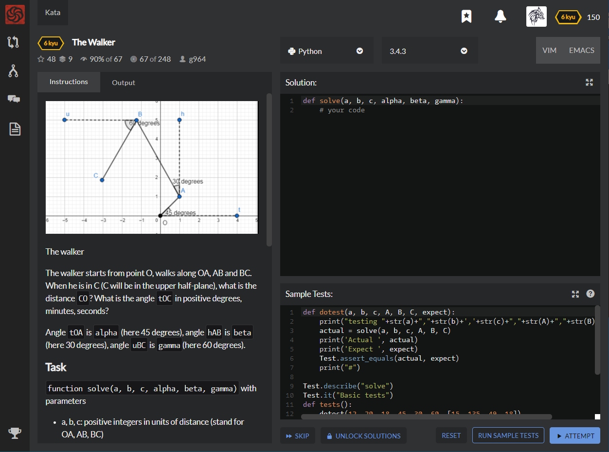

# [6 Kyu] The Walker




## Instructions


The walker

The walker starts from point O, walks along OA, AB and BC. When he is in C (C will be in the upper half-plane), what is the distance `CO`? What is the angle `tOC` in positive degrees, minutes, seconds?

Angle `tOA` is `alpha` (here 45 degrees), angle `hAB` is `beta` (here 30 degrees), angle `uBC` is `gamma`(here 60 degrees).

### Task

`function solve(a, b, c, alpha, beta, gamma)` with parameters

- a, b, c: positive integers in units of distance (stand for OA, AB, BC)
- alpha, beta, gamma: positive integers in degrees (positive angles are anticlockwise)

returns an array

- first element: distance CO (rounded to the nearest integer)
- then angle tOC with the third following elements:
  - second element of the array: number of degrees in angle tOC (truncated positive integer)
  - third element of the array: number of minutes in angle tOC (truncated positive integer)
  - fourth element of the array: number of seconds in angle tOC (truncated positive integer)

### Example

```python
print(solve(12, 20, 18, 45, 30, 60)) -> [15, 135, 49, 18]
- CO is 14.661... rounded to 15
- angle tOC is 135.821...
so
- degrees = 135
- minutes = 49.308...
- seconds = 18.518...

hence [15, 135, 49, 18]
```

### Note

If you need the constant `pi` you can use `pi = 3.14159265358979323846`


## Sample Test

```python
def dotest(a, b, c, A, B, C, expect):
    print("testing "+str(a)+","+str(b)+','+str(c)+","+str(A)+","+str(B)+","+str(C))
    actual = solve(a, b, c, A, B, C)
    print('Actual ', actual)
    print('Expect ', expect)
    Test.assert_equals(actual, expect)
    print("#")

Test.describe("solve")
Test.it("Basic tests")
def tests():
    dotest(12, 20, 18, 45, 30, 60, [15, 135, 49, 18])
    dotest(15,15,19,50,29,55, [12, 133, 18, 44])
    dotest(14,25,17,41,35,59, [20, 129, 41, 57])
    
tests()
print("<COMPLETEDIN::>")
print("<COMPLETEDIN::>")
```


## My solution

```python
from math import sin, cos, pi, radians, acos, degrees, floor

def solve(a, b, c, alpha, beta, gamma):
    alpha, beta, gamma = list(map(radians,[alpha,beta,gamma]))
    
    A = {'x' : a*cos(alpha), 'y' : a*sin(alpha)}
    B = {'x' : A['x']-b*sin(beta), 'y' : A['y']+b*cos(beta)}
    C = {'x' : B['x']-c*cos(gamma), 'y' : B['y']-c*sin(gamma)}
    
    CO = (C['x']**2 + C['y']**2)**.5
    degs = degrees(acos(C['y']/CO))+90
    mins = (degs-floor(degs))*60
    secs = (mins-floor(mins))*60
    
    return [round(CO), floor(degs), floor(mins), floor(secs)]
```


## Test Results

Test Passed

Test Passed

Test Passed

You have passed all of the tests! :)

---------

Time: 757ms Passed: 221 Failed: 0


## Best Solution

```python
from cmath import rect, polar
from math import degrees, radians

def solve(a, b, c, alpha, beta, gamma):
    dist, angle = polar(rect(a, radians(alpha)) + rect(b, radians(beta+90)) + rect(c, radians(gamma+180)))
    degree, temp = divmod(degrees(angle)*60, 60)
    minute, temp = divmod(temp*60, 60)
    return [round(dist), degree, minute, int(temp)]
```


## The things I got

**Cmath module**  : A module that provides access to mathematical functions for **complex numbers.**

**rect(*range*, *phi*)** : Return rectangular coordinates by **complex** number *x* with polar coordinates *range* and *phi*.

`(x_coordinate i + y_coordinate j)`

**polar(*rectangular coordinate(complex)*)** :  Return polar coordinates by tuple with complex number type rectangular coordinate.

`(range, phi) `


```python
>>> rect(3,0)
(3+0j)
>>> rect(3,pi)
(-3+3.6739403974420594e-16j)

>>> polar(3+0j)
(3.0,3.0)
>>> polar((-3+3.6739403974420594e-16j))
(3.0, 3.141592653589793)
```


**divmod(number1, number2)** : take two numbers and return quotient and remainder of division by tuple type.

```python
>>> divmod(7, 3)
(2, 1)
>>> divmod(30, 7)
(4, 2)
```


study with [wikidocs - divmod, map](https://wikidocs.net/32#divmod), [docs.python - cmath](https://docs.python.org/2/library/cmath.html), [kisok's blog - rad, min, sec](https://m.blog.naver.com/PostView.nhn?blogId=ezcmm&logNo=220153612828&proxyReferer=https%3A%2F%2Fwww.google.com%2F), and [andamiro25 - math](https://andamiro25.tistory.com/12).