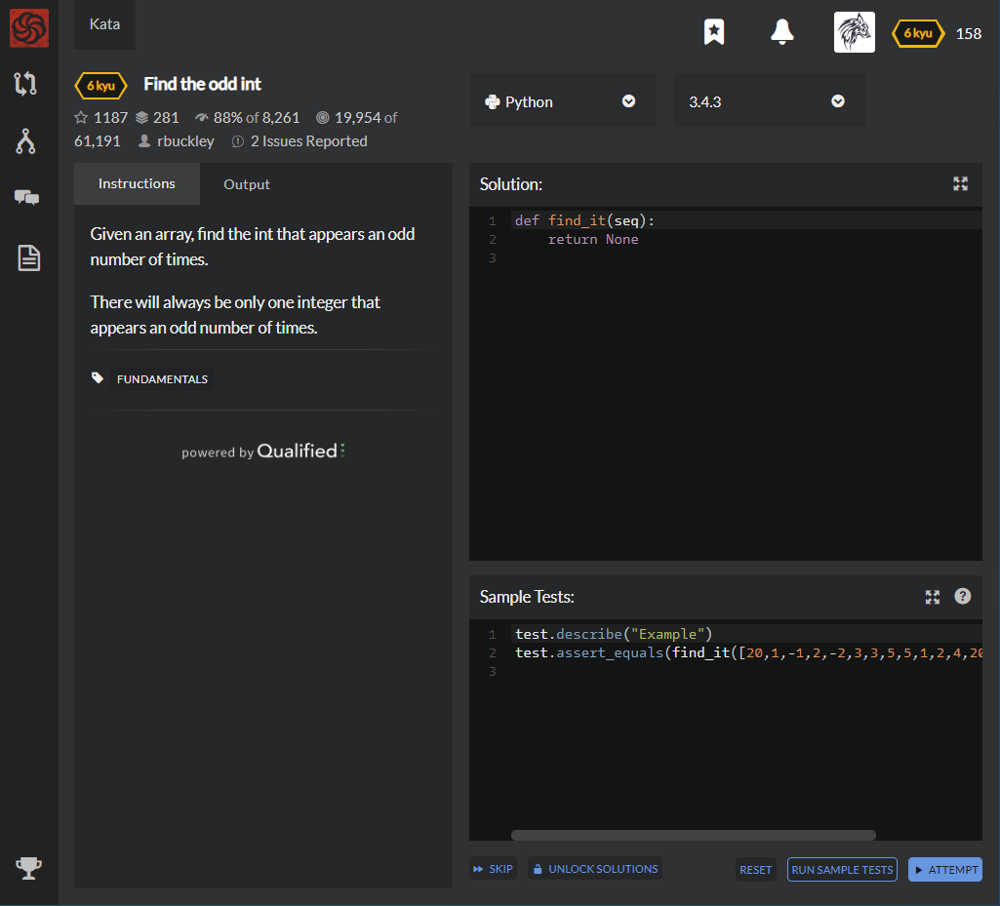

# [6 Kyu] Find the odd int




## Instructions

Given an array, find the int that appears an odd number of times.

There will always be only one integer that appears an odd number of times.


## Sample Test

```python
test.describe("Example")
test.assert_equals(find_it([20,1,-1,2,-2,3,3,5,5,1,2,4,20,4,-1,-2,5]), 5)
```


## My solution

```python
def find_it(seq):
    return [seq[list(map(seq.count,seq)).index(x)] for x in list(map(seq.count,seq)) if x%2][0]
```


## Test Results

Test Passed

Test Passed

Test Passed

You have passed all of the tests! :)

---------

Time: 753ms Passed: 6 Failed: 0


## Best Solution

```python
import operator

def find_it(xs):
    return reduce(operator.xor, xs)
```

Because only one integer appears and odd number of times, the others appears even number of times. But when XOR calculation is taken even number of times, it's result will be 0.

That is, the only one integer survive and will be the integer that appears odd number of times. 

`xor(1,1) = 0`

`xor(2,2,7,7) = 0`

`xor(3,3,3) = 3`

so  `xor(3,3,5,5,6,6,7,7,3)`  will be  `3`


Sooooo Clever..


## The things I got

**lambda *arguments* : *expression* ** : a small anonymous function that can take any number of arguments, but can only have one expression.

```python
>>> x = lambda a : a + 10
>>> x(5)
15

>>> x = lambda a,b : a * b
>>> x(5,6)
30
```

It is usually used to express functional programming clearly. 

```python
## Without lambda
>>> def power(x) :
...    return x**2
>>> list(map(power,[0,1,2,3,4]))
[0, 1, 4, 9, 16]

## With lambda
>>> list(map(lambda x: x ** 2,[0,1,2,3,4]))
[0, 1, 4, 9, 16]
```

Also, It can used with anonymous function that isn't justified yet.

```python
## Without lambda
>>> def f(g,a,b):
    	return g(a,b)

>>> def g(x,y):
    	return x*y
    
>>> f(g,1,2)
2


## With lambda
>>> def f(g,a,b)
		return g(a,b)

>>> f(lambda a,b : a*b, 2,3)
```


**reduce(*function*, *iterable*, *initializer*)** : reduce() continually applies the function to the iterable and returns a single value.


  


```python
>>> from functools import reduce
>>> reduce(lambda x, y: x+y, range(1,101))
5050


>>> reduce(lambda a,b : a if (a>b) else b, [34, 76, 29, 96, 68])
96


>>> def factorial(n):
    	return reduce(lambda x, y: x*y, range(1, n+1))
>>> factorial(6)
720
```


**Operator module** : provide all python operator by function form so no need to use lambda.

```python
## With lambda
>>> from function tools import reduce
>>> reduce(lambda a,b : a^b, range(1,6))
1

## With for-in statement
>>> n=0
>>> for i in range(6) : 
 	   n^= i
>>> n
1

## With operator
>>> reduce(operator.xor, range(6))
```


**Bitwise Operators** 

a = 60, b = 13 이라 가정한다.

a = 0011 1100

b = 0000 1101

| Operator | Description                                                  | Example                   |
| :------- | :----------------------------------------------------------- | :------------------------ |
| &        | AND 연산. 둘다 참일때만 만족                                 | (a & b) = 12 → 0000 1100  |
| \|       | OR 연산. 둘 중 하나만 참이여도 만족                          | (a \| b) = 61 → 0011 1101 |
| ^        | XOR 연산. 둘 중 하나만 참일 때 만족(두 값이 다를때)          | (a ^ b) = 49 → 0011 0001  |
| ~        | 보수 연산.                                                   | (~a) = -61 → 1100 0011    |
| <<       | 왼쪽 시프트 연산자. 변수의 값을 왼쪽으로 지정된 비트 수 만큼 이동 | a << 2 = 240 → 1111 0000  |
| >>       | 오른쪽 시프트 연산자. 변수의 값을 오른쪽으로 지정된 비트 수 만큼 이동 | a >> 2 = 15 → 0000 1111   |


study with [Python Course - Lambda, reduce](https://www.python-course.eu/python3_lambda.php), [codepractice - reduce](https://codepractice.tistory.com/86), [wikidocs - lambda](https://wikidocs.net/64), [wikidocs - bitwise operator](https://wikidocs.net/1161), [전문가를 위한 파이썬](https://books.google.co.kr/books?id=NJpIDwAAQBAJ&pg=PA372&lpg=PA372&dq=파이썬+operator+모듈&source=bl&ots=elYWlNGMYq&sig=ACfU3U3Zxd4mdAsefB38uKFiKpZ9RY8gOA&hl=ko&sa=X&ved=2ahUKEwjrwuyzpcjjAhVQeXAKHfl2D3g4ChDoATAOegQICBAB#v=onepage&q=파이썬+operator+모듈&f=false), and [codewars - discussion](https://www.codewars.com/kata/reviews/56257b3f27e918efed00017c/groups/562b4088d9377354db000032)
