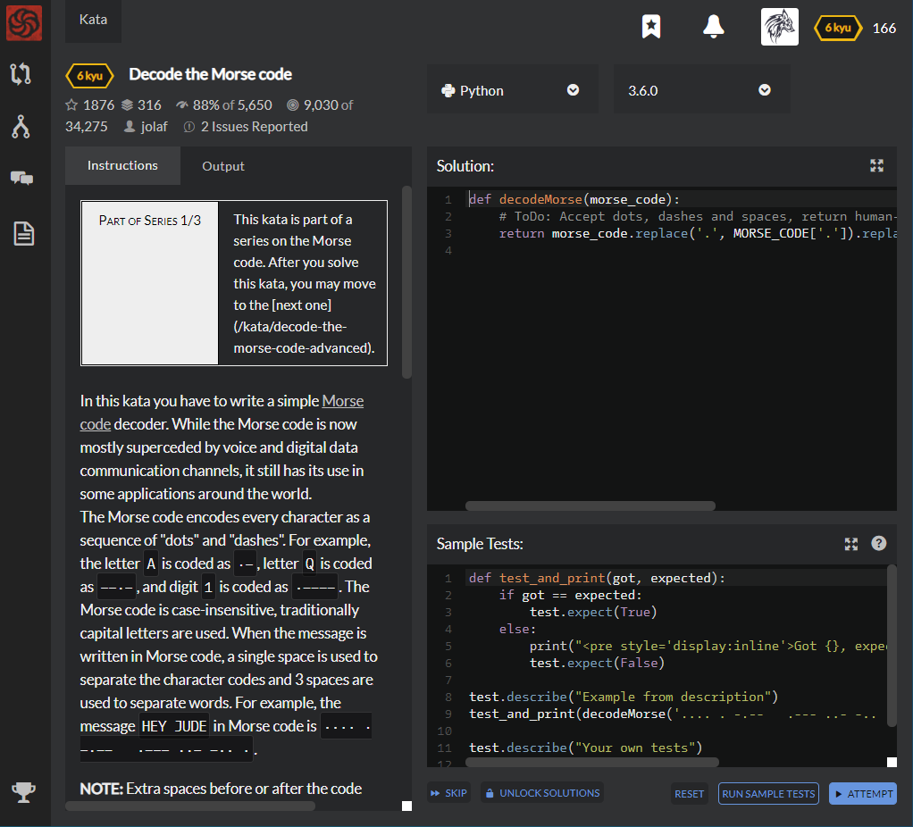

# [6 kyu] Decode the Morse code




## Instructions

In this kata you have to write a simple [Morse code](https://en.wikipedia.org/wiki/Morse_code)

The Morse code encodes every character as a sequence of "dots" and "dashes". For example, the letter `A` is coded as `·−`, letter `Q` is coded as `−−·−`, and digit `1` is coded as `·−−−−`. The Morse code is case-insensitive, traditionally capital letters are used. When the message is written in Morse code, a single space is used to separate the character codes and 3 spaces are used to separate words. For example, the message `HEY JUDE` in Morse code is `···· · −·−−   ·−−− ··− −·· ·`.

**NOTE :** Extra spaces before or after the code have no meaning and should be ignored.

In addition to letters, digits and some punctuation, there are some special service codes, the most notorious of those is the international distress signal [SOS](https://en.wikipedia.org/wiki/SOS) (that was first issued by [Titanic](https://en.wikipedia.org/wiki/RMS_Titanic)), that is coded as `···−−−···`. These special codes are treated as single special characters, and usually are transmitted as separate words.

Your task is to implement a function that would take the morse code as input and return a decoded human-readable string.

For example:

```python
decodeMorse('.... . -.--   .--- ..- -.. .')
#should return "HEY JUDE"
```

**NOTE :** For coding purposes you have to use ASCII characters `.` and `-`, not Unicode characters.

The Morse code table is preloaded for you as a dictionary, feel free to use it:

Python : `MORSE_CODE['.--']`

All the test strings would contain valid Morse code, so you may skip checking for errors and exceptions. In C#, tests will fail if the solution code throws an exception, please keep that in mind. This is mostly because otherwise the engine would simply ignore the tests, resulting in a "valid" solution.

Good luck!

After you complete this kata, you may try yourself at [Decode the Morse code, advanced](http://www.codewars.com/kata/decode-the-morse-code-advanced).


## Sample Test

```python
def test_and_print(got, expected):
    if got == expected:
        test.expect(True)
    else:
        print("<pre style='display:inline'>Got {}, expected {}</pre>".format(got, expected))
        test.expect(False)

test.describe("Example from description")
test_and_print(decodeMorse('.... . -.--   .--- ..- -.. .'), 'HEY JUDE')

test.describe("Your own tests")
# Add more tests here
```


## My solution

```python
def decodeMorse(morse_code):
    temp = [ x if x is not '' else ' ' for x in morse_code.replace('  ',' ').split(' ')]
    return ''.join([MORSE_CODE[x] if x is not ' ' else x for x in temp]).strip()
```

First, Erase all of empty space ' ' except spaces that exist in human-readable string

Second, Decode each categorized code but except space, except space just return itself


## Test Results

Test Passed

Test Passed

Test Passed

You have passed all of the tests! :)

---------

Time: 770ms Passed: 12 Failed: 0


## Best Solution

```python
def decodeMorse(morseCode):
    return ' '.join(''.join(MORSE_CODE[letter] for letter in word.split(' ')) for word in morseCode.strip().split('   '))
```


## The things I got

**string.lstrip()** : Erase empty space of left side

**string.rstrip()** : Erase empty space of right side

**string.strip()** : Erase empty space of both side

```python
>>> a = " hi "

>>> a.lstrip()
'hi '

>>> a.rstrip()
' hi'

>>> a.strip()
'hi'
```


study with [wikidocs - strip](https://wikidocs.net/13), [tariat - for if statement](https://dojang.io/mod/page/view.php?id=2299).