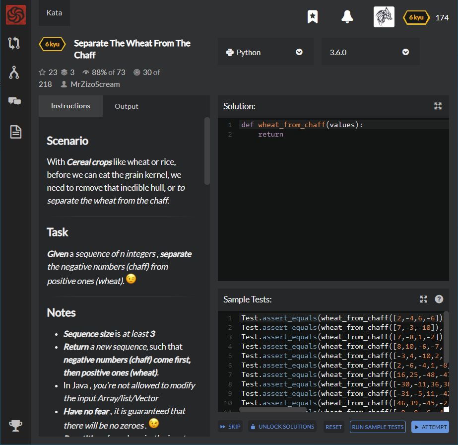

# [6 Kyu] Separate The Wheat From The Chaff




## Instructions

### Scenario

With **Cereal crops** like wheat or rice, before we can eat the grain kernel, we need to remove that inedible hull, or *to separate the wheat from the chaff*.

### Task

**Given** a *sequence of n integers* , **separate** the negative numbers (chaff) from positive ones (wheat). 

### Notes

- **Sequence size** is *at least* **3**
- **Return** *a new sequence*, such that **negative numbers (chaff) come first, then positive ones (wheat)**.
- In Java , *you're not allowed to modify the input Array/list/Vector*
- **Have no fear** , *it is guaranteed that there will be no zeros* . 
- **Repetition** of numbers in *the input sequence could occur* , so **duplications are included when separating**.
- If a misplaced *positive* number is found in the front part of the sequence, replace it with the last misplaced negative number (the one found near the end of the input). The second misplaced positive number should be swapped with the second last misplaced negative number. *Negative numbers found at the head (beginning) of the sequence* , **should be kept in place** .


### Input >> Output Examples

```python
wheatFromChaff ({7, -8, 1 ,-2}) ==> return ({-2, -8, 1, 7}) 
```

- **Since** `7` is a **positive number** , it should not be located at the beginning so it needs to be swapped with the **last negative number** `-2`.

  

```python
wheatFromChaff ({-31, -5, 11 , -42, -22, -46, -4, -28 }) ==> return ({-31, -5,- 28, -42, -22, -46 , -4, 11})
```

- **Since**, `{-31, -5}` are **negative numbers** *found at the head (beginning) of the sequence* , *so we keep them in place* .

- Since `11` is a positive number, it's replaced by the last negative which is `-28` , and so on till separation is complete.

  

```python
wheatFromChaff ({-25, -48, -29, -25, 1, 49, -32, -19, -46, 1}) ==> return ({-25, -48, -29, -25, -46, -19, -32, 49, 1, 1})
```

- **Since** `{-25, -48, -29, -25}` are **negative numbers** *found at the head (beginning) of the input* , *so we keep them in place* .
- Since `1` is a positive number, it's replaced by the last negative which is `-46` , and so on till separation is complete.
- Remember, *duplications are included when separating* , that's why the number `1` appeared twice at the end of the output.


## Sample Test

```python
Test.assert_equals(wheat_from_chaff([2,-4,6,-6]), [-6,-4,6,2])
Test.assert_equals(wheat_from_chaff([7,-3,-10]), [-10,-3,7])
Test.assert_equals(wheat_from_chaff([7,-8,1,-2]), [-2,-8,1,7])
Test.assert_equals(wheat_from_chaff([8,10,-6,-7,9]), [-7,-6,10,8,9])
Test.assert_equals(wheat_from_chaff([-3,4,-10,2,-6]), [-3,-6,-10,2,4])
Test.assert_equals(wheat_from_chaff([2,-6,-4,1,-8,-2]), [-2,-6,-4,-8,1,2])
Test.assert_equals(wheat_from_chaff([16,25,-48,-47,-37,41,-2]), [-2,-37,-48,-47,25,41,16])
Test.assert_equals(wheat_from_chaff([-30,-11,36,38,34,-5,-50]), [-30,-11,-50,-5,34,38,36])
Test.assert_equals(wheat_from_chaff([-31,-5,11,-42,-22,-46,-4,-28]), [-31,-5,-28,-42,-22,-46,-4,11])
Test.assert_equals(wheat_from_chaff([46,39,-45,-2,-5,-6,-17,-32,17]), [-32,-17,-45,-2,-5,-6,39,46,17])
Test.assert_equals(wheat_from_chaff([-9,-8,-6,-46,1,-19,44]), [-9,-8,-6,-46,-19,1,44])
Test.assert_equals(wheat_from_chaff([-37,-10,-42,19,-31,-40,-45,33]), [-37,-10,-42,-45,-31,-40,19,33])
Test.assert_equals(wheat_from_chaff([-25,-48,-29,-25,1,49,-32,-19,-46,1]), [-25,-48,-29,-25,-46,-19,-32,49,1,1])
Test.assert_equals(wheat_from_chaff([-7,-35,-46,-22,46,43,-44,-14,34,-5,-26]), [-7,-35,-46,-22,-26,-5,-44,-14,34,43,46])
Test.assert_equals(wheat_from_chaff([-46,-50,-28,-45,-27,-40,10,35,34,47,-46,-24]), [-46,-50,-28,-45,-27,-40,-24,-46,34,47,35,10])
Test.assert_equals(wheat_from_chaff([-33,-14,16,31,4,41,-10,-3,-21,-12,-45,41,-19]), [-33,-14,-19,-45,-12,-21,-10,-3,41,4,31,41,16])
Test.assert_equals(wheat_from_chaff([-17,7,-12,10,4,-8,-19,-24,40,31,-29,21,-45,1]), [-17,-45,-12,-29,-24,-8,-19,4,40,31,10,21,7,1])
Test.assert_equals(wheat_from_chaff([-16,44,-7,-31,9,-43,-44,-18,50,39,-46,-24,3,-34,-27]), [-16,-27,-7,-31,-34,-43,-44,-18,-24,-46,39,50,3,9,44])
```


## My solution

```python
def wheat_from_chaff(values):
    pos, neg = [], []
    for i,x in enumerate(values) :
        if x > 0 : pos.append(i)
        else : neg.append(i)
    
    i=0
    while True :
        try :
            pos_n = pos.pop(0)
            neg_n = neg.pop()
            
            if pos_n > neg_n : break
                
            temp = values[pos_n]
            values[pos_n] = values[neg_n]
            values[neg_n] = temp
            
            i+=1
            
        except IndexError :
            break
            
    return values
```


## Test Results

Test Passed

Test Passed

Test Passed

You have passed all of the tests! :)

---------

Time: 11302ms Passed: 168 Failed: 0


## Best Solution

```python
def wheat_from_chaff(values):
    i, j = 0, len(values) - 1
    vals = values[:]
    while i < j:
        if vals[i] < 0:
            i += 1
        elif vals[j] > 0:
            j -= 1
        else:
            vals[i], vals[j] = vals[j], vals[i]
            i, j = i + 1, j - 1
    return vals
```


## The things I got

**List[i], List[j] = List[j], List[i]** : Interchange items of list simultaneously

