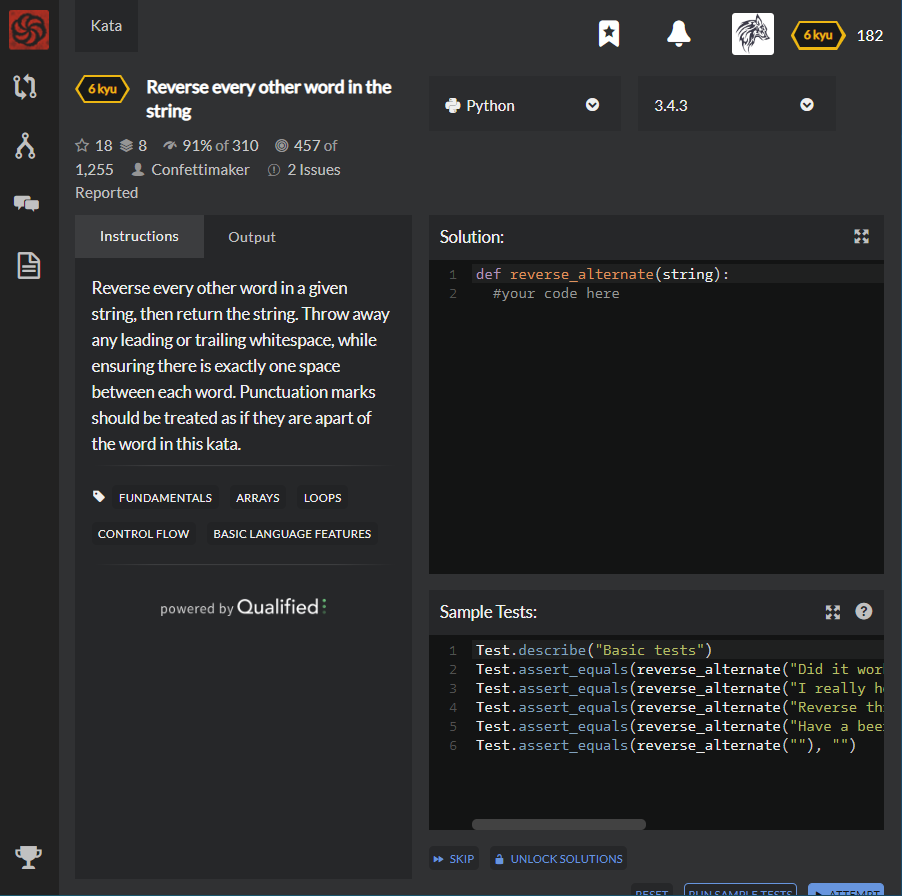

# [6 Kyu] Reverse every other word in the string




## Instructions

Reverse every other word in a given string, then return the string. Throw away any leading or trailing whitespace, while ensuring there is exactly one space between each word. Punctuation marks should be treated as if they are apart of the word in this kata.


## Sample Test

```python
Test.describe("Basic tests")
Test.assert_equals(reverse_alternate("Did it work?"), "Did ti work?")
Test.assert_equals(reverse_alternate("I really hope it works this time..."), "I yllaer hope ti works siht time...")
Test.assert_equals(reverse_alternate("Reverse this string, please!"), "Reverse siht string, !esaelp")
Test.assert_equals(reverse_alternate("Have a beer"), "Have a beer")
Test.assert_equals(reverse_alternate(""), "")
```


## My solution

```python
def reverse_alternate(string):
    result=''
    for i, x in enumerate(list(filter(lambda a : a is not '' , string.split(' ')))):
        if i%2 :
            result += x[::-1] + " "
        else : result += x + " "
        
    return result.strip()
```


## Test Results

Test Passed

Test Passed

Test Passed

You have passed all of the tests! :)

---------

Time: 806ms Passed: 47 Failed: 0


## Best Solution

```python
def reverse_alternate(string):
    return " ".join(y[::-1] if x%2 else y for x,y in enumerate(string.split()))
```


## The things I got

**enumerate(list)** : return enumerate object that contains index and index's value

```python
>>> for i, name in enumerate(['body', 'foo', 'bar']):
...     print(i, name)
...
0 body
1 foo
2 bar
```


study with [wikidocs](https://wikidocs.net/32#enumerate)