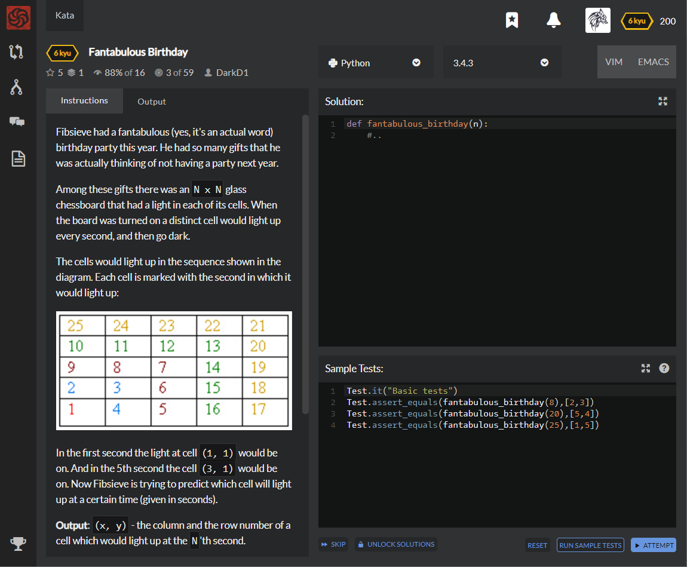

# [6 Kyu] Fantabulous Birthday




## Instructions

Fibsieve had a fantabulous (yes, it's an actual word) birthday party this year. He had so many gifts that he was actually thinking of not having a party next year.

Among these gifts there was an `N x N` glass chessboard that had a light in each of its cells. When the board was turned on a distinct cell would light up every second, and then go dark.

The cells would light up in the sequence shown in the diagram. Each cell is marked with the second in which it would light up:


In the first second the light at cell `(1, 1)` would be on. And in the 5th second the cell `(3, 1)` would be on. Now Fibsieve is trying to predict which cell will light up at a certain time (given in seconds).

**Output**: `(x, y)` - the column and the row number of a cell which would light up at the `N`'th second.

### Notes

- Column and row indices are `1-based`.

- `x` is the column index, and `y` is the row index.

- The cells are indexed from bottom-left corner.

- `N` will be large.  

    

    

## Sample Test

```python
Test.it("Basic tests")
Test.assert_equals(fantabulous_birthday(8),[2,3])
Test.assert_equals(fantabulous_birthday(20),[5,4])
Test.assert_equals(fantabulous_birthday(25),[1,5])
```


## My solution

```python
def fantabulous_birthday(n):
    start1 = int(n**.5)
    end1 = start1+1
    
    start = start1**2+1
    end = end1**2+1
    middle = (start+end)//2
    
    length = end - start
    if n in range(start,middle) : coor = [end1, n-start+1]
    else : coor = [end-n, end1]
    if start1%2 : coor[1],coor[0] = coor[0],coor[1]
    if n**.5%1 ==0 :
        min, max = sorted(coor)
        if min == coor[0] :
            coor[0] = 1
            coor[1] = coor[1]//2-1
        else : 
            coor[0] = coor[0]//2-1
            coor[1] = 1
        
    
    return coor
```


## Test Results

Test Passed

Test Passed

Test Passed

You have passed all of the tests! :)

---------

Time: 740ms Passed: 1118 Failed: 0


## Best Solution

```python
from math import ceil,sqrt

def fantabulous_birthday(n):
    a = ceil(sqrt(n))
    b = a*a-a+1
    c = a-abs(n-b)
    return [a,c] if (n < b) ^ (a % 2) == 0 else [c,a]
```


## The things I got

