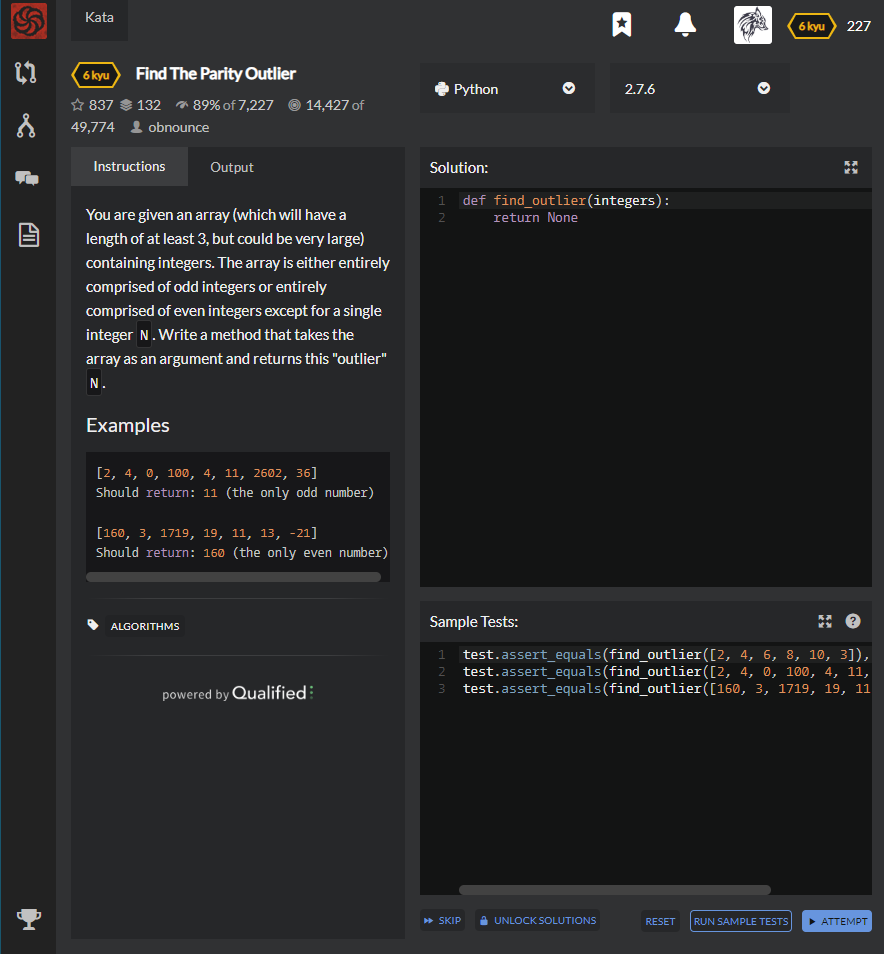

# [6 Kyu] Find The Parity Outlier




## Instructions

You are given an array (which will have a length of at least 3, but could be very large) containing integers. The array is either entirely comprised of odd integers or entirely comprised of even integers except for a single integer `N`. Write a method that takes the array as an argument and returns this "outlier" `N`.

## Examples

```python
[2, 4, 0, 100, 4, 11, 2602, 36]
Should return: 11 (the only odd number)

[160, 3, 1719, 19, 11, 13, -21]
Should return: 160 (the only even number)
```


## Sample Test

```python
test.assert_equals(find_outlier([2, 4, 6, 8, 10, 3]), 3)
test.assert_equals(find_outlier([2, 4, 0, 100, 4, 11, 2602, 36]), 11)
test.assert_equals(find_outlier([160, 3, 1719, 19, 11, 13, -21]), 160)
```


## My solution

```python
def find_outlier(integers):
    return list(filter(lambda a : a%2!=1,integers))[0] 
		if len(list(filter(lambda a : a%2!=1,integers)))==1
    	else list(filter(lambda a : a%2,integers))[0]
```


## Test Results

Test Passed

Test Passed

Test Passed

You have passed all of the tests! :)

---------

Time: 738ms Passed: 35 Failed: 0


## Best Solution

```python
def find_outlier(int):
    odds = [x for x in int if x%2!=0]
    evens= [x for x in int if x%2==0]
    return odds[0] if len(odds)<len(evens) else evens[0]
```


## The things I got

