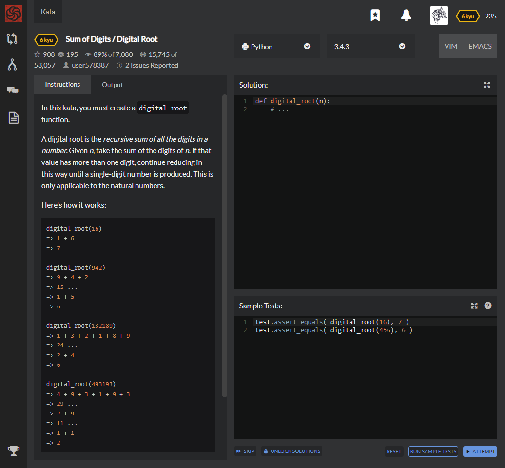

# [6 Kyu] Sum of Digits / Digital Root




## Instructions

In this kata, you must create a `digital root`function.

A digital root is the *recursive sum of all the digits in a number.* Given *n*, take the sum of the digits of *n*. If that value has more than one digit, continue reducing in this way until a single-digit number is produced. This is only applicable to the natural numbers.

Here's how it works:

```python
digital_root(16)
=> 1 + 6
=> 7

digital_root(942)
=> 9 + 4 + 2
=> 15 ...
=> 1 + 5
=> 6

digital_root(132189)
=> 1 + 3 + 2 + 1 + 8 + 9
=> 24 ...
=> 2 + 4
=> 6

digital_root(493193)
=> 4 + 9 + 3 + 1 + 9 + 3
=> 29 ...
=> 2 + 9
=> 11 ...
=> 1 + 1
=> 2
```


## Sample Test

```python
test.assert_equals( digital_root(16), 7 )
test.assert_equals( digital_root(456), 6 )
```


## My solution

```python
def digital_root(n):
    while n//10 : n = sum([int(x) for x in str(n)])
    return n
```


## Test Results

Test Passed

Test Passed

Test Passed

You have passed all of the tests! :)

---------

Time: 778ms Passed: 6 Failed: 0


## Best Solution

```python
def digital_root(n):
  return n%9 or n and 9
```

n = k * 10 + r = k * 9 + k + r

**We should know k+r**

so, k + r = n % 9

if n % 9 == 0 : k + r = 0 or 9


## The things I got

