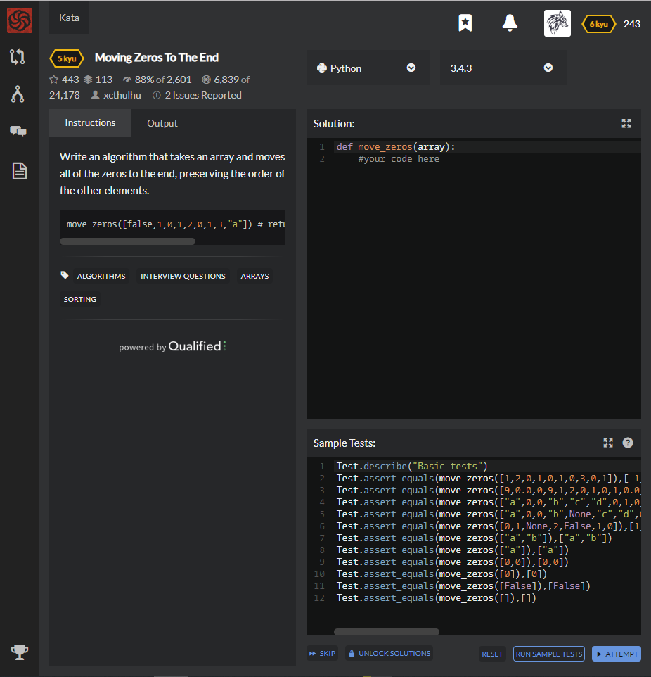

# [5 Kyu] Moving Zeros To The End




## Instructions

 Write an algorithm that takes an array and moves all of the zeros to the end, preserving the order of the other elements.

```python
move_zeros([false,1,0,1,2,0,1,3,"a"]) # returns[false,1,1,2,1,3,"a",0,0]
```


## Sample Test

```python
Test.describe("Basic tests")
Test.assert_equals(move_zeros([1,2,0,1,0,1,0,3,0,1]),[ 1, 2, 1, 1, 3, 1, 0, 0, 0, 0 ])
Test.assert_equals(move_zeros([9,0.0,0,9,1,2,0,1,0,1,0.0,3,0,1,9,0,0,0,0,9]),[9,9,1,2,1,1,3,1,9,9,0,0,0,0,0,0,0,0,0,0])
Test.assert_equals(move_zeros(["a",0,0,"b","c","d",0,1,0,1,0,3,0,1,9,0,0,0,0,9]),["a","b","c","d",1,1,3,1,9,9,0,0,0,0,0,0,0,0,0,0])
Test.assert_equals(move_zeros(["a",0,0,"b",None,"c","d",0,1,False,0,1,0,3,[],0,1,9,0,0,{},0,0,9]),["a","b",None,"c","d",1,False,1,3,[],1,9,{},9,0,0,0,0,0,0,0,0,0,0])
Test.assert_equals(move_zeros([0,1,None,2,False,1,0]),[1,None,2,False,1,0,0])
Test.assert_equals(move_zeros(["a","b"]),["a","b"])
Test.assert_equals(move_zeros(["a"]),["a"])
Test.assert_equals(move_zeros([0,0]),[0,0])
Test.assert_equals(move_zeros([0]),[0])
Test.assert_equals(move_zeros([False]),[False])
Test.assert_equals(move_zeros([]),[])
```


## My solution

```python
def move_zeros(array):
    k = list(filter(lambda x : x!=0 or type(x) != int and type(x) != float,array))
    k.extend([0 for i in range(len(array)-len(k))])
    return k
```


## Test Results

Test Passed

Test Passed

Test Passed

You have passed all of the tests! :)

---------

Time: 737ms Passed: 21 Failed: 0


## Best Solution

```python
def move_zeros(arr):
    l = [i for i in arr if isinstance(i, bool) or i!=0]
    return l+[0]*(len(arr)-len(l))
```

```python
def move_zeros(array):
    return sorted(array, key=lambda x: x==0 and type(x) is not bool)
```


## The things I got

**lambda + if** : The way how to express conditional statement with lambda

`lambda`  *parameter*  :  *expression1*  `if`  *statement*  `else`  *expression2*

```python
>>> a = [1, 2, 3, 4, 5, 6, 7, 8, 9, 10]
>>> list(map(lambda x: str(x) if x % 3 == 0 else x, a))
[1, 2, '3', 4, 5, '6', 7, 8, '9', 10]
```


**isinstance(object, class)** : return boolean if input object is instance of its class.

```python
>>> class Person: pass
...
>>> a = Person()
>>> isinstance(a, Person)
True
```


**sorted(list, key)** : sort the list that executed from key function.

```python
>>> sorted("This is a test string from Andrew".split(), key=str.lower)
['a', 'Andrew', 'from', 'is', 'string', 'test', 'This']
```

First, execute key function

`'this is a test string from andrew'`

Second, proceed sort

`['a', 'andrew', 'from', 'is', 'string', 'test', 'this']`

Return original type of values

`['a', 'Andrew', 'from', 'is', 'string', 'test', 'This']`


study with [코딩도장](https://dojang.io/mod/page/view.php?id=2360), [wikidocs - isinstance](https://wikidocs.net/32#isinstance), and [초보몽키 - sorted](https://wayhome25.github.io/python/2017/03/07/key-function/).