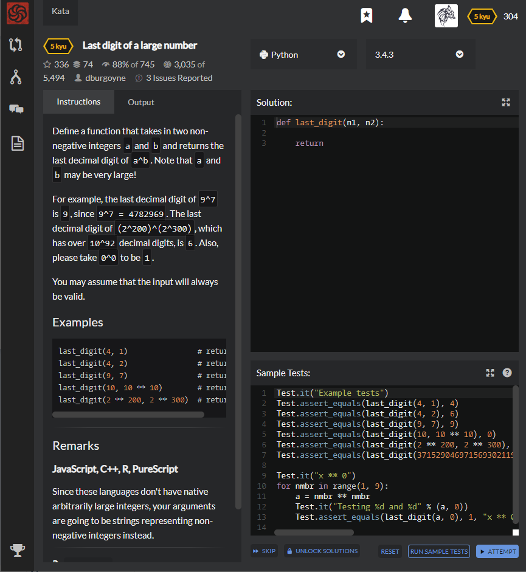

# [5 Kyu] Last digit of a large number




## Instructions

 Define a function that takes in two non-negative integers `a` and `b` and returns the last decimal digit of `a^b`. Note that `a` and `b` may be very large!

For example, the last decimal digit of `9^7` is `9`, since `9^7 = 4782969`. The last decimal digit of `(2^200)^(2^300)`, which has over `10^92` decimal digits, is `6`. Also, please take `0^0` to be `1`.

You may assume that the input will always be valid.

### Examples

```python
last_digit(4, 1)                # returns 4
last_digit(4, 2)                # returns 6
last_digit(9, 7)                # returns 9
last_digit(10, 10 ** 10)        # returns 0
last_digit(2 ** 200, 2 ** 300)  # returns 6
```


## Sample Test

```python
Test.it("Example tests")
Test.assert_equals(last_digit(4, 1), 4)
Test.assert_equals(last_digit(4, 2), 6)
Test.assert_equals(last_digit(9, 7), 9)
Test.assert_equals(last_digit(10, 10 ** 10), 0)
Test.assert_equals(last_digit(2 ** 200, 2 ** 300), 6)
Test.assert_equals(last_digit(3715290469715693021198967285016729344580685479654510946723, 68819615221552997273737174557165657483427362207517952651), 7)

Test.it("x ** 0")
for nmbr in range(1, 9):
    a = nmbr ** nmbr
    Test.it("Testing %d and %d" % (a, 0))
    Test.assert_equals(last_digit(a, 0), 1, "x ** 0 must return 1")
```


## My solution

```python
def preprocess(n,i=1) :
    if i==0 : return 1
    n = n%10
    last={0:[0]}
    for j in range(1,10) :
        last[j]=[]
        [last[j].append(j**i%10) for i in range(1,10) if j**i%10 not in last[j]]
        
    return last[n][i%len(last[n])-1]

def last_digit(n1, n2) :
    return preprocess(preprocess(n1),n2)
```


## Test Results

Test Passed

Test Passed

Test Passed

You have passed all of the tests! :)

---------

Time: 783ms Passed: 57 Failed: 0


## Best Solution

```python
def last_digit(n1, n2):
    return (n1 % 10) ** (n2 % 4 + 4 * bool(n2)) % 10
```


## The things I got

**bool()** : Figuring out if the data is True of False.

```python
>>> bool([1,2,3])
True
>>> bool([])
False
>>> bool(0)
False
>>> bool(3)
True
```