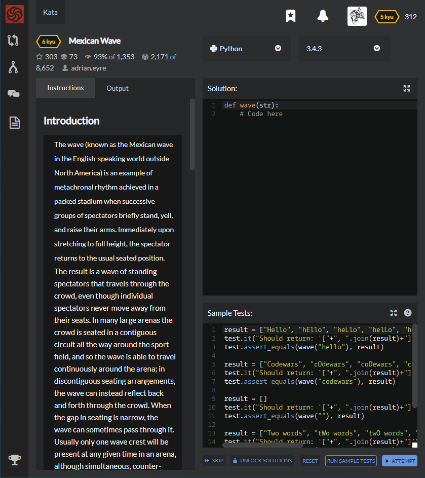

# [6 Kyu] Mexican Wave




## Instructions

|      | The wave (known as the Mexican wave in the English-speaking world outside North America) is an example of metachronal rhythm achieved in a packed stadium when successive groups of spectators briefly stand, yell, and raise their arms. Immediately upon stretching to full height, the spectator returns to the usual seated position. The result is a wave of standing spectators that travels through the crowd, even though individual spectators never move away from their seats. In many large arenas the crowd is seated in a contiguous circuit all the way around the sport field, and so the wave is able to travel continuously around the arena; in discontiguous seating arrangements, the wave can instead reflect back and forth through the crowd. When the gap in seating is narrow, the wave can sometimes pass through it. Usually only one wave crest will be present at any given time in an arena, although simultaneous, counter-rotating waves have been produced. (Source [Wikipedia](https://en.wikipedia.org/wiki/Wave_(audience))) |
| ---- | ------------------------------------------------------------ |
|      |                                                              |


### Task

|      | In this simple Kata your task is to create a function that turns a string into a Mexican Wave. You will be passed a string and you must return that string in an array where an uppercase letter is a person standing up. |
| ---- | ------------------------------------------------------------ |
|      |                                                              |

### Rules

|      | 1.  The input string will always be lower case but maybe empty. 2.  If the character in the string is whitespace then pass over it as if it was an empty seat. |
| ---- | ------------------------------------------------------------ |
|      |                                                              |

### Example

```ruby
wave("hello") => ["Hello", "hEllo", "heLlo", "helLo", "hellO"]
```

Good luck and enjoy!


## Sample Test

```python
result = ["Hello", "hEllo", "heLlo", "helLo", "hellO"]
test.it("Should return: '["+", ".join(result)+"]'")
test.assert_equals(wave("hello"), result)

result = ["Codewars", "cOdewars", "coDewars", "codEwars", "codeWars", "codewArs", "codewaRs", "codewarS"]
test.it("Should return: '["+", ".join(result)+"]'")
test.assert_equals(wave("codewars"), result)

result = []
test.it("Should return: '["+", ".join(result)+"]'")
test.assert_equals(wave(""), result)

result = ["Two words", "tWo words", "twO words", "two Words", "two wOrds", "two woRds", "two worDs", "two wordS"]
test.it("Should return: '["+", ".join(result)+"]'")
test.assert_equals(wave("two words"),result)

result = [" Gap ", " gAp ", " gaP "]
test.it("Should return: '["+", ".join(result)+"]'")
test.assert_equals(wave(" gap "), result)
```


## My solution

```python
def wave(string):
    return [(string[:i]+x.upper()+string[i+1:]) for i,x in enumerate(string) if x is not ' ']
```


## Test Results

Test Passed

Test Passed

Test Passed

You have passed all of the tests! :)

---------

Time: 968ms Passed: 100 Failed: 0


## Best Solution

```python
def wave(str):
    return [str[:i] + str[i].upper() + str[i+1:] for i in range(len(str)) if str[i].isalpha()]
```


## The things I got

**isalpha(string)** : check if the string is alphabet.

**isdigit(string)** : check if the string is digit.


study with [MKL's Database](https://m.blog.naver.com/PostView.nhn?blogId=lee95292&logNo=221201880034&proxyReferer=https%3A%2F%2Fwww.google.com%2F).