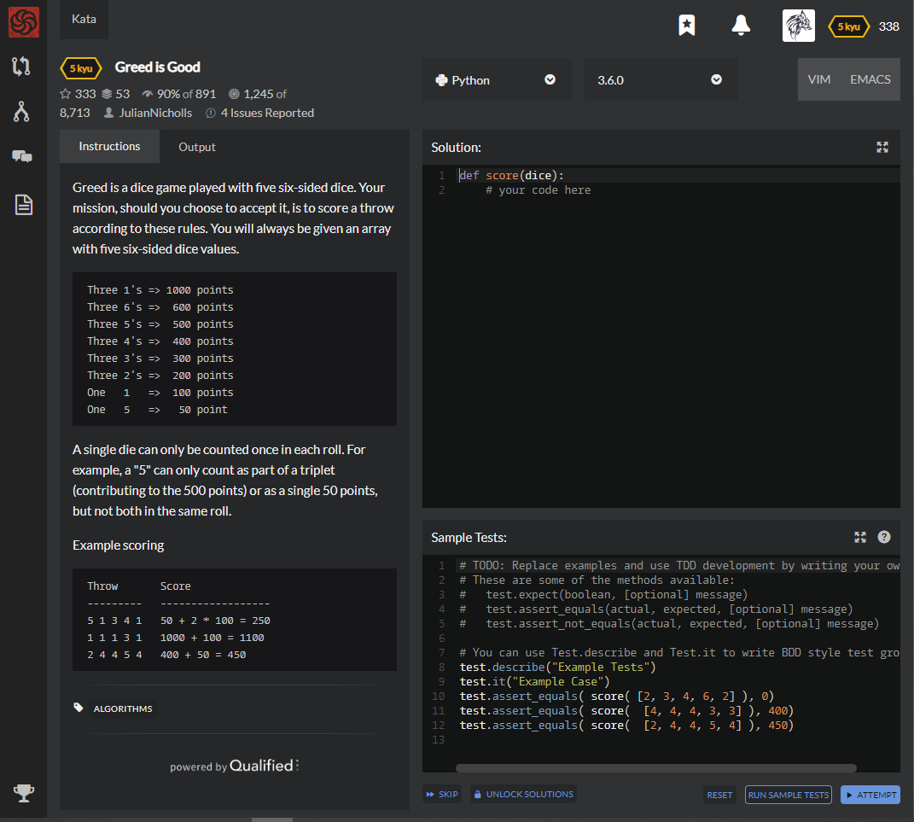

# [[5 Kyu] Greed is Good](https://www.codewars.com/kata/5270d0d18625160ada0000e4/train/python)




## Instructions

 Greed is a dice game played with five six-sided dice. Your mission, should you choose to accept it, is to score a throw according to these rules. You will always be given an array with five six-sided dice values.

```
 Three 1's => 1000 points
 Three 6's =>  600 points
 Three 5's =>  500 points
 Three 4's =>  400 points
 Three 3's =>  300 points
 Three 2's =>  200 points
 One   1   =>  100 points
 One   5   =>   50 point
```

A single die can only be counted once in each roll. For example, a "5" can only count as part of a triplet (contributing to the 500 points) or as a single 50 points, but not both in the same roll.

Example scoring

```python
 Throw       Score
 ---------   ------------------
 5 1 3 4 1   50 + 2 * 100 = 250
 1 1 1 3 1   1000 + 100 = 1100
 2 4 4 5 4   400 + 50 = 450
```


## Sample Test

```python
# TODO: Replace examples and use TDD development by writing your own tests
# These are some of the methods available:
#   test.expect(boolean, [optional] message)
#   test.assert_equals(actual, expected, [optional] message)
#   test.assert_not_equals(actual, expected, [optional] message)

# You can use Test.describe and Test.it to write BDD style test groupings
test.describe("Example Tests")
test.it("Example Case")
test.assert_equals( score( [2, 3, 4, 6, 2] ), 0)
test.assert_equals( score(  [4, 4, 4, 3, 3] ), 400)
test.assert_equals( score(  [2, 4, 4, 5, 4] ), 450)

```


## My solution

```python
def point(n,count):
    points = {
        1 : (100, 200, 1000, 1100, 1200,0),
        2 : (0, 0, 200, 200, 200,0),
        3 : (0, 0, 300, 300, 300,0),
        4 : (0, 0, 400, 400, 400,0),
        5 : (50, 100, 500, 550, 600,0),
        6 : (0, 0, 600, 600, 600,0)
    }
    return points[n][count-1]

def score(dice):
    return sum([point(i,dice.count(i)) for i in range(1,7)])
```


## Test Results

Test Passed

Test Passed

Test Passed

You have passed all of the tests! :)

---------

Time: 743ms Passed: 112 Failed: 0


## Best Solution

```python
def score(dice): 
  sum = 0
  counter = [0,0,0,0,0,0]
  points = [1000, 200, 300, 400, 500, 600]
  extra = [100,0,0,0,50,0]
  for die in dice: 
    counter[die-1] += 1
  
  for (i, count) in enumerate(counter):
    sum += (points[i] if count >= 3 else 0) + extra[i] * (count%3)

  return sum 
```


## The things I got

