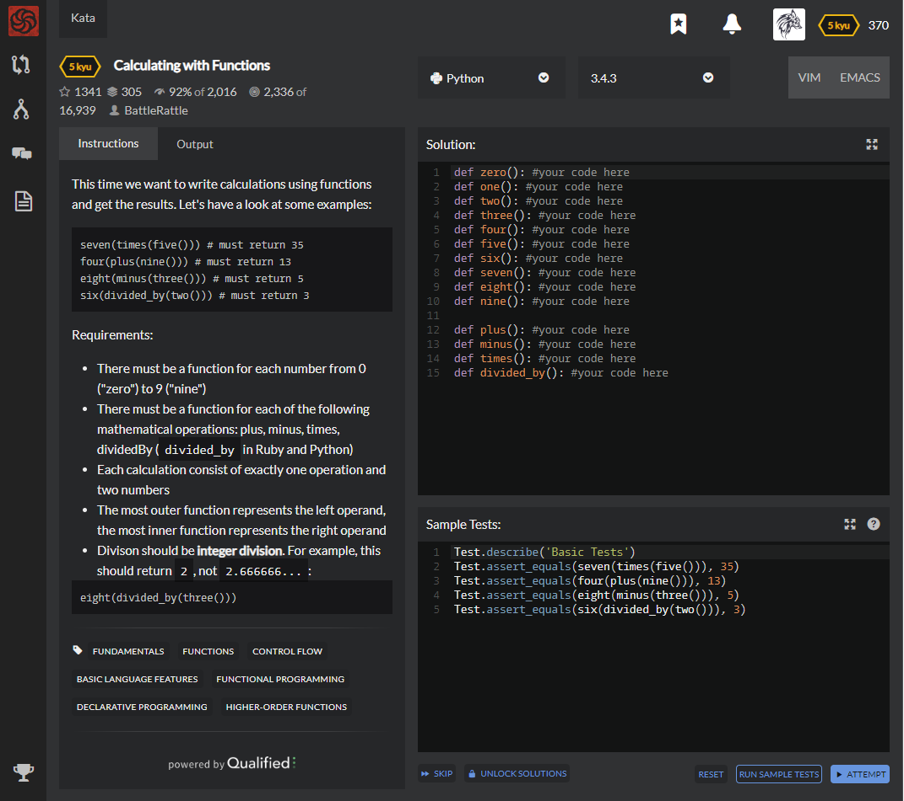

# [[5 Kyu] Calculating with Functions](https://www.codewars.com/kata/525f3eda17c7cd9f9e000b39/train/python)




## Instructions

 This time we want to write calculations using functions and get the results. Let's have a look at some examples:

```python
seven(times(five())) # must return 35
four(plus(nine())) # must return 13
eight(minus(three())) # must return 5
six(divided_by(two())) # must return 3
```

Requirements:

- There must be a function for each number from 0 ("zero") to 9 ("nine")
- There must be a function for each of the following mathematical operations: plus, minus, times, divided By (`divided_by` in Ruby and Python)
- Each calculation consist of exactly one operation and two numbers
- The most outer function represents the left operand, the most inner function represents the right operand
- Divison should be **integer division**. For example, this should return `2`, not `2.666666...`:

```python
eight(divided_by(three()))
```


## Sample Test

```python
Test.describe('Basic Tests')
Test.assert_equals(seven(times(five())), 35)
Test.assert_equals(four(plus(nine())), 13)
Test.assert_equals(eight(minus(three())), 5)
Test.assert_equals(six(divided_by(two())), 3)
```


## My solution

```python
def zero(k=0): return k if type(k) is int else k(0)
def one(k=1): return k if type(k) is int else k(1)
def two(k=2): return k if type(k) is int else k(2)
def three(k=3): return k if type(k) is int else k(3)
def four(k=4): return k if type(k) is int else k(4)
def five(k=5): return k if type(k) is int else k(5)
def six(k=6): return k if type(k) is int else k(6)
def seven(k=7): return k if type(k) is int else k(7)
def eight(k=8): return k if type(k) is int else k(8)
def nine(k=9): return k if type(k) is int else k(9)

def plus(n): return lambda x : x+n
def minus(n): return lambda x : x-n
def times(n): return lambda x : x*n
def divided_by(n): return lambda x : x//n
```


## Test Results

Test Passed

Test Passed

Test Passed

You have passed all of the tests! :)

---------

Time: 753ms Passed: 164 Failed: 0


## Best Solution

```python
def zero(f = None): return 0 if not f else f(0)
def one(f = None): return 1 if not f else f(1)
def two(f = None): return 2 if not f else f(2)
def three(f = None): return 3 if not f else f(3)
def four(f = None): return 4 if not f else f(4)
def five(f = None): return 5 if not f else f(5)
def six(f = None): return 6 if not f else f(6)
def seven(f = None): return 7 if not f else f(7)
def eight(f = None): return 8 if not f else f(8)
def nine(f = None): return 9 if not f else f(9)

def plus(y): return lambda x: x+y
def minus(y): return lambda x: x-y
def times(y): return lambda  x: x*y
def divided_by(y): return lambda  x: x/y
```


## The things I got

