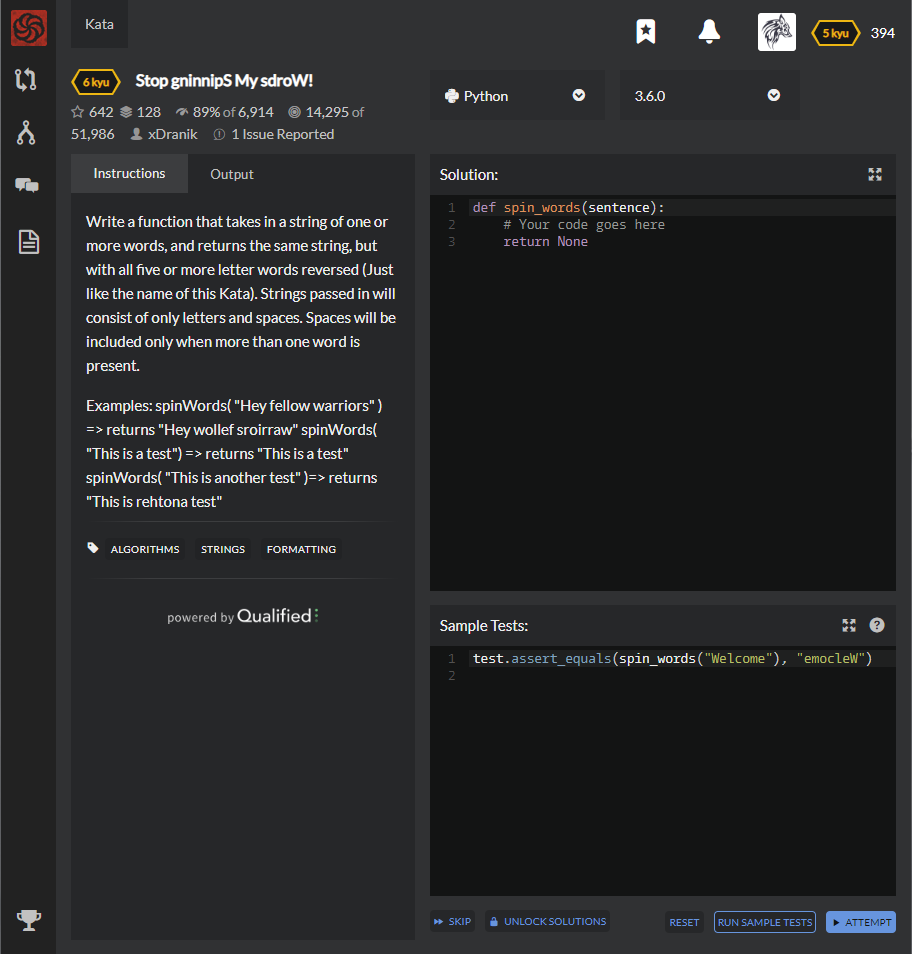

# [[6 Kyu] Stop gninnipS My sdroW!](https://www.codewars.com/kata/5264d2b162488dc400000001/train/python)




## Instructions

 Write a function that takes in a string of one or more words, and returns the same string, but with all five or more letter words reversed (Just like the name of this Kata). Strings passed in will consist of only letters and spaces. Spaces will be included only when more than one word is present.

Examples: spinWords( "Hey fellow warriors" ) => returns "Hey wollef sroirraw" spinWords( "This is a test") => returns "This is a test" spinWords( "This is another test" )=> returns "This is rehtona test"


## Sample Test

```python
test.assert_equals(spin_words("Welcome"), "emocleW")
```


## My solution

```python
def spin_words(sentence):
    return ' '.join([x[::-1] if len(x)>=5 else x for x in sentence.split(" ")])
```


## Test Results

Test Passed

Test Passed

Test Passed

You have passed all of the tests! :)

---------

Time: 781ms Passed: 24 Failed: 0


## Best Solution

```python
same
```


## The things I got

