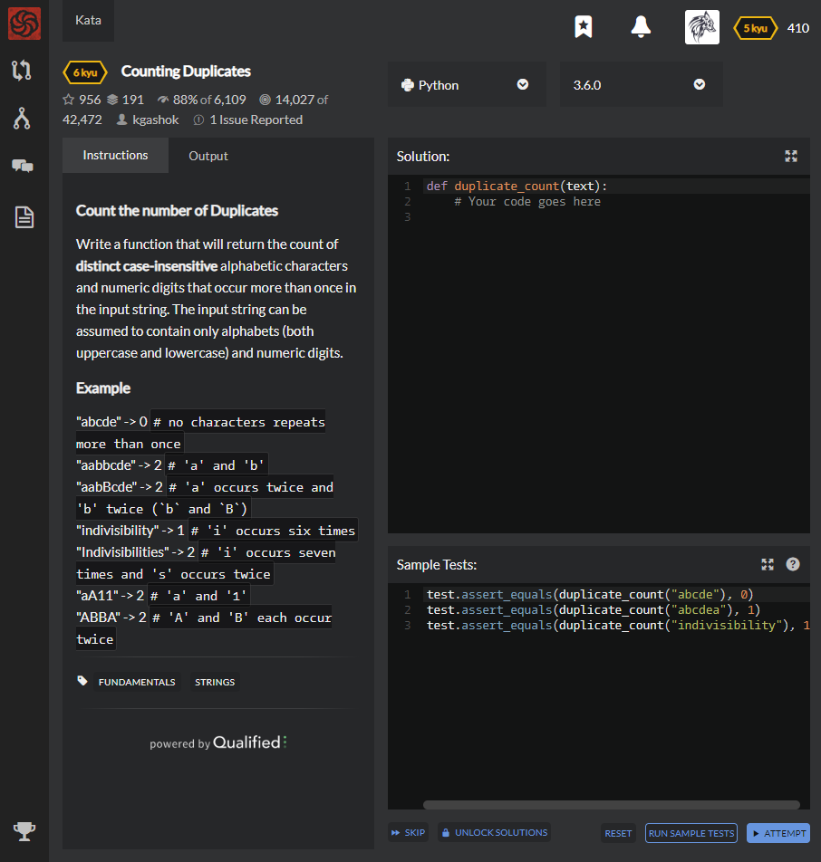

# [[6 Kyu] Counting Duplicates](https://www.codewars.com/kata/54bf1c2cd5b56cc47f0007a1/train/python)




## Instructions

 Count the number of Duplicates

Write a function that will return the count of **distinct case-insensitive** alphabetic characters and numeric digits that occur more than once in the input string. The input string can be assumed to contain only alphabets (both uppercase and lowercase) and numeric digits.

### Example

"abcde" -> 0 `# no characters repeats more than once`
"aabbcde" -> 2 `# 'a' and 'b'`
"aabBcde" -> 2 `# 'a' occurs twice and 'b' twice (`b` and `B`)`
"indivisibility" -> 1 `# 'i' occurs six times`
"Indivisibilities" -> 2 `# 'i' occurs seven times and 's' occurs twice`
"aA11" -> 2 `# 'a' and '1'`
"ABBA" -> 2 `# 'A' and 'B' each occur twice`


## Sample Test

```python
test.assert_equals(duplicate_count("abcde"), 0)
test.assert_equals(duplicate_count("abcdea"), 1)
test.assert_equals(duplicate_count("indivisibility"), 1)
```


## My solution

```python
import numpy as np

def duplicate_count(text):
    return np.sum(np.where(np.unique(np.array([x.upper() for x in text]),return_counts=True)[1]>=2,1,0))
```


## Test Results

Test Passed

Test Passed

Test Passed

You have passed all of the tests! :)

---------

Time: 1311ms Passed: 9 Failed: 0


## Best Solution

```python
def duplicate_count(s):
  return len([c for c in set(s.lower()) if s.lower().count(c)>1])
```


## The things I got

