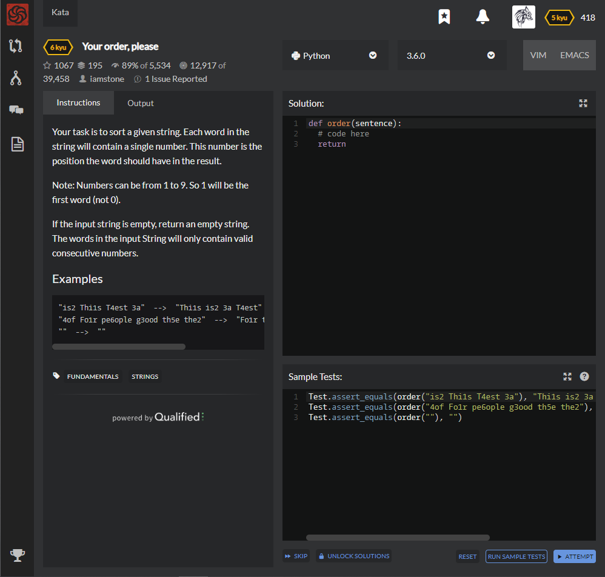

# [[6 Kyu] Your order, please](https://www.codewars.com/kata/55c45be3b2079eccff00010f/train/python)




## Instructions

 Your task is to sort a given string. Each word in the string will contain a single number. This number is the position the word should have in the result.

Note: Numbers can be from 1 to 9. So 1 will be the first word (not 0).

If the input string is empty, return an empty string. The words in the input String will only contain valid consecutive numbers.

### Examples

```python
"is2 Thi1s T4est 3a"  -->  "Thi1s is2 3a T4est"
"4of Fo1r pe6ople g3ood th5e the2"  -->  "Fo1r the2 g3ood 4of th5e pe6ople"
""  -->  ""
```


## Sample Test

```python
Test.assert_equals(order("is2 Thi1s T4est 3a"), "Thi1s is2 3a T4est")
Test.assert_equals(order("4of Fo1r pe6ople g3ood th5e the2"), "Fo1r the2 g3ood 4of th5e pe6ople")
Test.assert_equals(order(""), "")
```


## My solution

```python
def order(sentence):
    return ' '.join(sorted([x for x in sentence.split(' ')],key=lambda x : sorted(x)[:1]))
```


## Test Results

Test Passed

Test Passed

Test Passed

You have passed all of the tests! :)

---------

Time: 746ms Passed: 55 Failed: 0


## Best Solution

```python
def order(words):
  return ' '.join(sorted(words.split(), key=lambda w:sorted(w)))
```


## The things I got

