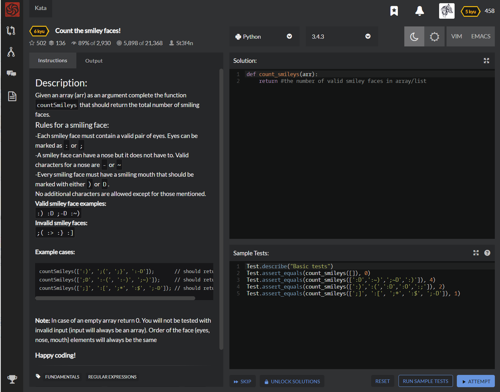

# [[6 Kyu] Count the smiley faces!](https://www.codewars.com/kata/583203e6eb35d7980400002a/train/python)




## Instructions

### Description

Given an array (arr) as an argument complete the function `countSmileys` that should return the total number of smiling faces.

### Rules for a smiling face

-Each smiley face must contain a valid pair of eyes. Eyes can be marked as `:` or `;`
-A smiley face can have a nose but it does not have to. Valid characters for a nose are `-` or `~`
-Every smiling face must have a smiling mouth that should be marked with either `)` or `D`.
No additional characters are allowed except for those mentioned.

**Valid smiley face examples : **`:) :D ;-D :~)`
**Invalid smiley faces : **`;( :> :} :]` 

### Example cases

```javascript
countSmileys([':)', ';(', ';}', ':-D']);       // should return 2;
countSmileys([';D', ':-(', ':-)', ';~)']);     // should return 3;
countSmileys([';]', ':[', ';*', ':$', ';-D']); // should return 1;
```


**Note:** In case of an empty array return 0. You will not be tested with invalid input (input will always be an array). Order of the face (eyes, nose, mouth) elements will always be the same

### Happy coding!


## Sample Test

```python
Test.describe("Basic tests")
Test.assert_equals(count_smileys([]), 0)
Test.assert_equals(count_smileys([':D',':~)',';~D',':)']), 4)
Test.assert_equals(count_smileys([':)',':(',':D',':O',':;']), 2)
Test.assert_equals(count_smileys([';]', ':[', ';*', ':$', ';-D']), 1)
```


## My solution

```python
def isSmile(string):
    eyes,noses,mouths = [':',';'],['-','~'],[')','D']
    if string[0] in eyes and string[1] in mouths : return True
    elif string[0] in eyes and string[1] in noses and string[2] in mouths : return True
    else : return False

def count_smileys(arr):
    return sum([isSmile(x) for x in arr])
```


## Test Results

Test Passed

Test Passed

Test Passed

You have passed all of the tests! :)

---------

Time: 725ms Passed: 104 Failed: 0


## Best Solution

```python
from re import findall
def count_smileys(arr):
    return len(list(findall(r"[:;][-~]?[)D]", " ".join(arr))))
```


## The things I got

**re module** : Regular expression module, need import

```python
import re
p = re.compile('[a-z]+') 
# compile must be done to use re method, which return pattern object

m = p.match('python')
# can use match method
```

```python
import re
m = re.match('regular expression', string source)
```

**findall** : return all possible cases of string that has matched pattern with regular expression

```python
>>> re.findall(r"app\w*","application orange apple banana")
['application','apple']
>>> re.findall('World','Hello World Hello World')
['World', 'World']
```

