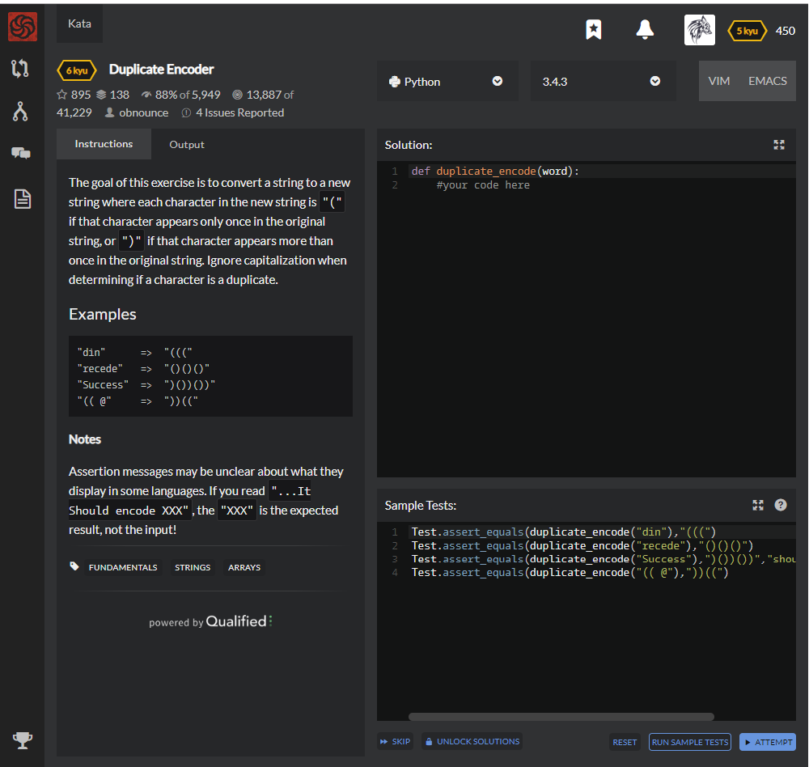

# [[6 Kyu] Duplicate Encoder](https://www.codewars.com/kata/54b42f9314d9229fd6000d9c/train/python)




## Instructions

The goal of this exercise is to convert a string to a new string where each character in the new string is `"("`if that character appears only once in the original string, or `")"` if that character appears more than once in the original string. Ignore capitalization when determining if a character is a duplicate.

### Examples

```
"din"      =>  "((("
"recede"   =>  "()()()"
"Success"  =>  ")())())"
"(( @"     =>  "))((" 
```

**Notes**

Assertion messages may be unclear about what they display in some languages. If you read `"...It Should encode XXX"`, the `"XXX"` is the expected result, not the input!


## Sample Test

```python
Test.assert_equals(duplicate_encode("din"),"(((")
Test.assert_equals(duplicate_encode("recede"),"()()()")
Test.assert_equals(duplicate_encode("Success"),")())())","should ignore case")
Test.assert_equals(duplicate_encode("(( @"),"))((")
```


## My solution

```python
def duplicate_encode(word):
    word=word.lower()
    k=[]
    [k.append(")") if word.count(a)>1 else k.append("(") for a in word]
    return ''.join(k)
```


## Test Results

Test Passed

Test Passed

Test Passed

You have passed all of the tests! :)

---------

Time: 865ms Passed: 48 Failed: 0


## Best Solution

```python
def duplicate_encode(word):
    return "".join(["(" if word.lower().count(c) == 1 else ")" for c in word.lower()])
```


## The things I got

