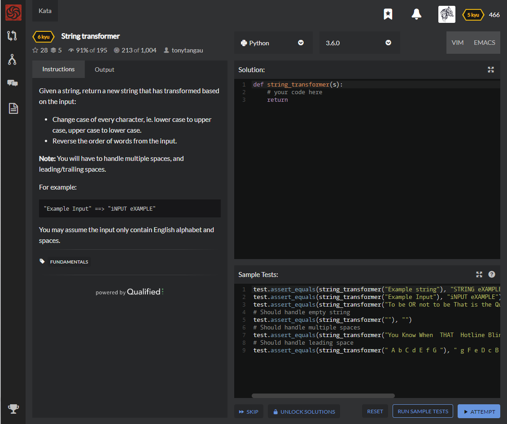

# [[6 Kyu] String transformer](https://www.codewars.com/kata/5878520d52628a092f0002d0/train/python)




## Instructions

Given a string, return a new string that has transformed based on the input:

- Change case of every character, ie. lower case to upper case, upper case to lower case.
- Reverse the order of words from the input.

**Note:** You will have to handle multiple spaces, and leading/trailing spaces.

For example:

```
"Example Input" ==> "iNPUT eXAMPLE"
```

You may assume the input only contain English alphabet and spaces.


## Sample Test

```python
test.assert_equals(string_transformer("Example string"), "STRING eXAMPLE")
test.assert_equals(string_transformer("Example Input"), "iNPUT eXAMPLE")
test.assert_equals(string_transformer("To be OR not to be That is the Question"), "qUESTION THE IS tHAT BE TO NOT or BE tO")
# Should handle empty string
test.assert_equals(string_transformer(""), "")
# Should handle multiple spaces
test.assert_equals(string_transformer("You Know When  THAT  Hotline Bling"), "bLING hOTLINE  that  wHEN kNOW yOU")
# Should handle leading space
test.assert_equals(string_transformer(" A b C d E f G "), " g F e D c B a ")
```


## My solution

```python
def string_transformer(s):
    return ' '.join([''.join(list(map(lambda a : a.lower() if a < 'a' else a.upper(),x))) for x in s.split(' ')[::-1]])
```


## Test Results

Test Passed

Test Passed

Test Passed

You have passed all of the tests! :)

---------

Time: 817ms Passed: 106 Failed: 0


## Best Solution

```python
def string_transformer(s):
    return ' '.join(s.swapcase().split(' ')[::-1])
```


## The things I got

**string.swapcase()** : swap string's case

```python
>> a = "Hi Python"
>> a.swapcase()
'hI pYTHON'
```

