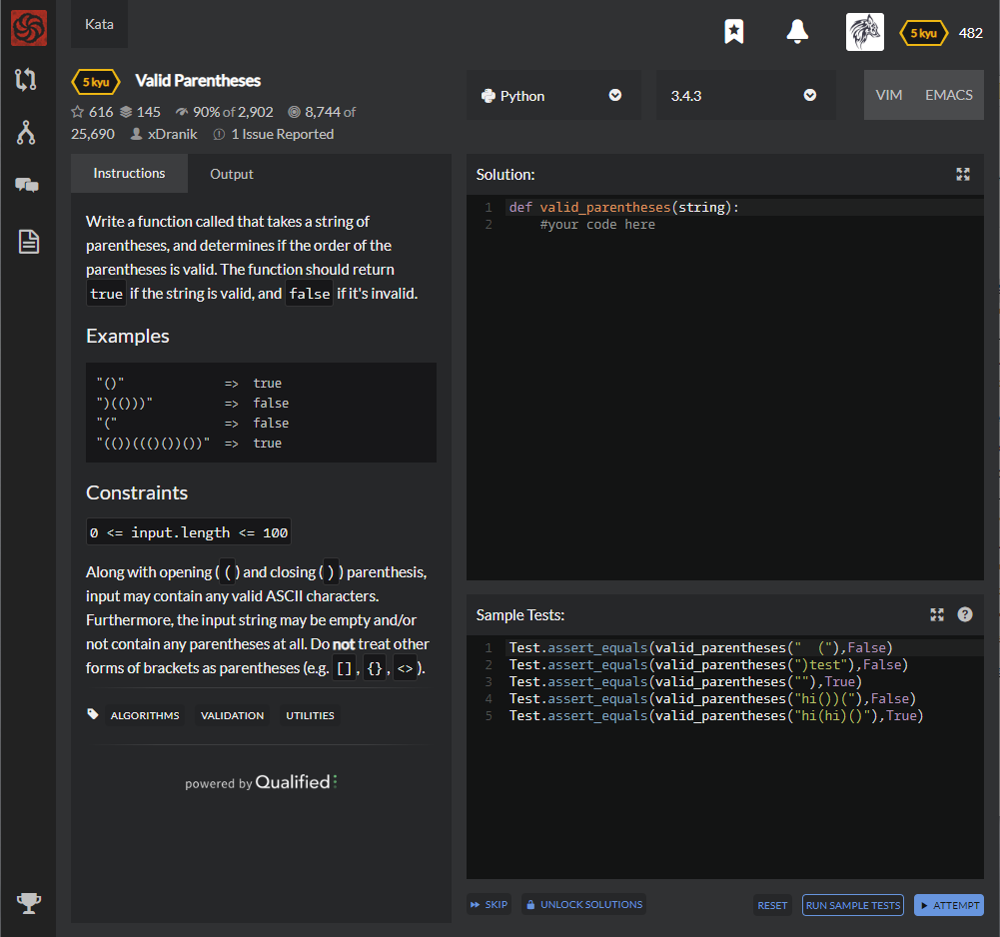

# [[5 Kyu] Valid Parentheses](https://www.codewars.com/kata/52774a314c2333f0a7000688/train/python)




## Instructions

Write a function called that takes a string of parentheses, and determines if the order of the parentheses is valid. The function should return `true` if the string is valid, and `false` if it's invalid.

### Examples

```python
"()"              =>  true
")(()))"          =>  false
"("               =>  false
"(())((()())())"  =>  true
```

### Constraints

```python
0 <= input.length <= 100
```

Along with opening (`(`) and closing (`)`) parenthesis, input may contain any valid ASCII characters. Furthermore, the input string may be empty and/or not contain any parentheses at all. Do **not** treat other forms of brackets as parentheses (e.g. `[]`, `{}`, `<>`).


## Sample Test

```python
Test.assert_equals(valid_parentheses("  ("),False)
Test.assert_equals(valid_parentheses(")test"),False)
Test.assert_equals(valid_parentheses(""),True)
Test.assert_equals(valid_parentheses("hi())("),False)
Test.assert_equals(valid_parentheses("hi(hi)()"),True)
```


## My solution

```python
def valid_parentheses(string):
    s = ''.join(list(filter(lambda x : x in ['(',')'],string)))
    while True :
        s_replaced = s.replace('()','')
        if s == s_replaced : break
        else : s = s_replaced
    return False if s else True
```


## Test Results

Test Passed

Test Passed

Test Passed

You have passed all of the tests! :)

---------

Time: 790ms Passed: 50 Failed: 0


## Best Solution

```python
def valid_parentheses(string):
    cnt = 0
    for char in string:
        if char == '(': cnt += 1
        if char == ')': cnt -= 1
        if cnt < 0: return False
    return True if cnt == 0 else False
```


## The things I got

