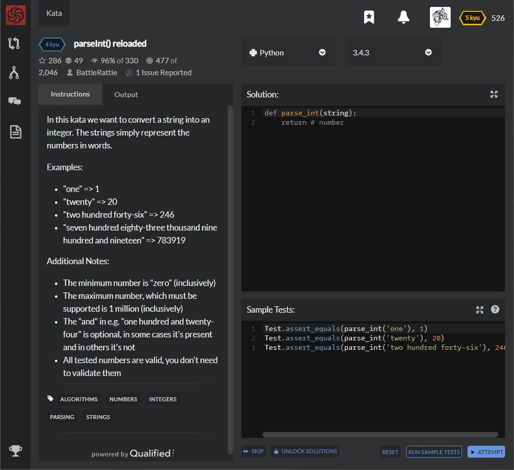

# [[4 Kyu] parseInt() reloaded](https://www.codewars.com/kata/525c7c5ab6aecef16e0001a5/train/python)




## Instructions

In this kata we want to convert a string into an integer. The strings simply represent the numbers in words.

### Examples

- "one" => 1
- "twenty" => 20
- "two hundred forty-six" => 246
- "seven hundred eighty-three thousand nine hundred and nineteen" => 783919

### Additional Notes:

- The minimum number is "zero" (inclusively)
- The maximum number, which must be supported is 1 million (inclusively)
- The "and" in e.g. "one hundred and twenty-four" is optional, in some cases it's present and in others it's not
- All tested numbers are valid, you don't need to validate them


## Sample Test

```python
Test.assert_equals(parse_int('one'), 1)
Test.assert_equals(parse_int('twenty'), 20)
Test.assert_equals(parse_int('two hundred forty-six'), 246)
Test.assert_equals(parse_int('five hundred thousand three hundred'), 500300)
Test.assert_equals(parse_int('eight hundred eighty-eight thousand eight hundred and eighty-eight'), 888888)
```


## My solution

```python
def preset() :
    single_digit = ['zero', 'one', 'two', 'three', 'four', 'five',
                    'six', 'seven', 'eight', 'nine','ten']
    double_digit = ['eleven', 'twelve', 'thirteen', 'fourteen', 'fifteen',
                    'sixteen', 'seventeen', 'eighteen', 'nineteen']
    ten_digit = ['twenty','thirty', 'forty', 'fifty', 'sixty', 'seventy', 'eighty', 'ninety']
    digits = single_digit + double_digit

    for i in range(8) :
        for j in range(0,10) :
            if j==0 : digits.append(ten_digit[i])
            else : digits.append(ten_digit[i]+'-'+single_digit[j])

    return digits

def parse_int(string):
    if string == 'one million' : return 1000000
    digits = preset()
    
    preprocess = string.replace(' and','').split(' ')
    for i,x in enumerate(preprocess) :
        if x in digits : preprocess[i] = digits.index(x)
        if x == 'hundred' : 
            preprocess[i-1] *= 100
            preprocess[i] = 0
        elif x == 'thousand' :
            preprocess[i] = 0
            for j in range(i) :
                preprocess[j] *= 1000
    return sum(preprocess)
```


## Test Results

Test Passed

Test Passed

Test Passed

You have passed all of the tests! :)

---------

Time: 731ms Passed: 690 Failed: 0


## Best Solution

```python
words = {w: n for n, w in enumerate('zero one two three four five six seven eight nine ten eleven twelve thirteen fourteen fifteen sixteen seventeen eighteen nineteen'.split())}
words.update({w: 10 * n for n, w in enumerate('twenty thirty forty fifty sixty seventy eighty ninety hundred'.split(), 2)})
thousands = {w: 1000 ** n for n, w in enumerate('thousand million billion trillion quadrillion quintillion sextillion septillion octillion nonillion decillion'.split(), 1)}
def parse_int(strng):
    num = group = 0
    for w in strng.replace(' and ', ' ').replace('-', ' ').split():
        if w == 'hundred': group *= words[w]
        elif w in words: group += words[w]
        else:
            num += group * thousands[w]
            group = 0
    return num + group
```


## The things I got

