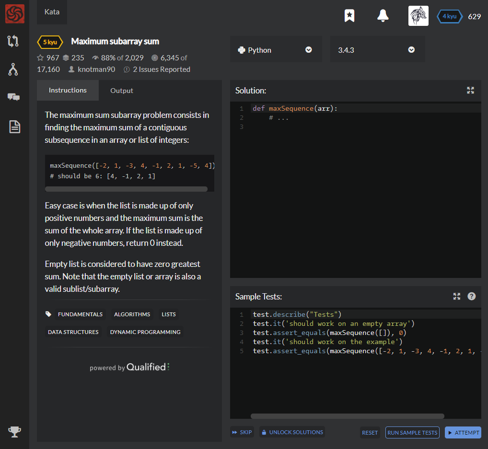

# [[5 Kyu] Maximum subarray sum](https://www.codewars.com/kata/54521e9ec8e60bc4de000d6c/train/python)




## Instructions

The maximum sum subarray problem consists in finding the maximum sum of a contiguous subsequence in an array or list of integers:

```python
maxSequence([-2, 1, -3, 4, -1, 2, 1, -5, 4])
# should be 6: [4, -1, 2, 1]
```

Easy case is when the list is made up of only positive numbers and the maximum sum is the sum of the whole array. If the list is made up of only negative numbers, return 0 instead.

Empty list is considered to have zero greatest sum. Note that the empty list or array is also a valid sublist/subarray.


## Sample Test

```python
test.describe("Tests")
test.it('should work on an empty array')   
test.assert_equals(maxSequence([]), 0)
test.it('should work on the example')
test.assert_equals(maxSequence([-2, 1, -3, 4, -1, 2, 1, -5, 4]), 6)
test.assert_equals(maxSequence([-1, -29, -3, -21, 18, 16, -18, 28, 19, -8, -30, -13, -4, 28, -15, -5, 12, -20, 26, 11, 10, -25, -16, -1, 26, 18, -11, 27, -29, 7, -3, -1, 19, 10, -28, 27, 11, 26, -10, 24, -7, -17, -17, -20, 23, 23, 11, -15, -25, 22]),234)
test.assert_equals(maxSequence([30, -13, -16, 21, -3, -18, 2, 27, -4, 8, 20, -22, 7, -25, -12, 7, 24, 5, -20, -30, -9, -13, -1, 11, 29, 17, 8, -7, 19, 6, -8, -1, -26, 7, 14, 13, -28, -18, -2, -10, 30, 10, -4, -3, -26, 16, 6, 11, 7, 13]),84)
```


## My solution

```python
def maxSequence(arr):
    positive_arr = list(map(lambda x : x if x>=0 else 0 ,arr))
    if positive_arr == arr : return sum(arr)
    elif sum(positive_arr) == 0 : return 0
    else : 
        positive_index = [i for i,x in enumerate(positive_arr) if x>0]
        sumsum=[]
        for i,x in enumerate(positive_index) :
            for j,y in enumerate(positive_index) :
                sumsum.append(sum(arr[x:y+1]))
        return max(sumsum)
```


## Test Results

Test Passed

Test Passed

Test Passed

You have passed all of the tests! :)

---------

Time: 954ms Passed: 53 Failed: 0


## Best Solution

```python
def maxSequence(arr):
    max,curr=0,0
    for x in arr:
        curr+=x
        if curr<0:curr=0
        if curr>max:max=curr
    return max
```


## The things I got

