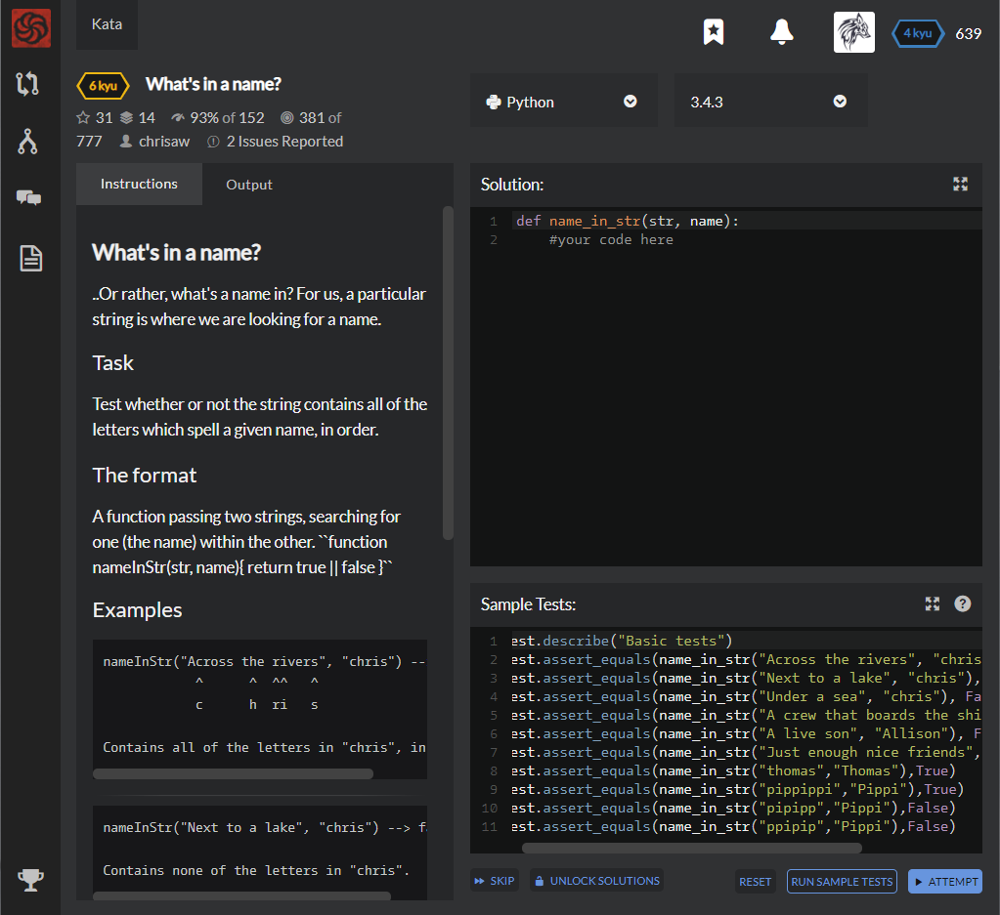

# [[6 Kyu] What's in a name?](https://www.codewars.com/kata/59daf400beec9780a9000045/train/python)




## Instructions

### What's in a name?

..Or rather, what's a name in? For us, a particular string is where we are looking for a name.

### Task

Test whether or not the string contains all of the letters which spell a given name, in order.

### The format

A function passing two strings, searching for one (the name) within the other. ``function nameInStr(str, name){ return true || false }``

### Examples

```python
nameInStr("Across the rivers", "chris") --> true
            ^      ^  ^^   ^
            c      h  ri   s

Contains all of the letters in "chris", in order.
```

------

```python
nameInStr("Next to a lake", "chris") --> false

Contains none of the letters in "chris".
```

------

```python
nameInStr("Under a sea", "chris") --> false
               ^   ^
               r   s

Contains only some of the letters in "chris".
```

------

```python
nameInStr("A crew that boards the ship", "chris") --> false
             cr    h              s i
             cr                h  s i  
             c     h      r       s i
             ...

Contains all of the letters in "chris", but not in order.
```

------

```python
nameInStr("A live son", "Allison") --> false
           ^ ^^   ^^^
           A li   son

Contains all of the correct letters in "Allison", in order, 
but not enough of all of them (missing an 'l').
```

Note: testing will *not* be case-sensative.


## Sample Test

```python
Test.describe("Basic tests")
Test.assert_equals(name_in_str("Across the rivers", "chris"), True)
Test.assert_equals(name_in_str("Next to a lake", "chris"), False)
Test.assert_equals(name_in_str("Under a sea", "chris"), False)
Test.assert_equals(name_in_str("A crew that boards the ship", "chris"), False)
Test.assert_equals(name_in_str("A live son", "Allison"), False)
Test.assert_equals(name_in_str("Just enough nice friends","Jennifer"),False)
Test.assert_equals(name_in_str("thomas","Thomas"),True)
Test.assert_equals(name_in_str("pippippi","Pippi"),True)
Test.assert_equals(name_in_str("pipipp","Pippi"),False)
Test.assert_equals(name_in_str("ppipip","Pippi"),False)
```


## My solution

```python
import re

def name_in_str(str, name):
    regular = ''.join([x+'.*' for x in name.lower()])
    try :
        re.search(regular,str.lower()).group()
        return True
    except Exception : return False
```


## Test Results

Test Passed

Test Passed

Test Passed

You have passed all of the tests! :)

---------

Time: 722ms Passed: 50 Failed: 0


## Best Solution

```python
def name_in_str(str, name):
    it = iter(str.lower())
    return all(c in it for c in name.lower())
```

```python
from re import search; name_in_str=lambda s,n: search(".*".join(list(n)),s,2) != None
```


## The things I got

**iter** : make iterable to generator(just go forward, not backward)

```python
>>> iteration = iter('abcdefg')
>>> 'b' in iteration
True
>>> 'a' in iteration
False
```


### Regular Expressions

**re Module** : support python regular expression

**[ 반복 메타 문자 ]**

| **[메타 문자]** | **[의미]**           |
| --------------- | -------------------- |
| *               | 0회 이상 반복        |
| +               | 1회 이상 반복        |
| ?               | 0회 or 1회           |
| {m}             | m회 반복             |
| {m, n}          | m회부터 n회까지 반복 |

 

**[ 매칭 메타 문자 ]**

| **[메타 문자]** | **[의미]**                              |
| --------------- | --------------------------------------- |
| .               | 줄바꿈 문자를 제외한 모든 문자와 매치됨 |
| ^               | 문자열의 시작과 매치됨                  |
| $               | 문자열의 마지막과 매치됨                |
| [ ]             | 문자 집합 중 한 문자를 의미             |
| \|              | 또는(or)를 의미                         |
| { }             | 정규식을 그룹으로 묶음                  |

 

**[ 이스케이프 기호 ]**

| **[종류]** | **[설명]**                                                  |
| ---------- | ----------------------------------------------------------- |
| \\         | 역슬래쉬 문자 자체                                          |
| \d         | 모든 숫자와 매치됨 `[0-9]`                                  |
| \D         | 숫자가 아닌 문자와 매치됨 `[^0-9]`                          |
| \s         | 화이트 스페이스 문자와 매치됨 `[ \t\n\r\f\v]`               |
| \S         | 화이트 스페이스가 아닌 것과 매치됨 `[^\t\n\r\f\v]`          |
| \w         | 숫자 또는 문자와 매치됨 `[a-zA-Z0-9_]`                      |
| \W         | 숫자 또는 문자가 아닌 것과 매치됨 `[^a-zA-Z0-9_]`           |
| \b         | 단어의 경계를 나타냄. 단어는 영문자 혹은 숫자의 연속 문자열 |
| \B         | 단어의 경계가 아님을 나타냄                                 |
| \A         | 문자열의 처음에만 일치                                      |
| \Z         | 문자열의 끝에만 일치                                        |

 

**[ 최소 매칭을 위한 정규식 ]**

| **[기회]** | **[의미]**                            |
| ---------- | ------------------------------------- |
| *?         | *와 같으나 문자열을 취소로 매치함     |
| +?         | +와 같으나 문자열을 취소로 매치함     |
| ??         | ?와 같으나 문자열을 최소로 매치함     |
| {m,n}?     | {m,n}과 같으나 문자열을 최소로 매치함 |

 

**[ 정규 표현식에서 사용 가능한 플래그 ]**

| **[플래그]**  | **[내용]**                                                   |
| ------------- | ------------------------------------------------------------ |
| I, IGNORECATE | 대, 소문자를 구별하지 않는다                                 |
| L, LOCATE     | \w, \W, \b, \B를 현재의 로케일에 영향을 받게 한다            |
| M, MULTILINE  | ^가 문자열의 맨 처음, 각 라인의 맨 처음과 매치 된다$는 문자열의 맨 끝, 각 라인의 맨 끝과 매치 |
| S, DOTALL     | .을 줄바꾸기 문자도 포함하여 매치하게 한다                   |
| U, UNICODE    | \w, \W, \b, \B가 유니코드 문자 특성에 의존하게 한다          |
| X, VERBOSE    | 정규식 안의 공백은 무시된다                                  |

 

**[ re모듈의 주요 메소드 ]**

| **[메소드]**                           | **[설명]**                                                   |
| -------------------------------------- | ------------------------------------------------------------ |
| compile(pattern[, flags])              | pattern을 컴파일하여 정규식 객체를 반환                      |
| match(pattern, string[,flags])         | string의 시작부분부터 pattern이 존재하는지 검사하여MatchObject 인스턴스를 반환 |
| search(pattern, string[,flags])        | string의 전체에 대해서 pattern이 존재하는지 검사하여MatchObject 인스턴스를 반환 |
| split(pattern, string[, maxplit=0])    | pattern을 구분자로 string을 분리하여 리스트로 반환           |
| findall(pattern, string[, flags])      | string에서 pattern을 만족하는 문자열을 리스트로 반환         |
| finditer(pattern, string[, flags])     | string에서 pattern을 만족하는 문자열을 반복자로 반환         |
| sub(pattern, repl, string[, count=0])  | string에서 pattern과 일치하는 부분에 대하여repl로 교체하여 결과 문자열을 반환 |
| subn(pattern, repl, string[, count=0]) | sub와 동일하나, 결과로(결과문자열, 매칭횟수)를튜플로 반환    |
| escape(string)                         | 영문자 숫자가 아닌 문자들을 백슬래쉬 처리해서 리턴.(임의의 문자열을 정규식 패턴으로 사용할 경우 유용) |

 

**[ Match 객체 ]**

Match객체는 match(), search()의 수행 결과로 생성되며, 검색된 결과를 효율적으로 처리할 수 있는 기능 제공.

◎ Match객체가 지원하는 메소드와 속성

| **[메소드]**         | **[속성]**                                                   |
| -------------------- | ------------------------------------------------------------ |
| group([group1, ...]) | 입력받은 인덱스에 해당하는 매칭된 문자열 결과의 부분 집합을 반환합니다.인덱스가 '0'이거나 입력되지 않은 경우 전체 매칭 문자열을 반환합니다. |
| groups()             | 매칭된 결과를 튜플 형태로 반환                               |
| groupdict()          | 이름이 붙여진 매칭 결과를 사전 형태로 반환                   |
| start([group])       | 매칭된 결과 문자열의 시작 인덱스를 반환. (인자로 부분 집합의 번호나명시된 이름이 전달된 경우, 그에 해당하는 시작 인덱스를 반환) |
| end([group])         | 매칭된 결과 문자열의 종료 인덱스를 반환. (인자로 부분 집합의 번호나명시된 이름이 전달된 경우, 그에 해당하는 종료 인덱스를 반환) |
| pos                  | 원본 문자열에서 검색을 시작하는 위치입니다.                  |
| endpos               | 원본 문자열에서 검색을 종료하는 위치입니다.                  |
| lastindex            | 매칭된 결과 집합에서 마지막 인덱스 번호를 반환. (일치된 결과가 없는 경우에는 None을 반환) |
| lastgroup            | 매칭된 결과 집합에서 마지막으로 일치한 이름을 반환. (정규식의 매칭 조건에이름이 지정되지 않았거나 일치된 결과가 없는 경우 None 반환) |
| string               | 매칭의 대상이 되는 원본 문자열입니다.                        |


study with [┗System∑Sec†ion┛](https://devanix.tistory.com/296)

