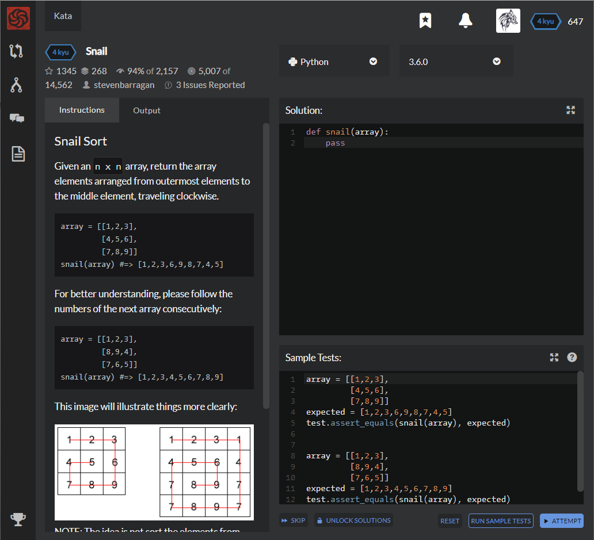

# [[4 Kyu] Snail](https://www.codewars.com/kata/521c2db8ddc89b9b7a0000c1/train/python)




## Instructions

### Snail Sort

Given an `n x n` array, return the array elements arranged from outermost elements to the middle element,   traveling clockwise.  

```python
array = [[1,2,3],
         [4,5,6],
         [7,8,9]]
snail(array) #=> [1,2,3,6,9,8,7,4,5]
```

For better understanding, please follow the numbers of the next array consecutively:  

```python
array = [[1,2,3],
         [8,9,4],
         [7,6,5]]
snail(array) #=> [1,2,3,4,5,6,7,8,9]
```

This image will illustrate things more clearly:  


NOTE 2: The 0x0 (empty matrix) is represented as `[[]]`  

```python
[[1, 2, 3, 4, 5, 6, 7, 8, 9, 10],
 [11, 12, 13, 14, 15, 16, 17, 18, 19, 20],
 [21, 22, 23, 24, 25, 26, 27, 28, 29, 30],
 [31, 32, 33, 34, 35, 36, 37, 38, 39, 40],
 [41, 42, 43, 44, 45, 46, 47, 48, 49, 50],
 [51, 52, 53, 54, 55, 56, 57, 58, 59, 60],
 [61, 62, 63, 64, 65, 66, 67, 68, 69, 70],
 [71, 72, 73, 74, 75, 76, 77, 78, 79, 80],
 [81, 82, 83, 84, 85, 86, 87, 88, 89, 90],
 [91, 92, 93, 94, 95, 96, 97, 98, 99, 100]]


[[(0, 0),  (0, 1),  (0, 2),  (0, 3),  (0, 4),  (0, 5),  (0, 6),  (0, 7),  (0, 8),  (0, 9)],
 [(1, 0),  (1, 1),  (1, 2),  (1, 3),  (1, 4),  (1, 5),  (1, 6),  (1, 7),  (1, 8),  (1, 9)],
 [(2, 0),  (2, 1),  (2, 2),  (2, 3),  (2, 4),  (2, 5),  (2, 6),  (2, 7),  (2, 8),  (2, 9)],
 [(3, 0),  (3, 1),  (3, 2),  (3, 3),  (3, 4),  (3, 5),  (3, 6),  (3, 7),  (3, 8),  (3, 9)],
 [(4, 0),  (4, 1),  (4, 2),  (4, 3),  (4, 4),  (4, 5),  (4, 6),  (4, 7),  (4, 8),  (4, 9)],
 [(5, 0),  (5, 1),  (5, 2),  (5, 3),  (5, 4),  (5, 5),  (5, 6),  (5, 7),  (5, 8),  (5, 9)],
 [(6, 0),  (6, 1),  (6, 2),  (6, 3),  (6, 4),  (6, 5),  (6, 6),  (6, 7),  (6, 8),  (6, 9)],
 [(7, 0),  (7, 1),  (7, 2),  (7, 3),  (7, 4),  (7, 5),  (7, 6),  (7, 7),  (7, 8),  (7, 9)],
 [(8, 0),  (8, 1),  (8, 2),  (8, 3),  (8, 4),  (8, 5),  (8, 6),  (8, 7),  (8, 8),  (8, 9)],
 [(9, 0),  (9, 1),  (9, 2),  (9, 3),  (9, 4),  (9, 5),  (9, 6),  (9, 7),  (9, 8),  (9, 9)]]
```


## Sample Test

```python
array = [[1,2,3],
         [4,5,6],
         [7,8,9]]
expected = [1,2,3,6,9,8,7,4,5]
test.assert_equals(snail(array), expected)


array = [[1,2,3],
         [8,9,4],
         [7,6,5]]
expected = [1,2,3,4,5,6,7,8,9]
test.assert_equals(snail(array), expected)
```


## My solution

```python
def down_left(result, k, n) :
    result += [(result[-1][0]+i,result[-1][1]) for i in range(1,n-k)] # Down
    result += [(result[-1][0],result[-1][0]-j) for j in range(1,n-k)] # Left
    return result

def up_right(result, k, n) :
    result += [(result[-1][0]-i,result[-1][1]) for i in range(1,n-k)] # Up
    result += [(result[-1][0],result[-1][1]+j) for j in range(1,n-k)] # Right
    return result

def snail(array):
    if array == [[]] : return []
    n = len(array)
    result = [(0,i) for i in range(n)]
    count = 0
    while True :
        ori_result = result[:]
        if count%2 : result = up_right(result, count, n)
        else : result = down_left(result, count, n)
        count += 1
        
        if ori_result == result : break
            
    return [array[x[0]][x[1]] for x in result]
```


## Test Results

Test Passed

Test Passed

Test Passed

You have passed all of the tests! :)

---------

Time: 956ms Passed: 105 Failed: 0


## Best Solution

```python
def snail(array):
    return list(array[0]) + snail(zip(*array[1:])[::-1]) if array else []
```


## The things I got

