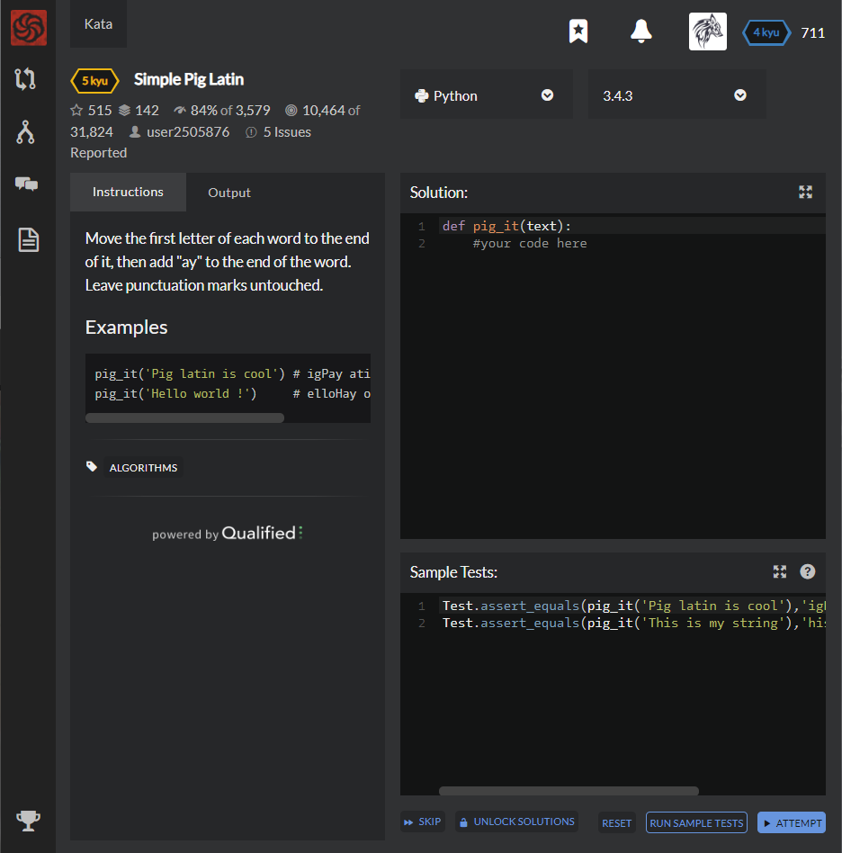

# [[5 Kyu] Simple Pig Latin](https://www.codewars.com/kata/520b9d2ad5c005041100000f/train/python)




## Instructions

Move the first letter of each word to the end of it, then add "ay" to the end of the word. Leave punctuation marks untouched.

### Examples

```python
pig_it('Pig latin is cool') # igPay atinlay siay oolcay
pig_it('Hello world !')     # elloHay orldway !
```

------


## Sample Test

```python
Test.assert_equals(pig_it('Pig latin is cool'),'igPay atinlay siay oolcay')
Test.assert_equals(pig_it('This is my string'),'hisTay siay ymay tringsay')
```


## My solution

```python
def pig_it(text):
    return ' '.join([x[1:] + x[0] + 'ay' if x.isalpha() else x for x in text.split(' ')])
```


## Test Results

Test Passed

Test Passed

Test Passed

You have passed all of the tests! :)

---------

Time: 845ms Passed: 22 Failed: 0


## Best Solution

```python
same
```


## The things I got

