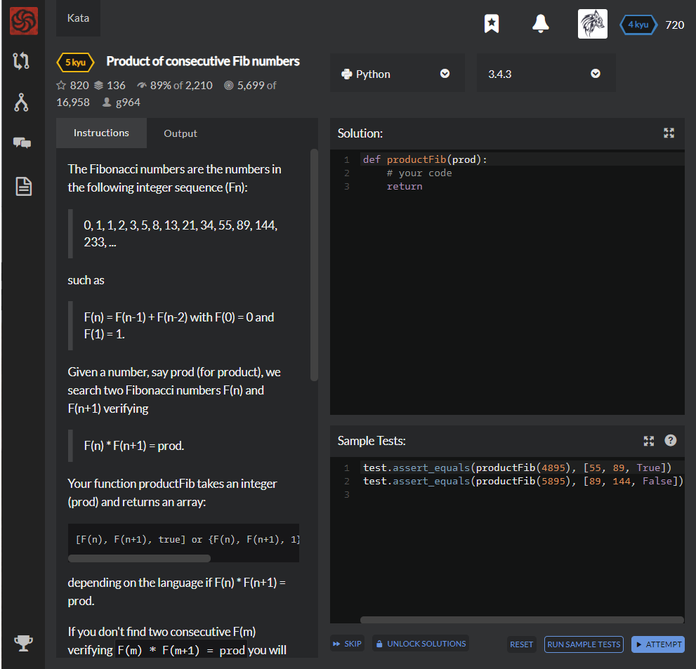

# [[5 Kyu] Product of consecutive Fib numbers](https://www.codewars.com/kata/5541f58a944b85ce6d00006a/train/python)




## Instructions

The Fibonacci numbers are the numbers in the following integer sequence (Fn):

> 0, 1, 1, 2, 3, 5, 8, 13, 21, 34, 55, 89, 144, 233, ...

such as

> F(n) = F(n-1) + F(n-2) with F(0) = 0 and F(1) = 1.

Given a number, say prod (for product), we search two Fibonacci numbers F(n) and F(n+1) verifying

> F(n) * F(n+1) = prod.

Your function productFib takes an integer (prod) and returns an array:

```
[F(n), F(n+1), true] or {F(n), F(n+1), 1} or (F(n), F(n+1), True)
```

depending on the language if F(n) * F(n+1) = prod.

If you don't find two consecutive F(m) verifying `F(m) * F(m+1) = prod`you will return

```
[F(m), F(m+1), false] or {F(n), F(n+1), 0} or (F(n), F(n+1), False)
```

F(m) being the smallest one such as `F(m) * F(m+1) > prod`.


### Examples

```python
productFib(714) # should return [21, 34, true], 
                # since F(8) = 21, F(9) = 34 and 714 = 21 * 34

productFib(800) # should return [34, 55, false], 
                # since F(8) = 21, F(9) = 34, F(10) = 55 and 21 * 34 < 800 < 34 * 55
```

**Notes:** Not useful here but we can tell how to choose the number n up to which to go: we can use the "golden ratio" phi which is `(1 + sqrt(5))/2` knowing that F(n) is asymptotic to: `phi^n / sqrt(5)`. That gives a possible upper bound to n.

You can see examples in "Example test".

### References

http://en.wikipedia.org/wiki/Fibonacci_number

http://oeis.org/A000045


## Sample Test

```python
test.assert_equals(productFib(4895), [55, 89, True])
test.assert_equals(productFib(5895), [89, 144, False])
```


## My solution

```python
from math import sqrt,log

def productFib(prod):
    a,b,c,d = fib(refib(prod)-1),fib(refib(prod)),fib(refib(prod)+1),fib(refib(prod)+2)
    if prod == a*b : return [a,b,prod in (a*b,b*c)]
    elif prod > b*c : return [c,d,False]
    else : return [b,c,prod in (a*b,b*c)]

def fib(n,k=1,first=0,second=1) :
    return second if n==k else fib(n,k+1,second,first+second)

def refib(n) :
    return round(log(sqrt(5)*sqrt(n))/log((1+sqrt(5))/2))
```


## Test Results

Test Passed

Test Passed

Test Passed

You have passed all of the tests! :)

---------

Time: 


## Best Solution

```python
def productFib(prod):
  a, b = 0, 1
  while prod > a * b:
    a, b = b, a + b
  return [a, b, prod == a * b]
```


## The things I got

