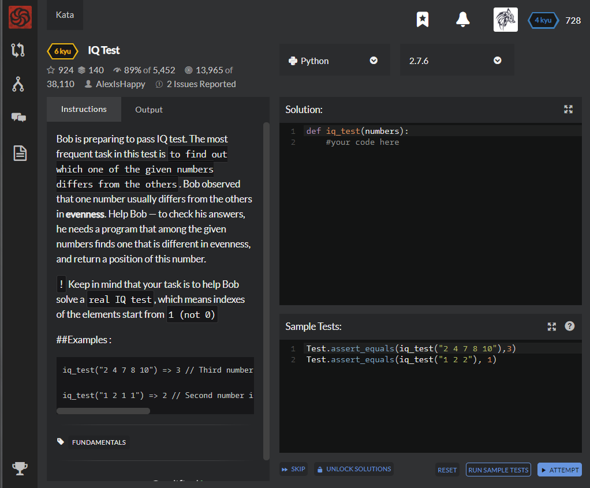

# [[6 Kyu] IQ Test](https://www.codewars.com/kata/552c028c030765286c00007d/train/python)




## Instructions

Bob is preparing to pass IQ test. The most frequent task in this test is `to find out which one of the given numbers differs from the others`. Bob observed that one number usually differs from the others in **evenness**. Help Bob — to check his answers, he needs a program that among the given numbers finds one that is different in evenness, and return a position of this number.

```
!` Keep in mind that your task is to help Bob solve a `real IQ test`, which means indexes of the elements start from `1 (not 0)
```

\##Examples :

```python
iq_test("2 4 7 8 10") => 3 // Third number is odd, while the rest of the numbers are even

iq_test("1 2 1 1") => 2 // Second number is even, while the rest of the numbers are odd
```


## Sample Test

```python
Test.assert_equals(iq_test("2 4 7 8 10"),3)
Test.assert_equals(iq_test("1 2 2"), 1)
```


## My solution

```python
def iq_test(numbers):
    k = [int(x)%2 for x in numbers.split(' ')]
    return k.index(1)+1 if k.count(0)>1 else k.index(0)+1
```


## Test Results

Test Passed

Test Passed

Test Passed

You have passed all of the tests! :)

---------

Time: 817ms Passed: 50 Failed: 0


## Best Solution

```python
same
```


## The things I got

