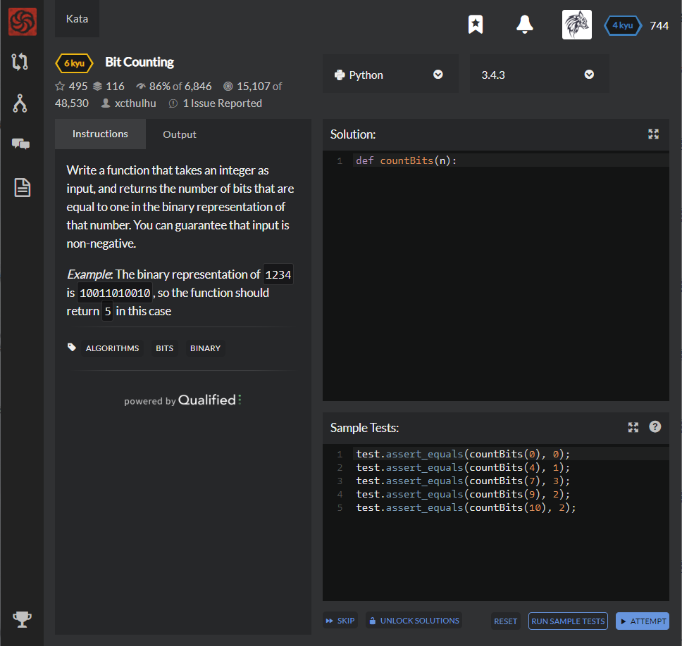

# [[6 Kyu] Bit Counting](https://www.codewars.com/kata/526571aae218b8ee490006f4/train/python)




## Instructions

Write a function that takes an integer as input, and returns the number of bits that are equal to one in the binary representation of that number. You can guarantee that input is non-negative.

*Example*: The binary representation of `1234`is `10011010010`, so the function should return `5` in this case


## Sample Test

```python
test.assert_equals(countBits(0), 0);
test.assert_equals(countBits(4), 1);
test.assert_equals(countBits(7), 3);
test.assert_equals(countBits(9), 2);
test.assert_equals(countBits(10), 2);
```


## My solution

```python
def countBits(n):
    return bin(n).count('1')
```


## Test Results

Test Passed

Test Passed

Test Passed

You have passed all of the tests! :)

---------

Time: 877ms Passed: 22 Failed: 0


## Best Solution

```python
same
```


## The things I got

