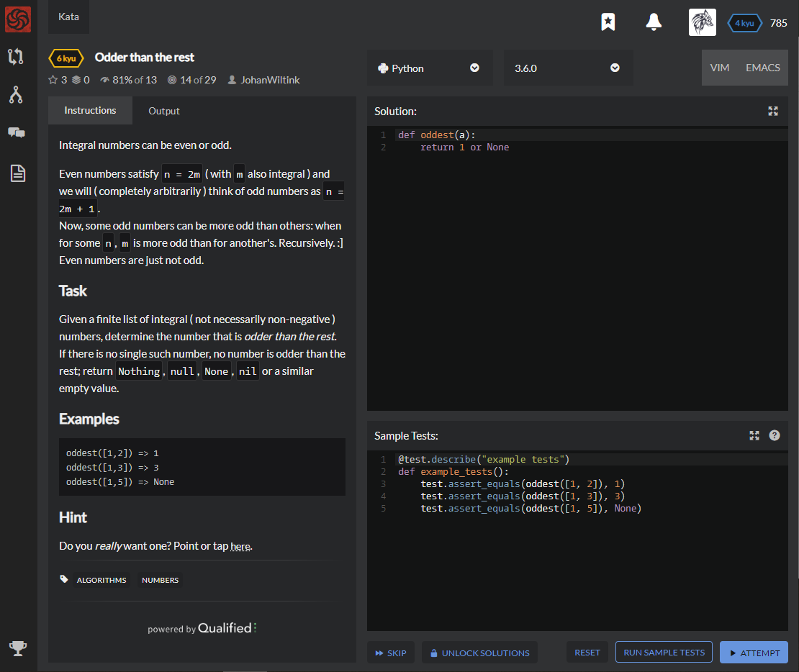

# [[6 Kyu] Odder than the rest](https://www.codewars.com/kata/5d6ee508aa004c0019723c1c/train/python)




## Instructions

Integral numbers can be even or odd.

Even numbers satisfy `n = 2m` ( with `m` also integral ) and we will ( completely arbitrarily ) think of odd numbers as `n = 2m + 1`.
Now, some odd numbers can be more odd than others: when for some `n`, `m` is more odd than for another's. Recursively. :]
Even numbers are just not odd.

### Task

Given a finite list of integral ( not necessarily non-negative ) numbers, determine the number that is *odder than the rest*.
If there is no single such number, no number is odder than the rest; return `Nothing`, `null`, `None`, `nil` or a similar empty value.

### Examples

```python
oddest([1,2]) => 1
oddest([1,3]) => 3
oddest([1,5]) => None
```

### Hint

Do you *really* want one? Point or tap here.


## Sample Test

```python
@test.describe("example tests")
def example_tests():
    test.assert_equals(oddest([1, 2]), 1)
    test.assert_equals(oddest([1, 3]), 3)
    test.assert_equals(oddest([1, 5]), None)
```


## My solution

```python

```


## Test Results

Test Passed

Test Passed

Test Passed

You have passed all of the tests! :)

---------

Time: 


## Best Solution

```python

```


## The things I got

