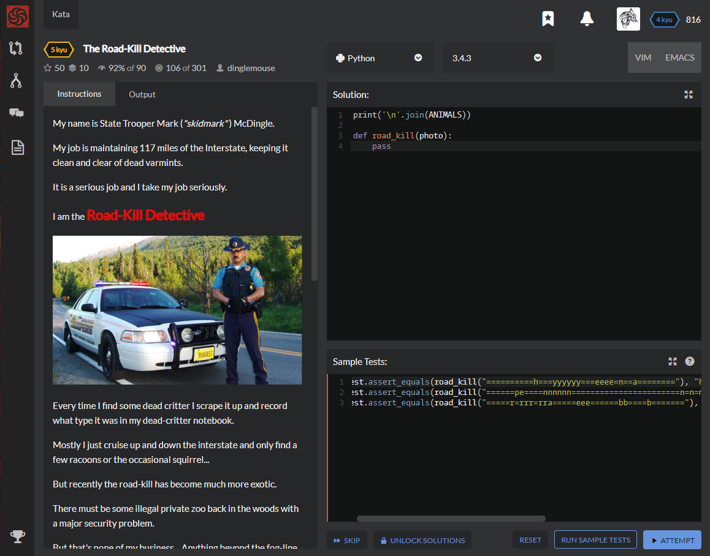

# [[5 Kyu] The Road-Kill Detective](https://www.codewars.com/kata/58e18c5434a3022d270000f2/train/python)




## Instructions

My name is State Trooper Mark (*"skidmark"* ) McDingle.

My job is maintaining 117 miles of the Interstate, keeping it clean and clear of dead varmints.

It is a serious job and I take my job seriously.

I am the **Road-Kill Detective**


Every time I find some dead critter I scrape it up and record what type it was in my dead-critter notebook.

Mostly I just cruise up and down the interstate and only find a few raccoons or the occasional squirrel...

But recently the road-kill has become much more exotic.

There must be some illegal private zoo back in the woods with a major security problem.

But that's none of my business... Anything beyond the fog-line is out of my jurisdiction.

### Evidence

Here are some photos of what I came across last week:

- There was a thing that looked like a `hyena`

  ```python
  ==========h===yyyyyy===eeee=n==a========
  ```

- a long black and white smudge that probably once was a `penguin`

  ```python
  ======pe====nnnnnn=======================n=n=ng====u==iiii=iii==nn========================n=
  ```

- and an unlucky `bear` that was hit going the other direction

  ```python
  =====r=rrr=rra=====eee======bb====b=======
  ```

### Kata Task

Even for a professional like me, the identification of flattened exotic animals is not always easy!

If it ever happens that I can't find all of the remains, or if there are gaps or other parts that I don't recognize, then I record it as `??` in my dead-critter notebook.

What I really need is a program that I can scan my photos into which can give back the correct answer straight away.

Something like this:

### Input

- `photo` (not null)

### Output

- the detected animal name, or `??` if unknown^

------

^ Note: An array/list of all "known" animals is preloaded in a variable called `ANIMALS` (refer to the initial solution)


## Sample Test

```python
test.assert_equals(road_kill("==========h===yyyyyy===eeee=n==a========"), "hyena")
test.assert_equals(road_kill("======pe====nnnnnn=======================n=n=ng====u==iiii=iii==nn========================n="), "penguin")
test.assert_equals(road_kill("=====r=rrr=rra=====eee======bb====b======="), "bear")
```


## My solution

```python
from re import search

def road_kill(photo) :
    return max([x if (set(list(x))==(set(photo)-{'='}) and 
                         (search(".*".join(list(x)),photo,2)) 
                      or search(".*".join(list(reversed(list(x)))),photo,2))
                else '??' for i,x in enumerate(ANIMALS)])

```


## Test Results

Test Passed

Test Passed

Test Passed

You have passed all of the tests! :)

---------

Time: 1002ms Passed: 121 Failed: 0


## Best Solution

```python
from re import match

def road_kill(photo):
    remains = photo.replace('=', '')
    
    for animal in ANIMALS:
        parts = '^' + '+'.join(c for c in animal) + '+$'
        if match(parts, remains) or match(parts, remains[::-1]):
            return animal
    return '??'
```


## The things I got

정규표현식을 연습합시다

`^` : 문자열 처음

`+` : 1회이상 반복

`$` : 문자열 마지막

`match(pattern, string[,flags])` : string의 시작부분부터 pattern이 존재하는지 검사하여 MatchObject 인스턴스를 반환


깔끔하게 짭시다 코드를