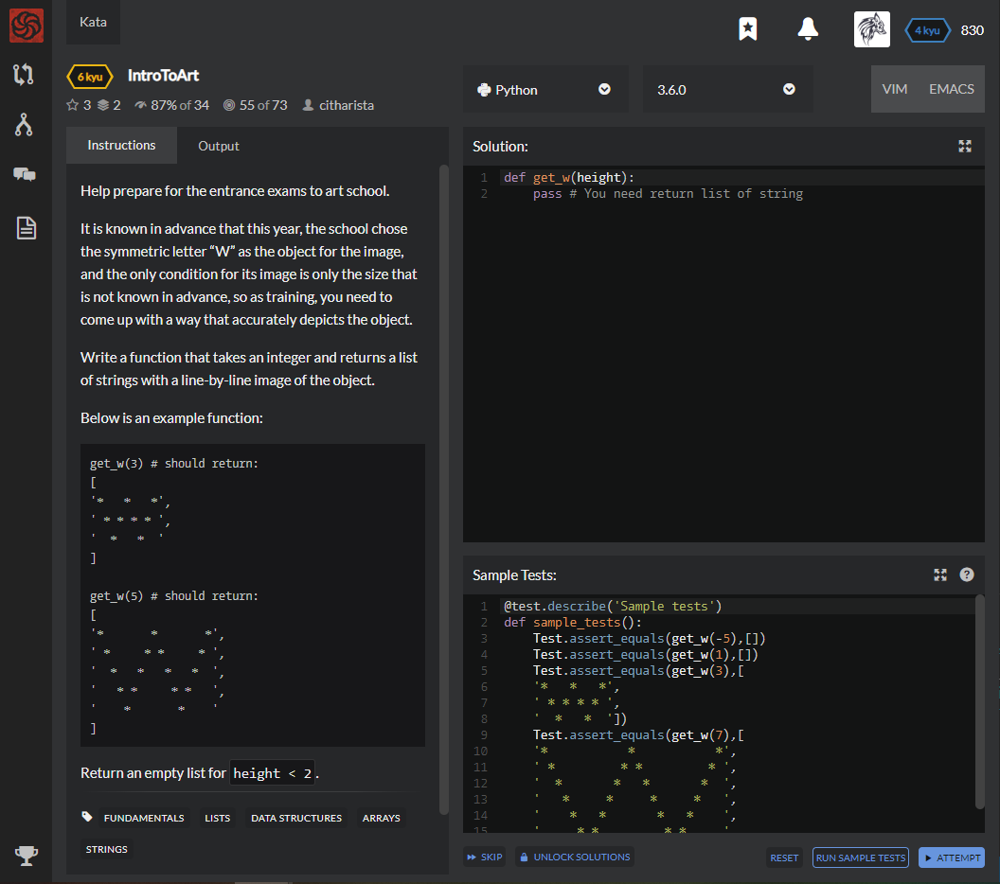

# [[6 Kyu] IntroToArt](https://www.codewars.com/kata/5d7d05d070a6f60015c436d1/train/python)




## Instructions

Help prepare for the entrance exams to art school.

It is known in advance that this year, the school chose the symmetric letter “W” as the object for the image, and the only condition for its image is only the size that is not known in advance, so as training, you need to come up with a way that accurately depicts the object.

Write a function that takes an integer and returns a list of strings with a line-by-line image of the object.

Below is an example function:

```python
get_w(3) # should return:
[
'*   *   *',
' * * * * ',
'  *   *  '
]

get_w(5) # should return:
[
'*       *       *',
' *     * *     * ',
'  *   *   *   *  ',
'   * *     * *   ',
'    *       *    '
]
```

Return an empty list for `height < 2`.


## Sample Test

```python
@test.describe('Sample tests')
def sample_tests():
    Test.assert_equals(get_w(-5),[])
    Test.assert_equals(get_w(1),[])
    Test.assert_equals(get_w(3),[
    '*   *   *',
    ' * * * * ',
    '  *   *  '])
    Test.assert_equals(get_w(7),[
    '*           *           *',
    ' *         * *         * ',
    '  *       *   *       *  ',
    '   *     *     *     *   ',
    '    *   *       *   *    ', 
    '     * *         * *     ',
    '      *           *      '])
```


## My solution

```python
def get_w(height):
    top = ['*' + ' ' * (2*(height-2)+1) + '*' + ' ' * (2*(height-2)+1) + '*']
    middle = [' ' * i + '*' + ' ' * (2*(height-i-2)+1) + '*' + ' ' * (2*i-1) + '*' + ' ' * (2*(height-i-2)+1) + '*' + ' ' * i for i in range(1,height-1)]
    bottom = [' ' * (height-1) + '*' + ' ' * (2*(height-2)+1) + '*' + ' ' * (height-1)]
    return top+middle+bottom if height > 1 else []
```


## Test Results

Test Passed

Test Passed

Test Passed

You have passed all of the tests! :)

---------

Time: 815ms Passed: 121 Failed: 0


## Best Solution

```python

```


## The things I got

