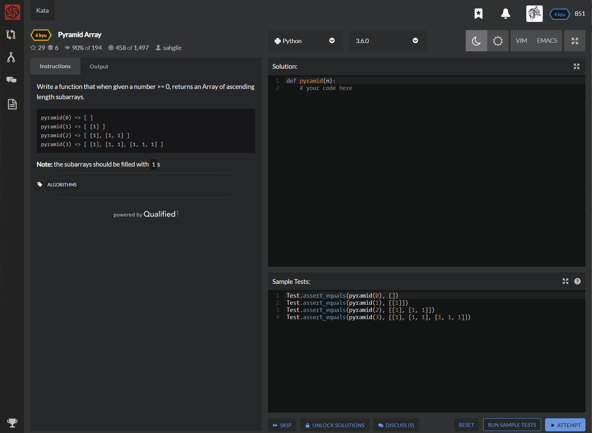

# [[6 Kyu] Pyramid Array](https://www.codewars.com/kata/515f51d438015969f7000013/train/python)




## Instructions

- Write a function that when given a number >= 0, returns an Array of ascending length subarrays.

  ```python
  pyramid(0) => [ ]
  pyramid(1) => [ [1] ]
  pyramid(2) => [ [1], [1, 1] ]
  pyramid(3) => [ [1], [1, 1], [1, 1, 1] ]
  ```

  **Note:** the subarrays should be filled with `1`s


## Sample Test

```python
Test.assert_equals(pyramid(0), [])
Test.assert_equals(pyramid(1), [[1]])
Test.assert_equals(pyramid(2), [[1], [1, 1]])
Test.assert_equals(pyramid(3), [[1], [1, 1], [1, 1, 1]])
```


## My solution

```python
def pyramid(n):
    return [[1 for i in range(0,n) if i<=j] for j in range(n)]
```


## Test Results

Test Passed

Test Passed

Test Passed

You have passed all of the tests! :)

---------

Time: 852ms Passed: 24 Failed: 0


## Best Solution

```python
def pyramid(n):
    return [[1]*x for x in range(1, n+1)]
```


## The things I got

