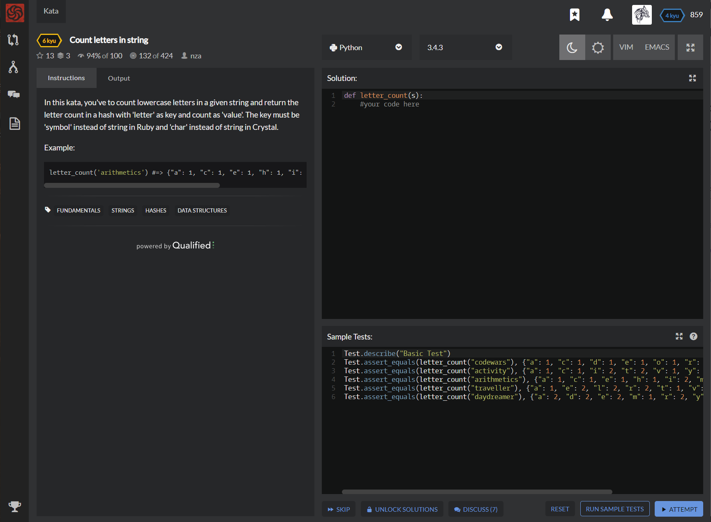

# [[6 Kyu] Count letters in string](https://www.codewars.com/kata/5808ff71c7cfa1c6aa00006d/train/python)




## Instructions

- In this kata, you've to count lowercase letters in a given string and return the letter count in a hash with 'letter' as key and count as 'value'. The key must be 'symbol' instead of string in Ruby and 'char' instead of string in Crystal.

### Example

```python
letter_count('arithmetics') #=> {"a": 1, "c": 1, "e": 1, "h": 1, "i": 2, "m": 1, "r": 1, "s": 1, "t": 2}
```


## Sample Test

```python
Test.describe("Basic Test")
Test.assert_equals(letter_count("codewars"), {"a": 1, "c": 1, "d": 1, "e": 1, "o": 1, "r": 1, "s": 1, "w": 1})
Test.assert_equals(letter_count("activity"), {"a": 1, "c": 1, "i": 2, "t": 2, "v": 1, "y": 1})
Test.assert_equals(letter_count("arithmetics"), {"a": 1, "c": 1, "e": 1, "h": 1, "i": 2, "m": 1, "r": 1, "s": 1, "t": 2})
Test.assert_equals(letter_count("traveller"), {"a": 1, "e": 2, "l": 2, "r": 2, "t": 1, "v": 1})
Test.assert_equals(letter_count("daydreamer"), {"a": 2, "d": 2, "e": 2, "m": 1, "r": 2, "y": 1})
```


## My solution

```python
def letter_count(s):
    return { x:s.count(x) if x else x for x in s  }
```


## Test Results

Test Passed

Test Passed

Test Passed

You have passed all of the tests! :)

---------

Time: 847ms Passed: 45 Failed: 0


## Best Solution

```python
from collections import Counter as letter_count
```


## The things I got

**Counter[element]** : 각 element가 몇번나오는지 딕셔너리로 리턴

```python
from collections import Counter
 
#문자열에 적용
st = "나는 정말하하호호 히히 후후하하하 호호하하"
count = Counter(st)
 
 
print(count)
print(count["하"])
 
<결과값>
 
Counter({'하': 7, ' ': 4, '호': 4, '히': 2, '후': 2, 
'나': 1, '는': 1, '정': 1, '말': 1})
7

```

