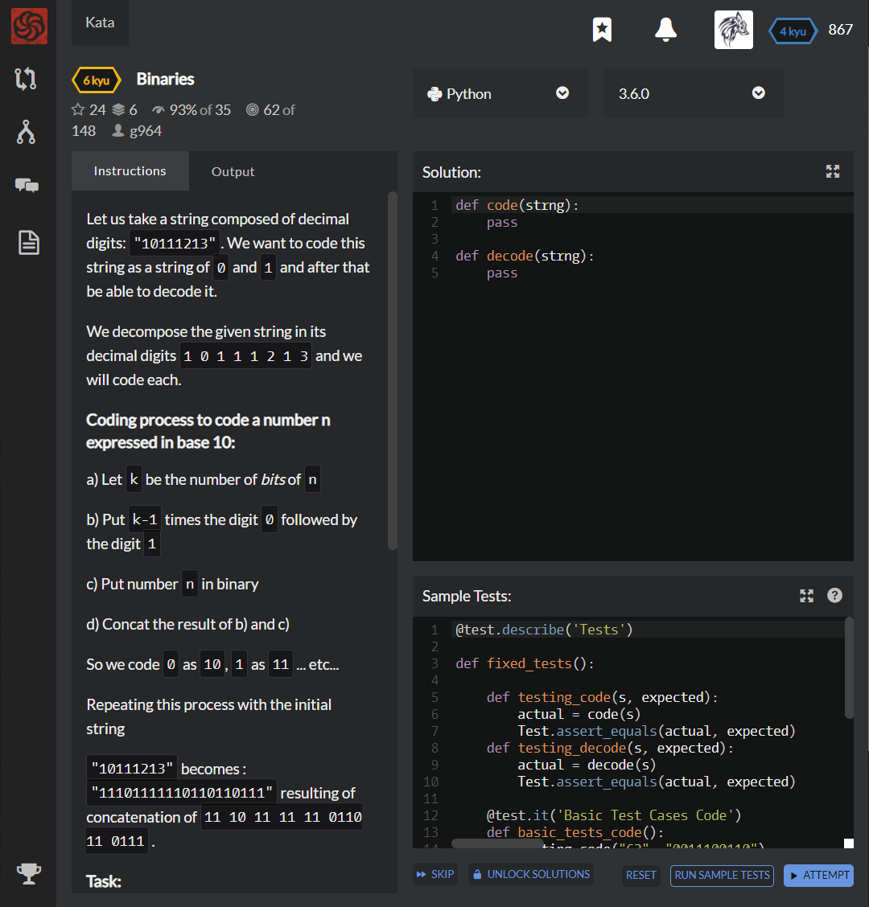

# [[6 Kyu] Binaries](https://www.codewars.com/kata/5d98b6b38b0f6c001a461198/train/python)




## Instructions

Let us take a string composed of decimal digits: `"10111213"`. We want to code this string as a string of `0` and `1` and after that be able to decode it.

We decompose the given string in its decimal digits `1 0 1 1 1 2 1 3` and we will code each.

### Coding process to code a number n expressed in base 10

a) Let `k` be the number of *bits* of `n`

b) Put `k-1` times the digit `0` followed by the digit `1`

c) Put number `n` in binary

d) Concat the result of b) and c)

So we code `0` as `10`, `1` as `11` ... etc...

Repeating this process with the initial string

`"10111213"` becomes : `"11101111110110110111"` resulting of concatenation of `11 10 11 11 11 0110 11 0111` .

### Task

- Given `strng` a string of digits representing a decimal number the function `code(strng)` should return the coding of `strng` as explained above.
- Given a string `strng` resulting from the previous coding, decode it to get the corresponding decimal string.

### Examples

```
code("77338855") --> "001111001111011101110001100000011000001101001101"
code("77338")  --> "0011110011110111011100011000"
code("0011121314") --> "1010111111011011011111001100"

decode("001111001111011101110001100000011000001101001101") -> "77338855"
decode("0011110011110111011100011000") -> "77338"
decode("1010111111011011011111001100") -> "0011121314"
```


### Note

Please could you ask before translating : some translations are already written.


## Sample Test

```python
@test.describe('Tests')
        
def fixed_tests():
    
    def testing_code(s, expected):
        actual = code(s)
        Test.assert_equals(actual, expected)
    def testing_decode(s, expected):
        actual = decode(s)
        Test.assert_equals(actual, expected)
        
    @test.it('Basic Test Cases Code')
    def basic_tests_code():
        testing_code("62", "0011100110")
        testing_code("55337700", "001101001101011101110011110011111010")
        testing_code("1119441933000055", "1111110001100100110000110011000110010111011110101010001101001101")
        testing_code("69", "00111000011001")
        testing_code("86", "00011000001110")
    
    @test.it('Basic Test Cases Decode')
    def basic_tests_decode():
        testing_decode("10001111", "07")
        testing_decode("001100001100001100001110001110001110011101110111001110001110001110001111001111001111001100001100001100", "444666333666777444")
        testing_decode("01110111110001100100011000000110000011110011110111011100110000110001100110", "33198877334422")
        testing_decode("0011010011010011011010101111110011000011000011000011100011100011100011100011100011100001100100011001000110011100011001001111001111001111001111001111001111", "55500011144466666699919777777")
        testing_decode("01110111011111000110010011110011110011110011110011110011110111011101110110011001100110011001101111111010101100011001000110000001100000011000", "3331977777733322222211100019888")
        
        
```


## My solution

```python
def code(strng):
    return ''.join([(len(bin(int(x)))-3)*'0' + '1' + bin(int(x))[2:] for x in strng ])
    
def decode(strng):
    result = ''
    while(len(strng)) :
        if strng[0] == '1' :
            if strng[1] == '0' : result += '0'
            else : result += '1'
            strng = strng[2:]
        else :
            for i,x in enumerate(strng) :
                if x == '1' : break
            result += str(int('0b'+strng[i+1:i*2+2],2))
            strng = strng[i*2+2:]
    return result
```


## Test Results

Test Passed

Test Passed

Test Passed

You have passed all of the tests! :)

---------

Time: 916ms Passed: 142 Failed: 0


## Best Solution

```python
def code(s):
    return ''.join( f'{"0"*(d.bit_length()-1)}1{d:b}' for d in map(int,s))
    
def decode(s):
    it, n, out = iter(s), 1, []
    for c in it:
        if c=='0':
            n += 1
        else:
            out.append( int(''.join(next(it) for _ in range(n)), 2) )
            n = 1
    return ''.join(map(str, out))
```


## The things I got

