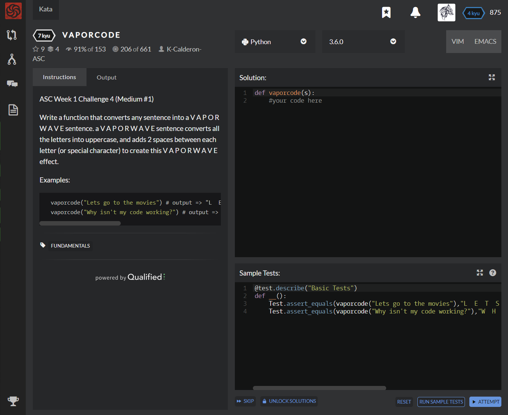

# [[7 Kyu] V A P O R C O D E](https://www.codewars.com/kata/5966eeb31b229e44eb00007a/train/python)




## Instructions

- ASC Week 1 Challenge 4 (Medium #1)

  Write a function that converts any sentence into a V A P O R W A V E sentence. a V A P O R W A V E sentence converts all the letters into uppercase, and adds 2 spaces between each letter (or special character) to create this V A P O R W A V E effect.

  Examples:

  ```python
    vaporcode("Lets go to the movies") # output => "L  E  T  S  G  O  T  O  T  H  E  M  O  V  I  E  S"
    vaporcode("Why isn't my code working?") # output => "W  H  Y  I  S  N  '  T  M  Y  C  O  D  E  W  O  R  K  I  N  G  ?"
  ```


## Sample Test

```python
@test.describe("Basic Tests")
def __():
    Test.assert_equals(vaporcode("Lets go to the movies"),"L  E  T  S  G  O  T  O  T  H  E  M  O  V  I  E  S")
    Test.assert_equals(vaporcode("Why isn't my code working?"),"W  H  Y  I  S  N  '  T  M  Y  C  O  D  E  W  O  R  K  I  N  G  ?")
```


## My solution

```python
def vaporcode(s):
    return '  '.join([x.upper() for i,x in enumerate(s) if x is not ' '][:])
```


## Test Results

Test Passed

Test Passed

Test Passed

You have passed all of the tests! :)

---------

Time: 786ms Passed: 42 Failed: 0


## Best Solution

```python
def vaporcode(s):
    return "  ".join(s.replace(" ", "").upper())
```


## The things I got

