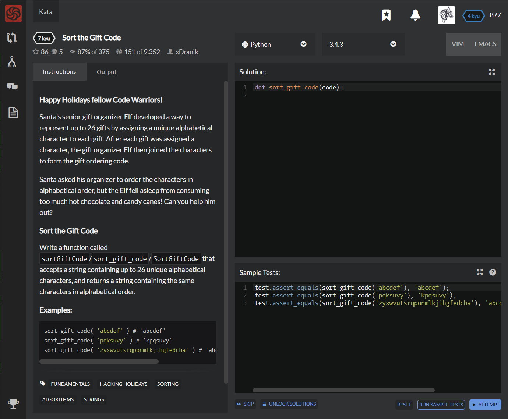

# [[7 Kyu] Sort the Gift Code](https://www.codewars.com/kata/52aeb2f3ad0e952f560005d3/train/python)



### Happy Holidays fellow Code Warriors!

Santa's senior gift organizer Elf developed a way to represent up to 26 gifts by assigning a unique alphabetical character to each gift. After each gift was assigned a character, the gift organizer Elf then joined the characters to form the gift ordering code.

Santa asked his organizer to order the characters in alphabetical order, but the Elf fell asleep from consuming too much hot chocolate and candy canes! Can you help him out?

### Sort the Gift Code

Write a function called `sortGiftCode`/`sort_gift_code`/`SortGiftCode` that accepts a string containing up to 26 unique alphabetical characters, and returns a string containing the same characters in alphabetical order.

### Examples

```python
sort_gift_code( 'abcdef' ) # 'abcdef'
sort_gift_code( 'pqksuvy' ) # 'kpqsuvy'
sort_gift_code( 'zyxwvutsrqponmlkjihgfedcba' ) # 'abcdefghijklmnopqrstuvwxyz'
```


## Sample Test

```python
test.assert_equals(sort_gift_code('abcdef'), 'abcdef');
test.assert_equals(sort_gift_code('pqksuvy'), 'kpqsuvy');
test.assert_equals(sort_gift_code('zyxwvutsrqponmlkjihgfedcba'), 'abcdefghijklmnopqrstuvwxyz');
```


## My solution

```python
def sort_gift_code(code):
    return ''.join(sorted(code))
```


## Test Results

Test Passed

Test Passed

Test Passed

You have passed all of the tests! :)

---------

Time: 886ms Passed: 10 Failed: 0


## Best Solution

```python
same
```


## The things I got

