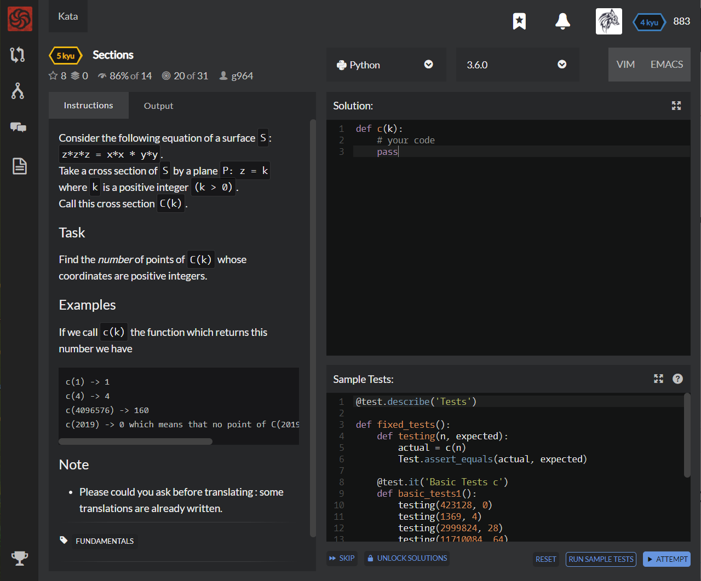

# [[7 Kyu] Bingo ( Or Not )](https://www.codewars.com/kata/5a1ee4dfffe75f0fcb000145/train/python)



For this game of `BINGO`, you will receive a single array of 10 numbers from 1 to 26 as an input. Duplicate numbers within the array are possible.

Each number corresponds to their alphabetical order letter (e.g. 1 = A. 2 = B, etc). Write a function where you will win the game if your numbers can spell `"BINGO"`. They do not need to be in the right order in the input array). Otherwise you will lose. Your outputs should be `"WIN"` or `"LOSE"` respectively.


## Sample Test

```python
@test.describe('Example Tests')
def example_tests():
    test.assert_equals(bingo([1, 2, 3, 4, 5, 6, 7, 8, 9, 10]), "LOSE")        
    test.assert_equals(bingo([20, 12, 23, 14, 6, 22, 12, 17, 2, 26]), "LOSE")        
    test.assert_equals(bingo([1, 2, 3, 7, 5, 14, 7, 15, 9, 10]), "WIN")        
    test.assert_equals(bingo([5, 2, 13, 7, 5, 14, 17, 15, 9, 10]), "WIN")
```


## My solution

```python
def bingo(array): 
    return "WIN" if set(array).issuperset(set([2,9,14,7,15])) else "LOSE"
```


## Test Results

Test Passed

Test Passed

Test Passed

You have passed all of the tests! :)

---------

Time: 838ms Passed: 204 Failed: 0


## Best Solution

```python
def bingo(lst): 
    return "WIN" if set(lst) >= BINGO else "LOSE"
```


## The things I got

