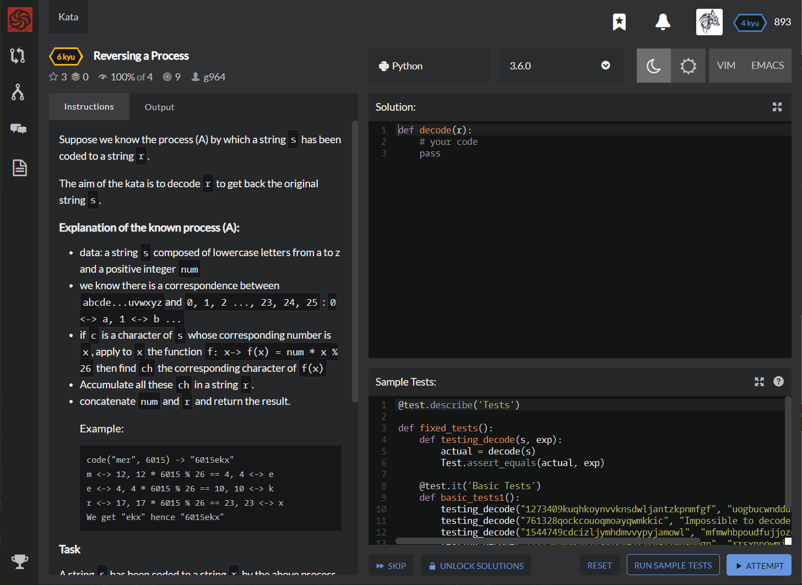

# [[6 Kyu] Reversing a Process](https://www.codewars.com/kata/5dad6e5264e25a001918a1fc/train/python)



Suppose we know the process (A) by which a string `s` has been coded to a string `r`.

The aim of the kata is to decode `r` to get back the original string `s`.

### Explanation of the known process (A):

- data: a string `s` composed of lowercase letters from a to z and a positive integer `num`

- we know there is a correspondence between `abcde...uvwxyz`and `0, 1, 2 ..., 23, 24, 25` : `0 <-> a, 1 <-> b ...`

- if `c` is a character of `s` whose corresponding number is `x`, apply to `x` the function `f: x-> f(x) = num * x % 26` then find `ch` the corresponding character of `f(x)`

- Accumulate all these `ch` in a string `r`.

- concatenate `num` and `r` and return the result.

  #### Example:

  ```
  code("mer", 6015) -> "6015ekx"
  m <-> 12, 12 * 6015 % 26 == 4, 4 <-> e
  e <-> 4, 4 * 6015 % 26 == 10, 10 <-> k
  r <-> 17, 17 * 6015 % 26 == 23, 23 <-> x
  We get "ekx" hence "6015ekx"
  ```

### Task

A string `s` has been coded to a string `r` by the above process (A). Write a function `r -> decode(r)` to get back `s` *whenever it is possible*.

Indeed it can happen that the decoding is impossible when positive integer `num` has not been correctly chosen. In that case return "Impossible to decode".

### Example:

```python
decode("6015ekx") -> "mer"
decode("5057aan") -> "Impossible to decode"
```


## Sample Test

```python
@test.describe('Tests')
     
def fixed_tests():
    def testing_decode(s, exp):
        actual = decode(s)
        Test.assert_equals(actual, exp)
        
    @test.it('Basic Tests')
    def basic_tests1():
        testing_decode("1273409kuqhkoynvvknsdwljantzkpnmfgf", "uogbucwnddunktsjfanzlurnyxmx")
        testing_decode("761328qockcouoqmoayqwmkkic", "Impossible to decode")
        testing_decode("1544749cdcizljymhdmvvypyjamowl", "mfmwhbpoudfujjozopaugcb")
        testing_decode("1122305vvkhrrcsyfkvejxjfvafzwpsdqgp", "rrsxppowmjsrclfljrajtybwviqb")
        

```


## My solution

```python
def decode(r):
    num = int(''.join([x for x in r if x.isdigit()]))%26
    char = [ord(x)-97 for x in r if x.isalpha()]
    source = [i*num%26 for i in range(0,26)]
    if len(set(source)) != 26 : return "Impossible to decode"
    return ''.join([chr(source.index(x)+97) for x in char])
```


## Test Results

Test Passed

Test Passed

Test Passed

You have passed all of the tests! :)

---------

Time: 983ms Passed: 229 Failed: 0


## Best Solution

```python
import re
from string import ascii_lowercase

def decode(r):
    n,s = re.match('^(\d+)([a-z]+)$',r).groups()
    n=int(n)
    if not n%2 or not n%13: return 'Impossible to decode'
    m={ascii_lowercase[(i*n)%26]:c for i,c in enumerate(ascii_lowercase)}
    return ''.join(m[c] for c in s)
```


## The things I got

