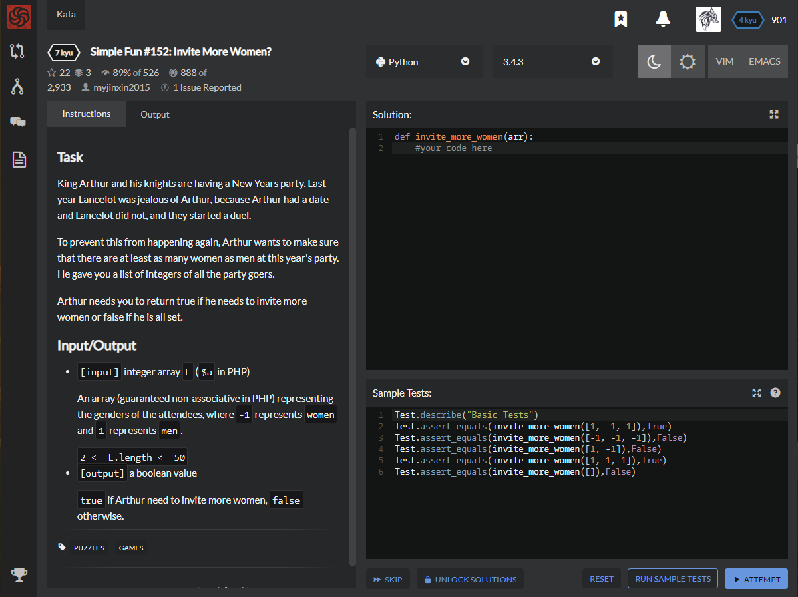

# [[7 Kyu] Simple Fun #152: Invite More Women?](https://www.codewars.com/kata/58acfe4ae0201e1708000075/train/python)




## Instructions

### Task

King Arthur and his knights are having a New Years party. Last year Lancelot was jealous of Arthur, because Arthur had a date and Lancelot did not, and they started a duel.

To prevent this from happening again, Arthur wants to make sure that there are at least as many women as men at this year's party. He gave you a list of integers of all the party goers.

Arthur needs you to return true if he needs to invite more women or false if he is all set.

### Input/Output

- `[input]` integer array `L` (`$a` in PHP)

  An array (guaranteed non-associative in PHP) representing the genders of the attendees, where `-1` represents `women` and `1` represents `men`.

  `2 <= L.length <= 50`

- `[output]` a boolean value

  `true` if Arthur need to invite more women, `false` otherwise.


## Sample Test

```python
Test.describe("Basic Tests")
Test.assert_equals(invite_more_women([1, -1, 1]),True)
Test.assert_equals(invite_more_women([-1, -1, -1]),False)
Test.assert_equals(invite_more_women([1, -1]),False)
Test.assert_equals(invite_more_women([1, 1, 1]),True)
Test.assert_equals(invite_more_women([]),False)
```


## My solution

```python
def invite_more_women(arr):
    return True if len(arr) and arr[-1]==1 else False
```


## Test Results

Test Passed

Test Passed

Test Passed

You have passed all of the tests! :)

---------

Time: 838ms Passed: 45 Failed: 0


## Best Solution

```python
def invite_more_women(arr):
    return sum(arr) > 0
```


## The things I got

